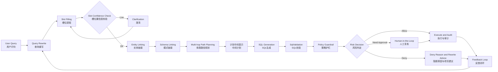
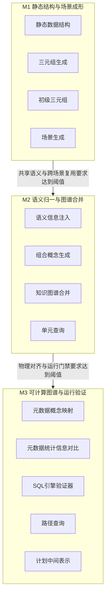

# 知识图谱与数据地图方案

**文档结构说明**：
- 第 1-9 章：知识图谱与数据地图核心方案
- 第 10 章：NL2SQL 全链路方案（下游消费方案）
- 第 11 章：图数据库选型建议
- 第 12 章：端到端案例讲解（静态结构与查询方法）

---

## 第 1 章 · 总览与设计原则

术语以 [00-统一术语表](00-统一术语表.md) 为准。下游 `NL2SQL（自然语言转 SQL，Natural Language to SQL）` 执行链路以第 10 章为准。

---

## 1.1 项目定位

数据直通车上游建设的不是"文档整理后的图数据库"，而是一套面向口径治理、问题缩域、证据追溯和下游 `NL2SQL（自然语言转 SQL，Natural Language to SQL）` 供给的知识底座。

项目建设必要性来自以下事实：

1. 同一个问题往往会穿过多个系统标识、多个表和多条历史路径。
2. 同样叫"交易日期"，在不同场景里可能对应不同时间语义。
3. 基金、理财、保险表面相近，实际不能混查。
4. 历史脚本很多，但新旧口径并不稳定一致。
5. 业务最关心的不是"能不能查"，而是"为什么这样查、为什么和上次不一样"。

基于以上事实，上游不能只做表字段搜索、文档分块检索或样例 `SQL（结构化查询语言，Structured Query Language）` 推荐，而应建设"结构化知识 + 文本证据 + 版本上下文 + 历史示例"混合底座。

---

## 1.2 建设对象

项目建设对象围绕上游知识底座展开，具体承担以下 5 项职责：

1. 把真实问题收敛到稳定的 `业务领域（Domain）` 和 `业务场景（Scene）`。
2. 把业务术语、派生规则、表间关联关系、表字段、证据和版本组织成可治理图谱。
3. 在运行时返回问题相关业务子图，而不是把全库元数据直接丢给下游。
4. 通过 `Data Map（数据地图，Data Map）` 把这套知识服务化，用于浏览、解释、复核和影响分析。
5. 给下游 `NL2SQL（自然语言转 SQL，Natural Language to SQL）`、解释模块和人工复核提供统一上游输入。

知识图谱负责组织知识，数据地图负责服务知识，下游系统负责消费知识。

---

## 1.3 三大模块

知识图谱设计分为三大模块：

| 模块 | 职责 | 子模块 |
|------|------|--------|
| 静态数据结构 | 定义图里有什么对象、分几层 | 统一图元素模型、三层架构、核心节点、关系约束 |
| 知识图谱学习 | 图谱怎么被生产出来 | 三元组生成 → 三元组推理 → 知识图谱合并（向量相似度） |
| 知识图谱查询 | 运行时怎么从大图裁出业务子图 | 五类命中 → 双向 BFS 寻路 → 路径评分与裁剪 → 业务子图输出 |

横切治理机制贯穿三大模块：证据治理、版本治理、影响分析、发布门禁。

---

## 1.4 设计原则

### 1.4.1 缩域优先原则

企业级 `NL2SQL（自然语言转 SQL，Natural Language to SQL）` 不能让模型直接面对全库。先缩到正确领域，再缩到正确场景，才谈得上正确生成。

1. 先命中 `业务领域（Domain）`。
2. 再命中一个或多个候选 `业务场景（Scene）`。
3. 最后只把与当前问题相关的一小块知识交给下游。

### 1.4.2 混合检索原则

图检索 + 文本检索 + 向量检索 + 规则召回，缺一不可。单一检索方式无法覆盖企业级知识图谱的全部查询需求。

### 1.4.3 白盒可解释原则

所有决策可追溯到证据与规则。路径选择、口径判定、版本替代都必须能回答"为什么"。

### 1.4.4 证据与版本一等治理原则

证据片段和版本快照是独立治理对象，不是备注信息。理由：

1. 证据需要跨对象共享——同一份文档可能支撑 10+ 条关系，独立对象存一次、引用多次。
2. 版本需要场景级一致性——版本快照捕获整个场景的状态，而非单个元素的时间戳。
3. 影响分析需要证据可查询——"如果这份证据失效，哪些关系受影响"必须是一次图遍历。
4. 治理工作流需要锚点——审批、复核、发布操作的对象是证据和版本，不是散落的属性。

### 1.4.5 置信度内嵌原则

在证据和版本作为独立治理对象的同时，每个图元素和扩展属性携带 `conf_score（置信度）` 属性，用于寻路时的快速过滤和评分。治理深度靠独立对象，运行性能靠内嵌属性，两者互补。

---

## 1.5 上游输出物

上游不直接输出 `SQL（结构化查询语言，Structured Query Language）`，而是输出问题相关业务子图，至少包含：

1. 命中的领域与场景。
2. 默认时间语义。
3. 关键规则与关联关系。
4. 相关表字段与证据。
5. 当前有效版本。
6. 候选路径及其评分与解释。

是否澄清、是否拒答、是否继续生成，属于下游 `NL2SQL（自然语言转 SQL，Natural Language to SQL）` 或运行编排层。

---

## 1.6 初始领域划分参考

初始 Domain/Scene 种子来源于业务侧现有分类体系，参见 [01-当前业务侧的业务场景分类](../03-其他文档/01-当前业务侧的业务场景分类)。

该分类体系包含 5 大业务领域：

| 领域 | 对应 Domain | 典型 Scene 举例 |
|------|-------------|----------------|
| 零售基础业务 | 零售 | 储蓄业务、账户管理、资金划转、电子银行 |
| 公司业务 | 对公 | 代发业务、账户服务、收付结算、贸易融资 |
| 贷款及信用卡 | 信贷 | 个人贷款、信用卡业务 |
| 外汇及境外机构 | 外汇 | 个人外汇、香港一卡通 |
| 财富管理 | 财富 | 基金业务、理财业务、保险业务、证券业务 |

当前统一方案优先覆盖"财富管理-基金业务"领域，以基金申购与赎回申请记录查询作为首个标准场景。

---

## 1.7 总览架构图

图说明：这张图把“知识生产、知识组织、运行消费”三大模块放在一页里，回答方案如何从原始材料收口到可交付的业务子图。

阅读顺序：先看左侧的领域种子与双流输入，再看中部三层主图，最后看右侧的运行消费与底部横切治理。

图中重点：
1. 当前优先覆盖的是“财富管理 -> 基金业务”，不是一次性铺开全部领域。
2. 文本知识流和元数据实证流先分流生产，再在合并前对齐到同一套主图对象。
3. 运行时最终消费的是业务子图与受控解释，不是把原始抽取结果直接下发给下游。
4. 证据、版本、影响分析和发布门禁是横切治理能力，不属于某一层的附属说明。

`draw.io（图示编辑工具，draw.io Diagramming Tool）` 源文件： [00-主方案.drawio.xml](00-主方案.drawio.xml)（页面：总览架构）

---

## 第 2 章 · 统一图元素模型与置信度体系

本章定义知识图谱中所有节点和边的底层数据结构。无论是元数据层的表字段，还是语义层的业务口径，还是治理层的证据片段，在存储层面都统一为"图元素"。

---

## 2.1 设计决策

| 决策项 | 结论 | 理由 |
|--------|------|------|
| 节点与边是否统一抽象 | 是，统一为图元素 | 简化存储模型，统一生命周期管理 |
| 逻辑标识与物理标识是否分离 | 是，`ele_uid` + `ele_uuid` 双标识 | 逻辑标识支持版本演进，物理标识保证审计不可篡改 |
| 置信度存储位置 | 内嵌在图元素和扩展属性中 | 寻路时需要快速读取，不能每次都遍历证据对象 |
| 证据与版本存储位置 | 独立治理对象（也是图元素） | 支持跨对象共享、影响分析和治理工作流 |
| 属性掩码是否启用 | 是 | 寻路时快速判断节点是否包含特定属性，避免全属性扫描 |

---

## 2.2 图元素（Graph Element）基础模型

所有知识图谱中的点和边都是图元素。图元素包含强制原子属性和可选扩展属性。

### 2.2.1 强制原子属性

| 属性名 | 中文注释 | 类型 | 代发场景样例值 | 设计职责 |
|--------|----------|------|----------------|----------|
| `ele_uid` | 逻辑唯一标识符 | STRING | `scene_payroll_detail_query（代发明细查询场景样例标识）` | 作为逻辑主键，承接版本演进与对象替代 |
| `ele_uuid` | 物理唯一标识符 | STRING | `scene_payroll_detail_query::20260317103015987::a13c9f2b` | 作为不可变审计主键，记录一次具体落库事实 |
| `ele_type` | 元素类型 | ENUM | `dot_scene（业务场景类型）` | 标识对象属于场景、字段概念、来源表还是治理对象 |
| `is_active` | 活动标记 | BOOLEAN | `true` | 标识当前版本是否仍然有效参与运行 |
| `ele_ins_tm` | 插入时间 | TIMESTAMP | `2026-03-17 10:30:15.987` | 记录对象进入主图的时间 |
| `ele_exp_tm` | 失效时间 | TIMESTAMP | `NULL` | 记录对象退出主图或被替代的时间 |
| `ele_src` | 创建来源 | STRING | `03-其他文档/05-口径文档现状-代发明细查询.sql#L4-L175` | 保留对象来自哪份材料、哪段 SQL 或哪次人工输入 |
| `ele_attr_msk` | 属性掩码 | BIGINT | `63` | 先做位判断，再决定是否读取扩展属性，避免寻路时全属性扫描 |

`ele_uuid（物理唯一标识符）` 采用固定拼接规则：

1. 格式固定为 ``{ele_uid}::{YYYYMMDDHHMMSSmmm}::{src_fingerprint_8（来源摘要 8 位值）}``。
2. 分隔符固定为 `::`。
3. `YYYYMMDDHHMMSSmmm` 使用毫秒级本地时间串。
4. `src_fingerprint_8（来源摘要 8 位值）` 由 `ele_src（创建来源）` 做稳定摘要得到，避免把原始长来源串直接写入主键。
5. `ele_uuid（物理唯一标识符）` 总长度上限固定为 `160` 个字符；若 `ele_uid（逻辑唯一标识符）` 过长，应先在生成前做标准化裁剪。

代发样例：

```text
scene_payroll_detail_query::20260317103015987::a13c9f2b
```

含义：
1. `scene_payroll_detail_query（代发明细查询场景样例标识）` 表示逻辑对象是“代发明细查询”这个业务场景。
2. `20260317103015987` 表示 `2026-03-17 10:30:15.987` 这一版进入主图。
3. `a13c9f2b` 表示来源字符串的稳定 8 位摘要。

### 2.2.2 可选原子属性

| 属性名 | 中文注释 | 类型 | 代发场景样例值 | 设计职责 |
|--------|----------|------|----------------|----------|
| `ele_puuid` | 父对象物理唯一标识符 | STRING | `scene_payroll_detail_query::20260317101500921::4f83c2de` | 记录当前对象由哪一个父对象派生或复制而来 |
| `ele_conf_score` | 图元素整体置信度分值 | DECIMAL(3,2) | `0.95` | 在对象级快速反映当前对象的可信程度，参与寻路评分和发布门禁 |
| `review_status` | 人工确认状态 | ENUM | `UNREVIEWED（未确认）` | 记录对象当前是否已被人工确认，和 `conf_score（置信度分值）` 分开治理 |
| `snapshot_id` | 运行态快照标识 | STRING | `scene_payroll_detail_query@published@20260318` | 标记对象属于哪个已发布运行态图投影，供查询、评分和输出统一绑定 |

---

## 2.3 点元素（Dot）

点元素是图元素的一种，拥有全部图元素强制属性，加上以下可选扩展属性：

| 属性名 | 中文注释 | 类型 | 代发场景样例值 | 设计职责 |
|--------|----------|------|----------------|----------|
| `popularity` | 热度值 | INTEGER | `128` | 用于热门场景、热门字段概念的轻量校正，不替代业务门禁 |
| `ele_conf_score` | 点元素整体置信度分值 | DECIMAL(3,2) | `0.98` | 表达点对象“是否可信存在”，例如业务场景、字段概念、来源表本身是否可靠 |

点的 `ele_conf_score` 反映其"存在性"。通常很少出现"可能不存在的点"，但可能出现"这个点并不存在某个属性"的情况。

---

## 2.4 边元素（Line）

边元素也是图元素的一种，除全部图元素强制属性外，还包含边特有的强制属性：

### 2.4.1 边特有强制属性

| 属性名 | 中文注释 | 类型 | 代发场景样例值 | 设计职责 |
|--------|----------|------|----------------|----------|
| `line_from_uid` | 边起点逻辑标识符 | STRING | `scene_payroll_detail_query` | 记录这条边从哪个逻辑对象出发 |
| `line_to_uid` | 边终点逻辑标识符 | STRING | `jr_protocol_to_detail（代发协议到代发明细的表间关联关系对象样例标识）` | 记录这条边最终指向哪个逻辑对象 |

### 2.4.2 边特有可选属性

| 属性名 | 中文注释 | 类型 | 代发场景样例值 | 设计职责 |
|--------|----------|------|----------------|----------|
| `ele_conf_score` | 边置信度分值 | DECIMAL(3,2) | `1.00` | 反映边关系是否稳定可信，例如主外键和白盒关联关系的可靠度 |
| `popularity` | 边热度值 | INTEGER | `37` | 用于路径热度校正，避免冷门弱证据边无差别进入前列 |
| `path_weight` | 路径权重 | DECIMAL(3,2) | `1.20` | 反映边类型对寻路优先级的结构性偏置 |

### 2.4.3 路径权重标准值

| 边类型 | `path_weight` 值 | 说明 |
|--------|------------------|------|
| 物理主外键（FK） | 1.2 | 极其可靠，优先走 |
| 血缘映射（Lineage） | 1.0 | 标准路径 |
| 映射损耗 | 0.98 | 语义到物理层的损耗 |
| 向量点亮（Vector） | 0.8 | 语义相关但物理不一定通 |

---

## 2.5 扩展属性模型

当图元素需要携带复杂的、来自模糊语料的描述性信息时，使用扩展属性。扩展属性本身也有完整的审计字段。

### 2.5.1 扩展属性字段

| 属性名 | 中文注释 | 类型 | 必填 | 代发场景样例值 | 设计职责 |
|--------|----------|------|------|----------------|----------|
| `attr_title` | 扩展属性标题 | STRING | 是 | `default_time_semantic` | 作为同一对象下扩展属性的稳定标题键 |
| `attr_uuid` | 扩展属性物理唯一标识符 | STRING | 是 | `default_time_semantic::20260317110200921::6d12ab7c` | 记录一次具体属性写入事实 |
| `is_active` | 扩展属性活动标记 | BOOLEAN | 是 | `true` | 控制当前属性版本是否有效 |
| `attr_ins_tm` | 扩展属性插入时间 | TIMESTAMP | 是 | `2026-03-17 11:02:00.921` | 记录当前属性进入系统的时间 |
| `attr_exp_tm` | 扩展属性失效时间 | TIMESTAMP | 否 | `NULL` | 记录当前属性失效时间 |
| `attr_value` | 扩展属性内容 | TEXT | 是 | `TRX_DT 作为代发明细查询默认时间；批次统计不复用该字段。` | 承载复杂说明、边界、解释和规则正文 |
| `attr_src` | 扩展属性来源 | STRING | 是 | `03-其他文档/05-口径文档现状-代发明细查询.sql#L70-L178` | 保留属性来自哪份原始材料或人工确认 |
| `attr_puuid` | 父扩展属性物理唯一标识符 | STRING | 否 | `default_time_semantic::20260317103000911::88bc1a2f` | 支持属性继承链和审计回放 |
| `attr_conf_score` | 扩展属性置信度分值 | DECIMAL(3,2) | 否 | `0.90` | 对属性级语义可信度做细粒度评分 |
| `attr_desc` | 扩展属性补充说明 | TEXT | 否 | `默认时间来自代发明细表，不覆盖批次表建立时间。` | 存放属性级辅助解释，避免正文被主值污染 |

### 2.5.2 扩展属性置信度继承规则

当扩展属性存在 `attr_puuid`（父属性）时，其置信度应计算为：

```
attr_conf_score = (parent.attr_conf_score + new_source_conf_score) / 2
```

---

## 2.6 置信度体系

### 2.6.1 置信度分级标准

| 置信度值 | 来源条件 | `review_status（人工确认状态）` | 说明 |
|----------|----------|-------------------------------|------|
| 1.0 | 人为生成 + 人为确认 | `VERIFIED（已确认）` | 元数据、SQL 批量录入等 |
| 0.98 | 人为输入 + AI 生成 + 人为确认 | `VERIFIED（已确认）` | 人机协作且已确认 |
| 0.95 | AI 生成 + 未人为确认 | `UNREVIEWED（未确认）` | AI 直接抽取，待确认 |
| 0.9 | AI 推理 + 人为确认 | `VERIFIED（已确认）` | 推理结果已确认 |
| 0.8 | AI 推理 + 未人为确认 | `UNREVIEWED（未确认）` | 推理结果待确认 |

补充约束：

1. `conf_score（置信度分值）` 只表达对象可信程度，不再兼任“是否已经人工确认”的判断。
2. `review_status（人工确认状态）` 固定使用 `UNREVIEWED（未确认）`、`VERIFIED（已确认）`、`REJECTED（已驳回）` 三态。
3. `REJECTED（已驳回）` 是治理结论，不对应单独的置信度档位；对象可保留原始 `conf_score（置信度分值）` 作为审计信息，但运行和发布都按驳回处理。

**发布门槛阈值 `0.9` 的来源**：`0.9` 仍然是对象级的最低可信度门槛，但自动发布还必须同时满足 `review_status = VERIFIED（已确认）`。换言之，`0.95 + UNREVIEWED（未确认）` 不能自动放行，`0.9 + VERIFIED（已确认）` 才是最低的自动发布基线。

### 2.6.2 置信度使用场景

| 场景 | 使用方式 |
|------|----------|
| 寻路评分 | 路径上每跳的 `ele_conf_score` 参与累乘评分 |
| 合并决策 | 低置信度对象在合并时优先被高置信度对象覆盖 |
| 人工核对触发 | `review_status = UNREVIEWED（未确认）` 的对象自动进入人工核对队列；`review_status = REJECTED（已驳回）` 的对象不得进入自动发布链路 |
| 发布门禁 | 自动发布要求关键路径同时满足 `conf_score >= 0.9` 且 `review_status = VERIFIED（已确认）`（见第 8 章 8.4 节） |

### 2.6.3 置信度与证据的关系

置信度是运行时快速评分的内嵌属性，`review_status（人工确认状态）` 是治理时的人工结论，证据是深度追溯的独立对象。三者关系：

- 置信度值由证据来源类型决定（见分级标准）。
- 人工确认完成后，优先更新 `review_status（人工确认状态）`，不强制改写原始 `conf_score（置信度分值）` 档位。
- 证据失效时，相关对象的置信度应降级或标记待复核。
- `review_status（人工确认状态）` 不能替代证据——“已确认”不等于“不需要证据”。
- 置信度不能替代证据——"置信度 1.0"不等于"不需要证据"。

---

## 2.7 属性掩码（ele_attr_msk）

属性掩码是一个 64 位整数，每一位对应一类对扩展属性读取有效的属性。运行时遍历节点时，`ele_attr_msk（属性掩码）` 只负责判断“是否需要进一步加载扩展属性”，不再承担“节点是否可遍历”的硬过滤职责。

### 2.7.1 掩码位定义（正式规范）

| 位 | 含义 | 说明 |
|----|------|------|
| bit 0 | 有业务口径 | 节点携带业务口径定义 |
| bit 1 | 有派生规则 | 节点携带派生规则 |
| bit 2 | 有表间关联关系 | 节点携带 JOIN 关系 |
| bit 3 | 有 SQL 代码段 | 节点携带 SQL 示例 |
| bit 4 | 有时间语义 | 节点携带时间解释 |
| bit 5 | 有证据引用 | 节点关联了证据片段 |
| bit 6 | 有版本引用 | 节点关联了版本快照 |
| bit 7 | 有向量嵌入 | 节点已生成 Embedding 向量 |

补充约束：

1. `bit 0-7` 为当前正式启用位，不允许重定义。
2. `bit 8-15` 预留给运行时读取优化能力。
3. `bit 16-31` 预留给共享资产与治理扩展。
4. `bit 32-63` 保留，不允许擅自占用。

### 2.7.2 掩码使用示例

代发样例一：`scene_payroll_detail_query（代发明细查询场景样例标识）`

- 命中位：`bit 0（业务口径）`、`bit 1（派生规则）`、`bit 2（表间关联关系）`、`bit 3（SQL 代码段）`、`bit 4（时间语义）`、`bit 5（证据引用）`
- 十进制掩码值：`63`
- 含义：这是一个已具备业务口径、入口规则、白盒关联、SQL 路径、默认时间和证据引用的场景节点

代发样例二：`jr_protocol_to_detail（代发协议到代发明细的表间关联关系对象样例标识）`

- 命中位：`bit 2（表间关联关系）`、`bit 5（证据引用）`
- 十进制掩码值：`36`
- 含义：这是一个白盒关联关系对象，既有结构定义，也挂了证据

```python
# 检查节点是否携带派生规则
HAS_DERIVATION_RULE = 1 << 1
if node.ele_attr_msk & HAS_DERIVATION_RULE:
    # 读取派生规则扩展属性
    rules = load_extended_attrs(node, "derivation_rule")
```

---

## 2.8 图元素模型图

图说明：这张图不再把第 2 章画成“字段名清单”，而是改成“字段建模蓝图”。每个关键字段都给出中文注释、类型、代发场景样例值和设计职责，让后面三层架构、生产链路、合并和寻路图都能共用同一套底层约束。

阅读顺序：先看左侧公共基础字段和 `ele_uuid（物理唯一标识符）` 规则，再看中部点元素、线元素和扩展属性如何承接不同信息密度，最后看右侧 `ele_attr_msk（属性掩码）` 的真实组合样例以及运行门禁顺序。

图中重点：
1. `ele_uid（逻辑唯一标识符）` 与 `ele_uuid（物理唯一标识符）` 分离后，版本演进和审计追溯才能同时成立。
2. 图中所有样例值都换成“代发明细查询”场景，包括 `scene_payroll_detail_query（代发明细查询场景样例标识）`、`fc_payroll_trx_dt（交易日期字段概念样例标识）`、`jr_protocol_to_detail（代发协议到代发明细的表间关联关系对象样例标识）`。
3. `Dot（点元素）`、`Line（边元素）`、`Extended Attr（扩展属性）` 共享同一底层模型，但各自承担不同信息密度与读取职责。
4. `conf_score（置信度分值）` 与 `review_status（人工确认状态）` 共同参与门禁；`ele_attr_msk（属性掩码）` 只负责决定是否读取扩展属性，不负责剪掉元数据遍历链路。

`draw.io（图示编辑工具，draw.io Diagramming Tool）` 源文件： [00-主方案.drawio.xml](00-主方案.drawio.xml)（页面：统一图元素模型）

---

## 第 3 章 · 三层架构与核心节点

本章定义知识图谱的三层知识组织和 17 类图元素类型（场景治理层 2 类 + 语义知识层 9 类 + 元数据层 4 类 + 治理对象 2 类）。所有节点底层均遵循第 2 章的统一图元素模型。

---

## 3.1 三层知识组织

| 层级 | 名称 | 职责 | 包含节点 |
|------|------|------|----------|
| 第三层 | 场景治理层 | 运行时主中心，最小治理单元 | 业务领域、业务场景 |
| 第二层 | 语义知识层 | 把"业务怎么说"和"数据怎么落"连起来 | 规范词元、业务术语、业务口径、字段概念、组合概念、边界概念、派生规则、表间关联关系对象、SQL 代码段、字典 |
| 第一层 | 元数据层 | 物理落点，不做语义合并 | 数据库、模式、来源表、字段 |
| 横切 | 治理对象 | 证据追溯与版本管理 | 证据片段、版本快照 |

关键约束：

1. 场景是运行时主中心——所有查询最终收敛到场景。
2. 元数据节点不可随意合并或替换——它们是物理事实。
3. 语义节点允许冗余、缓慢合并——业务表达天然多样。
4. 治理对象横切所有层——任何层的节点都可以引用证据和版本。

---

## 3.2 场景治理层

### 3.2.1 业务领域（Domain）

| 属性 | 类型 | 说明 |
|------|------|------|
| `ele_type` | ENUM | `dot_domain` |
| `domain_name` | STRING | 领域名称，如"零售"、"对公"、"公司业务" |
| `domain_desc` | TEXT | 领域业务概述 |
| `domain_overview` | TEXT | 域级业务概述，承载大段业务说明文本 |
| `visibility_roles` | JSON | 可见角色列表；为空表示沿用系统默认可见性 |

职责：稳定父层，承载一组相关场景。领域边界一旦确定，不因单个场景变化而频繁调整。

### 3.2.2 业务场景（Scene）

| 属性 | 类型 | 说明 |
|------|------|------|
| `ele_type` | ENUM | `dot_scene` |
| `scene_name` | STRING | 场景名称 |
| `scene_desc` | TEXT | 场景描述 |
| `primary_composite_concept` | STRING | 主业务对象（组合概念）的 `ele_uid` |
| `default_time_semantic` | STRING | 默认时间语义（如"交易日期"） |
| `applicable_scope` | TEXT | 适用范围说明 |
| `inapplicable_scope` | TEXT | 不适用范围说明 |
| `status` | ENUM | `DRAFT` / `PUBLISHED` / `DISCARDED` |
| `standard_output_fields` | JSON | 标准输出字段清单（字段概念 `ele_uid` 列表 + 必需/可选标记） |
| `ref_policy` | ENUM | 引用策略，默认 `LOCKED（锁定版本）` |
| `snapshot_id` | STRING | 当前已发布运行态快照标识；仅在运行态投影视图中必填 |
| `visibility_roles` | JSON | 可见角色列表；为空表示沿用所属 `Domain（业务领域）` 的默认角色 |
| `governance_tier` | ENUM | 治理等级，固定取值为 `CORE（核心）`、`SHARED（共享）`、`EXPLORATORY（探索）` |

职责：最小治理单元。围绕一个主业务对象组织业务问题，封装边界、默认时间解释、主路径、关键规则与版本。

关键讲解要点：

1. `公司客户号 / 公司户口号 / 代发协议号` 是“代发明细查询”场景的不同入口；`代发批次号` 进入独立的“代发批次结果查询”场景，不再和明细场景混写。
2. 组合概念是对象基线，标准输出字段清单是场景投影，两个层级不能混写。
3. `Plan（取数方案）` 解决内部路径分流，不改变场景边界。
4. 同一主对象下的时间解释差异默认属于场景内口径差异；一旦主对象、输出粒度或默认输出契约发生变化，应拆分为独立场景。

### 3.2.3 `standard_output_fields（标准输出字段清单）` 结构约束

`standard_output_fields（标准输出字段清单）` 是 `Scene（业务场景）` 对外承诺的字段投影，不是自由 `JSON（JavaScript 对象表示法，JavaScript Object Notation）` 片段。每个条目固定包含以下字段：

| 字段名 | 类型 | 是否必填 | 说明 |
|------|------|---------|------|
| `field_concept_uid` | STRING | 是 | 引用 `字段概念（Field Concept）` 的 `ele_uid（逻辑唯一标识符）` |
| `required` | BOOLEAN | 是 | 是否属于场景最小可交付字段 |
| `display_order` | INTEGER | 是 | 正整数，定义默认展示顺序 |

示例使用 `JSONC（带注释的JSON展示格式，JSON with Comments）` 表达：

```jsonc
[
  {
    "field_concept_uid": "fc_payroll_trx_dt", // 交易日期
    "required": true, // 发布门禁要求必须可满足
    "display_order": 10 // 默认展示顺序
  },
  {
    "field_concept_uid": "fc_payroll_protocol_nbr", // 代发协议号
    "required": true,
    "display_order": 20
  },
  {
    "field_concept_uid": "fc_payroll_trx_amt", // 交易金额
    "required": false,
    "display_order": 30
  }
]
```

---

## 3.3 语义知识层

### 3.3.1 规范词元（Canonical Term）

| 属性 | 类型 | 说明 |
|------|------|------|
| `ele_type` | ENUM | `dot_canonical_term` |
| `canonical_form` | STRING | 规范化后的标准表达 |
| `raw_variants` | JSON | 原生词元列表（归并前的多种表达） |
| `disambiguation_note` | TEXT | 消歧说明 |

职责：规范词元是语义层的标准化入口桥梁。它由若干原生表达经过归并、消歧、选主后形成。

定位说明：

- 逻辑上：规范词元单独展示为一层。
- 本体上：它的落点仍在语义层。
- 作用上：它是原生词元到概念层之间的标准化入口。

### 3.3.2 业务术语（Business Term）

| 属性 | 类型 | 说明 |
|------|------|------|
| `ele_type` | ENUM | `dot_business_term` |
| `term_name` | STRING | 术语名称 |
| `term_aliases` | JSON | 别名列表 |
| `term_definition` | TEXT | 术语定义 |
| `term_source` | STRING | 术语来源 |

职责：承载业务词汇及其解释。

### 3.3.3 业务口径（Business Caliber）

| 属性 | 类型 | 说明 |
|------|------|------|
| `ele_type` | ENUM | `dot_business_caliber` |
| `caliber_name` | STRING | 口径名称 |
| `caliber_definition` | TEXT | 业务定义 |
| `statistical_scope` | TEXT | 统计范围 |
| `calculation_boundary` | TEXT | 计算边界 |
| `interpretation_requirement` | TEXT | 解释要求 |

职责：承载业务定义、统计范围、计算边界与解释要求。

### 3.3.4 字段概念（Field Concept）

| 属性 | 类型 | 说明 |
|------|------|------|
| `ele_type` | ENUM | `dot_field_concept` |
| `field_name` | STRING | 字段概念名称，如"交易日期"、"客户号" |
| `field_definition` | TEXT | 字段语义定义 |
| `data_type_hint` | STRING | 数据类型提示（如 DATE、DECIMAL） |

职责：能够单独落成标准输出字段的概念。

### 3.3.5 组合概念（Composite Concept）

| 属性 | 类型 | 说明 |
|------|------|------|
| `ele_type` | ENUM | `dot_composite_concept` |
| `concept_name` | STRING | 组合概念名称，如"代发明细记录"、"代发批次结果" |
| `concept_definition` | TEXT | 概念定义 |
| `constituent_fields` | JSON | 组成字段概念的 `ele_uid` 列表 |

职责：代表一个查询对象或返回对象。组合概念定义对象静态结构，不直接承载查询动作。

### 3.3.6 边界概念（Scope Concept）

| 属性 | 类型 | 说明 |
|------|------|------|
| `ele_type` | ENUM | `dot_domain_concept` |
| `concept_name` | STRING | 边界概念名称，如"代发"、"公司业务" |
| `concept_definition` | TEXT | 概念定义 |
| `boundary_desc` | TEXT | 业务域边界说明 |

职责：用于限定业务域边界。

### 3.3.7 概念边界判断原则

| 判断条件 | 归类 |
|----------|------|
| 能单独成为稳定输出属性 | 字段概念 |
| 能定义业务域边界 | 边界概念 |
| 能代表"查什么对象 / 返回什么对象" | 组合概念 |

### 3.3.8 派生规则（Derivation Rule）

| 属性 | 类型 | 说明 |
|------|------|------|
| `ele_type` | ENUM | `dot_derivation_rule` |
| `rule_name` | STRING | 规则名称，如"公司户口号→代发协议号" |
| `rule_definition` | TEXT | 规则定义 |
| `input_concept` | STRING | 输入概念的 `ele_uid` |
| `output_concept` | STRING | 输出概念的 `ele_uid` |
| `rule_type` | ENUM | `IDENTITY_MAPPING` / `PARAMETER_CONVERSION` / `CONDITION_ROUTING` |

职责：承载身份、参数和条件映射链。派生规则承担"同一主体在不同身份、不同表示、不同环境下的转化关系"。

与查询逻辑的区分：

- 派生规则：根据公司客户号查代发协议号、根据公司户口号查代发协议号。
- 查询逻辑：根据代发协议号查代发明细、根据代发批次号查批次结果。

### 3.3.9 表间关联关系对象（Join Relation Object）

| 属性 | 类型 | 说明 |
|------|------|------|
| `ele_type` | ENUM | `dot_join_relation` |
| `relation_name` | STRING | 关联关系名称 |
| `left_table` | STRING | 左表 `ele_uid` |
| `right_table` | STRING | 右表 `ele_uid` |
| `join_keys` | JSON | 关联键对列表 |
| `join_type` | ENUM | `INNER` / `LEFT` / `RIGHT` / `FULL` |
| `applicable_boundary` | TEXT | 适用边界说明 |

职责：承载白盒关联关系及其证据、版本与适用边界。

### 3.3.10 SQL 代码段（SQL Snippet）

| 属性 | 类型 | 说明 |
|------|------|------|
| `ele_type` | ENUM | `dot_sql_snippet` |
| `snippet_name` | STRING | 代码段名称 |
| `sql_text` | TEXT | SQL 原文 |
| `snippet_purpose` | TEXT | 用途说明 |
| `referenced_tables` | JSON | 引用的表 `ele_uid` 列表 |
| `referenced_columns` | JSON | 引用的字段 `ele_uid` 列表 |

职责：承载白盒查询路径、示例写法和证据锚点。

### 3.3.11 字典（Dictionary）

| 属性 | 类型 | 说明 |
|------|------|------|
| `ele_type` | ENUM | `dot_dictionary` |
| `dict_name` | STRING | 字典名称 |
| `code_mappings` | JSON | 码值到含义的映射表 |
| `applicable_scope` | TEXT | 适用范围 |

职责：承载跨场景复用码值语义。

---

## 3.4 元数据层

元数据层节点不可随意合并或替换，它们是物理事实。所有元数据节点额外携带以下元数据专属属性：

| 属性 | 类型 | 说明 |
|------|------|------|
| `md_id` | STRING | 元数据唯一标识，如 `gauss_a.nds_data.table_a.column_1` |
| `md_cmt` | TEXT | 注释 |

### 3.4.1 数据库（Database）

| 属性 | 类型 | 说明 |
|------|------|------|
| `ele_type` | ENUM | `dot_md_database` |
| `db_name` | STRING | 数据库名称 |
| `db_type` | STRING | 数据库类型（如 GaussDB） |

### 3.4.2 模式（Schema）

| 属性 | 类型 | 说明 |
|------|------|------|
| `ele_type` | ENUM | `dot_md_schema` |
| `schema_name` | STRING | 模式名称 |

### 3.4.3 来源表（Source Table）

| 属性 | 类型 | 说明 |
|------|------|------|
| `ele_type` | ENUM | `dot_md_table` |
| `table_name` | STRING | 表名 |
| `table_desc` | TEXT | 表描述 |
| `row_count_estimate` | BIGINT | 估算行数 |

### 3.4.4 字段（Column）

| 属性 | 类型 | 说明 |
|------|------|------|
| `ele_type` | ENUM | `dot_md_column` |
| `column_name` | STRING | 字段名 |
| `column_type` | STRING | 字段数据类型 |
| `column_desc` | TEXT | 字段描述 |
| `is_primary_key` | BOOLEAN | 是否主键 |
| `is_foreign_key` | BOOLEAN | 是否外键 |
| `sensitivity_level` | ENUM | 敏感等级：`NONE` / `LOW` / `MEDIUM` / `HIGH` |

---

## 3.5 治理对象（横切层）

### 3.5.1 证据片段（Evidence Fragment）

| 属性 | 类型 | 说明 |
|------|------|------|
| `ele_type` | ENUM | `dot_evidence` |
| `evidence_type` | ENUM | `DOC_FRAGMENT` / `SQL_FRAGMENT` / `TICKET_EXAMPLE` / `HUMAN_CONFIRMATION` |
| `source_document` | STRING | 来源文档标识 |
| `source_location` | STRING | 来源位置（行号、段落号） |
| `content_text` | TEXT | 证据原文 |
| `content_fingerprint` | STRING | 内容指纹（用于去重和变更检测） |

职责：可被对象或关系引用的原始证据切片。详见第 8 章。

### 3.5.2 版本快照（Version Snapshot）

| 属性 | 类型 | 说明 |
|------|------|------|
| `ele_type` | ENUM | `dot_version` |
| `snapshot_scope` | STRING | 快照范围（通常是 Scene 的 `ele_uid`） |
| `version_tag` | STRING | 版本标签 |
| `status` | ENUM | `DRAFT` / `PUBLISHED` / `DISCARDED` |
| `predecessor_uuid` | STRING | 前一版本的 `ele_uuid` |
| `change_summary` | TEXT | 变更摘要 |

职责：版本比较、替代关系与回放依据。详见第 8 章。

---

## 3.6 核心节点类型汇总（18 类）

| 序号 | 节点类型 | `ele_type` | 所属层 |
|------|----------|------------|--------|
| 1 | 业务领域 | `dot_domain` | 场景治理层 |
| 2 | 业务场景 | `dot_scene` | 场景治理层 |
| 3 | 规范词元 | `dot_canonical_term` | 语义知识层 |
| 4 | 业务术语 | `dot_business_term` | 语义知识层 |
| 5 | 业务口径 | `dot_business_caliber` | 语义知识层 |
| 6 | 字段概念 | `dot_field_concept` | 语义知识层 |
| 7 | 组合概念 | `dot_composite_concept` | 语义知识层 |
| 8 | 边界概念 | `dot_domain_concept` | 语义知识层 |
| 9 | 派生规则 | `dot_derivation_rule` | 语义知识层 |
| 10 | 表间关联关系对象 | `dot_join_relation` | 语义知识层 |
| 11 | SQL 代码段 | `dot_sql_snippet` | 语义知识层 |
| 12 | 字典 | `dot_dictionary` | 语义知识层 |
| 13 | 数据库 | `dot_md_database` | 元数据层 |
| 14 | 模式 | `dot_md_schema` | 元数据层 |
| 15 | 来源表 | `dot_md_table` | 元数据层 |
| 16 | 字段 | `dot_md_column` | 元数据层 |
| 17 | 证据片段 | `dot_evidence` | 治理对象 |
| 18 | 版本快照 | `dot_version` | 治理对象 |

> 注：含元数据层 4 类和治理对象 2 类，实际共 18 类图元素类型。语义知识层 10 类 + 场景治理层 2 类 = 12 类核心业务节点，加上元数据层 4 类和治理对象 2 类共 18 类。

---

## 3.7 三层架构图

图说明：这张图不再从 `18` 类节点清单起讲，而是用“代发明细查询”这个真实案例，把三层知识组织、`12` 类核心业务节点、`18` 类总节点和横切治理对象串成一条主线，回答“为什么要分这三层、每一层到底在解决什么问题”。

阅读顺序：先看左上角“查某客户在给定时间范围内的代发明细”这个真实问题，再看 `业务场景` 如何把代发协议号、默认时间 `TRX_DT（交易日期）` 和输出字段边界定住，接着看中部语义知识层如何把派生规则、表间关联关系对象、`SQL（结构化查询语言，Structured Query Language）` 代码段和字典讲清楚，最后看下方元数据层如何按“数据库 -> 模式 -> 来源表 -> 字段清单”把主链路、批次链路和历史分表链全部展开，再回看右侧 `18` 类图元映射。

图中重点：
1. `业务场景` 是运行时主中心，真实问题最终不是收敛到“某个字段”或“某个表”，而是收敛到场景边界、主对象和标准输出字段契约。
2. 语义知识层里的 `业务口径`、`组合概念`、`字段概念`、`表间关联关系对象`、`字典`、`SQL` 代码段各自回答不同问题；其中“公司户口号 / 公司客户号 -> 代发协议号”属于入口派生规则，不是新的业务场景。
3. 元数据层现在不再用“模式集合框 + 表示意 + 字段示意”代替真实结构，而是显式拆成数据库、`NDS_VHIS`、`PDM_VHIS`、历史分表链，以及对应来源表和字段清单。
4. 图里已经把 `NLJ54_AGF_PROTOCOL_PAY_CARD_T`、`T03_SF_COOP_AGR_INF_S`、`T05_AGN_DTL`、`T05_AGN_BCH_EVT` 和历史表链分开画出；每张表下都挂了本方案当前用到的字段清单，不再只留两个示意字段。
5. 当前方案明确采用分层查询原则：语义知识层与场景治理层走 `Semantic Retrieval（语义召回）`，元数据层走 `Deterministic Lookup（确定性定位）`，二者在统一寻路骨架中汇合。
6. 右侧 `18` 类总节点不是附录口径，而是用“代发明细查询”重新落地后的对照表，目的是让讲解时不再停留在抽象名词层。

`draw.io（图示编辑工具，draw.io Diagramming Tool）` 源文件： [00-主方案.drawio.xml](00-主方案.drawio.xml)（页面：三层架构与核心节点）

---

## 第 4 章 · 关系类型与约束

本章定义知识图谱中所有合法的关系类型、约束规则和路径权重。所有关系在存储层面都是边元素（Line），遵循第 2 章的统一图元素模型。

---

## 4.1 关系分类

### 4.1.1 按语义分类

| 关系类别 | 说明 | 示例 |
|----------|------|------|
| 包含关系 | 父子层级，物理层刚性关系 | 数据库→模式、模式→表、表→字段 |
| 映射关系 | 语义层到元数据层的对应 | 字段概念→字段、组合概念→来源表 |
| 组成关系 | 概念的内部结构 | 组合概念→字段概念 |
| 引用关系 | 场景或规则对其他对象的使用 | 场景→组合概念、场景→派生规则 |
| 归一关系 | 词元或术语的标准化收敛 | 规范词元→业务术语 |
| 治理关系 | 证据和版本的挂载 | 任意节点→证据片段、受治理资产→版本快照 |
| 关联关系 | 表间 JOIN 关系 | 表间关联关系对象→来源表（左）、表间关联关系对象→来源表（右） |

### 4.1.2 按刚性分类

| 刚性等级 | 说明 | 关系类型 | 示例谓语 |
|----------|------|----------|----------|
| 刚性 | 不可违反，违反即数据错误 | 物理层包含关系 | `CONTAINS（包含）`（物理层）、`LEFT_TABLE（左表）`、`RIGHT_TABLE（右表）`、`ON_KEY（关联键）` |
| 半刚性 | 正常情况不应违反，违反需要证据说明 | 映射关系、关联关系、组成关系 | `MAPS_TO（映射到）`、`COMPOSED_OF（由...组成）`、`REFERENCES（引用）`、`SPECIFIED_BY（由口径定义）` |
| 柔性 | 允许冗余和演进 | 归一关系、引用关系、翻译关系 | `NORMALIZES_TO（归一到）`、`REFERS_TO（指向）`、`USES_*（使用类关系）`、`TRANSLATES（翻译到）`、`APPLIES_TO（适用于）` |
| 不参与寻路 | 治理专用，BFS 跳过 | 治理关系 | `EVIDENCED_BY（由证据支撑）`、`HAS_VERSION（挂载版本）`、`SUPERSEDES（新版本替代旧版本）` |

---

## 4.2 合法三元组规则集

以下是所有合法的三元组模式。不在此表中的三元组模式视为非法，不允许进入主图。

### 4.2.1 物理层包含关系

| 主语类型 | 谓语 | 宾语类型 | `ele_type` 约束 | `path_weight` |
|----------|------|----------|-----------------|---------------|
| 数据库 | `CONTAINS（包含）` | 模式 | `dot_md_database` → `dot_md_schema` | 1.2 |
| 模式 | `CONTAINS（包含）` | 来源表 | `dot_md_schema` → `dot_md_table` | 1.2 |
| 来源表 | `CONTAINS（包含）` | 字段 | `dot_md_table` → `dot_md_column` | 1.2 |

### 4.2.2 场景治理层关系

| 主语类型 | 谓语 | 宾语类型 | 说明 | `path_weight` |
|----------|------|----------|------|---------------|
| 业务领域 | `CONTAINS（包含）` | 业务场景 | 领域包含场景 | 1.0 |
| 业务领域 | `HAS_DOMAIN_CONCEPT（挂载边界概念）` | 边界概念 | 领域的边界概念 | 1.0 |
| 业务场景 | `HAS_PRIMARY_OBJECT（绑定主对象）` | 组合概念 | 场景的主业务对象 | 1.0 |
| 业务场景 | `HAS_OUTPUT_FIELD（挂载输出字段）` | 字段概念 | 场景的标准输出字段 | 1.0 |
| 业务场景 | `USES_CALIBER（使用业务口径）` | 业务口径 | 场景使用的口径 | 1.0 |
| 业务场景 | `USES_RULE（使用派生规则）` | 派生规则 | 场景使用的入口规则 | 1.0 |
| 业务场景 | `USES_JOIN（使用关联关系）` | 表间关联关系对象 | 场景使用的关联关系 | 1.0 |
| 业务场景 | `USES_SNIPPET（使用SQL代码段）` | SQL 代码段 | 场景使用的 SQL 示例 | 1.0 |
| 业务场景 | `USES_DICT（使用字典）` | 字典 | 场景使用的码值字典 | 1.0 |
| 业务场景 | `BOUNDED_BY（受边界约束）` | 边界概念 | 场景的领域边界 | 1.0 |

### 4.2.3 语义层内部关系

| 主语类型 | 谓语 | 宾语类型 | 说明 | `path_weight` |
|----------|------|----------|------|---------------|
| 规范词元 | `NORMALIZES_TO（归一到）` | 业务术语 | 词元归一到术语 | 0.98 |
| 业务术语 | `DEFINES（定义）` | 业务口径 | 术语定义口径 | 1.0 |
| 业务术语 | `REFERS_TO（指向）` | 字段概念 | 术语指向字段概念 | 0.98 |
| 业务术语 | `REFERS_TO（指向）` | 组合概念 | 术语指向组合概念 | 0.98 |
| 业务术语 | `REFERS_TO（指向）` | 边界概念 | 术语指向领域边界概念 | 0.98 |
| 组合概念 | `COMPOSED_OF（由...组成）` | 字段概念 | 组合概念包含字段概念 | 1.0 |
| 字段概念 | `SPECIFIED_BY（由口径定义）` | 业务口径 | 字段概念的口径定义 | 1.0 |
| 字段概念 | `REFERS_TO（指向）` | 边界概念 | 字段概念绑定领域边界 | 0.98 |
| 派生规则 | `INPUT_FROM（输入来自）` | 字段概念 | 规则的输入概念 | 1.0 |
| 派生规则 | `OUTPUT_TO（输出到）` | 字段概念 | 规则的输出概念 | 1.0 |
| 字典 | `TRANSLATES（翻译到）` | 字段概念 | 字典翻译的字段概念 | 0.98 |

### 4.2.4 跨层映射关系

| 主语类型 | 谓语 | 宾语类型 | 说明 | `path_weight` |
|----------|------|----------|------|---------------|
| 字段概念 | `MAPS_TO（映射到）` | 字段 | 语义到物理的字段映射 | 0.98 |
| 组合概念 | `MAPS_TO（映射到）` | 来源表 | 语义到物理的表映射 | 0.98 |
| SQL 代码段 | `REFERENCES（引用）` | 来源表 | SQL 引用的表 | 1.0 |
| SQL 代码段 | `REFERENCES（引用）` | 字段 | SQL 引用的字段 | 1.0 |
| 表间关联关系对象 | `LEFT_TABLE（左表）` | 来源表 | 关联的左表 | 1.2 |
| 表间关联关系对象 | `RIGHT_TABLE（右表）` | 来源表 | 关联的右表 | 1.2 |
| 表间关联关系对象 | `ON_KEY（关联键）` | 字段 | 关联键字段 | 1.2 |
| 字典 | `APPLIES_TO（适用于）` | 字段 | 字典适用的物理字段 | 0.98 |

### 4.2.5 治理关系

| 主语类型 | 谓语 | 宾语类型 | 说明 | `path_weight` |
|----------|------|----------|------|---------------|
| 任意节点 | `EVIDENCED_BY（由证据支撑）` | 证据片段 | 对象或关系的证据支撑 | 不参与寻路评分 |
| 任一受治理资产 | `HAS_VERSION（挂载版本）` | 版本快照 | `Scene（业务场景）`、`Dictionary（字典）`、`Business Caliber（业务口径）`、`Derivation Rule（派生规则）`、`Join Relation Object（表间关联关系对象）`、`SQL Snippet（SQL 代码段）`、`Composite Concept（组合概念）` 的版本记录 | 不参与寻路评分 |
| 版本快照 | `SUPERSEDES（新版本替代旧版本）` | 版本快照 | 新版本替代旧版本 | 不参与寻路评分 |

> 治理关系不参与寻路评分。BFS 遍历时跳过 `ele_type` 为 `dot_evidence` 和 `dot_version` 的节点。证据和版本信息在路径评分的业务维度（证据可信度、场景稳定性）中通过属性读取，不通过图遍历。
>
> `规范词元（Canonical Term）` 是词元匹配阶段的检索入口对象。运行时先通过 `NORMALIZES_TO（归一到）` 与术语索引把用户表达映射到 `字段概念（Field Concept）`，再把字段概念作为 `BFS（广度优先搜索，Breadth-First Search）` 起点；`BFS` 主路径不要求回溯到规范词元入边。

---

## 4.3 非法三元组示例

| 非法模式 | 原因 |
|----------|------|
| 字段 → `CONTAINS（包含）` → 来源表 | 方向反转，物理层包含关系不可逆 |
| 业务场景 → `MAPS_TO（映射到）` → 字段 | 场景不直接映射到物理字段，必须经过概念层 |
| 字段概念 → `CONTAINS（包含）` → 字段概念 | 字段概念是原子概念，不包含其他字段概念 |
| 来源表 → `NORMALIZES_TO（归一到）` → 业务术语 | 元数据节点不参与归一 |

---

## 4.4 属性与关系的双重表示决策

部分节点同时在属性（JSON）和关系（边）中表达了相同语义。全局决策如下：

**关系是 source of truth，属性是派生缓存。**

| 节点类型 | 冗余属性 | 对应关系（source of truth） | 处理方式 |
|----------|----------|---------------------------|----------|
| 业务场景 | `primary_composite_concept` (STRING) | `HAS_PRIMARY_OBJECT（绑定主对象）` → 组合概念 | 属性由关系派生，写入时自动同步 |
| 业务场景 | `standard_output_fields` (JSON) | `HAS_OUTPUT_FIELD（挂载输出字段）` → 字段概念 | 属性由关系派生，写入时自动同步 |
| 组合概念 | `constituent_fields` (JSON) | `COMPOSED_OF（由...组成）` → 字段概念 | 属性由关系派生，写入时自动同步 |
| 表间关联关系对象 | `left_table` / `right_table` (STRING) | `LEFT_TABLE（左表）` / `RIGHT_TABLE（右表）` → 来源表 | 属性由关系派生，写入时自动同步 |
| 表间关联关系对象 | `join_keys` (JSON) | `ON_KEY（关联键）` → 字段 | 属性由关系派生，写入时自动同步 |
| SQL 代码段 | `referenced_tables` / `referenced_columns` (JSON) | `REFERENCES（引用）` → 来源表 / 字段 | 属性由关系派生，写入时自动同步 |
| 边元素 | `evidence_refs` (JSON) | `EVIDENCED_BY（由证据支撑）` → 证据片段 | 属性由关系派生，写入时自动同步 |

约束：

1. 创建或更新节点时，必须先写关系，再由系统自动派生属性。
2. 查询时，属性用于快速读取（避免遍历），关系用于图遍历和影响分析。
3. 属性与关系不一致时，以关系为准，属性需要重新派生。

---

## 4.5 关系属性

所有关系（边元素）除第 2 章定义的图元素基础属性外，还可携带以下扩展属性：

| 属性 | 类型 | 说明 |
|------|------|------|
| `relation_desc` | TEXT | 关系描述 |
| `applicable_period` | STRING | 适用时间段 |

> `evidence_refs` 和 `version_ref` 不再作为边的内嵌属性。证据通过 `EVIDENCED_BY（由证据支撑）` 关系表达，版本通过 `HAS_VERSION（挂载版本）` 关系表达（见 4.4 双重表示决策）。

---

## 4.6 关系约束图

图说明：这张图把合法三元组规则、刚性等级、非法模式改写和关系真值来源放在一页里，回答“什么关系可以进主图，什么关系必须回退重写”。

阅读顺序：先看左侧按层分组的合法关系模式，再看中部的刚性等级与非法模式改写，最后看右侧的关系真值来源与治理约束。

图中重点：
1. 关系是否合法，首先取决于是否命中第 4 章规则表，而不是字面上看起来是否合理。
2. 物理层包含关系和 `LEFT_TABLE（左表）`、`RIGHT_TABLE（右表）`、`ON_KEY（关联键）` 属于刚性关系，错误就是物理事实错误。
3. `JOINS（表关联）`、`JOIN_KEY（关联键）`、`DEFAULT_TIME_FIELD（默认时间字段）` 这类原始标签必须先改写成正式对象或场景属性，不能直接入图。
4. 证据和版本关系不参与 `BFS（广度优先搜索）`，但决定了关系是否可追溯、可解释、可发布。

`draw.io（图示编辑工具，draw.io Diagramming Tool）` 源文件： [00-主方案.drawio.xml](00-主方案.drawio.xml)（页面：合法三元组关系约束）

---

## 第 5 章 · 知识生产链路

本章定义知识图谱的完整生产流程：从原始材料到已发布知识的全链路。

---

## 5.1 生产链路总览

知识生产采用"双流交汇"架构：文本知识流负责抽取场景边界、规则、证据和候选关系；元数据实证流负责确认表字段落点、统计特征和可执行路径。两条流在知识图谱合并环节交汇。

关键约束：任何要进入已发布主图的关键关系，都要同时说明文本依据和元数据落点或验证状态。

### 5.1.1 代发样例主链路

本章统一采用“代发明细查询”作为完整展开链样例。当前主链路固定为：

1. 当前主链路入口固定为公司客户号、公司户口号、代发协议号；`代发批次号` 作为对照入口进入独立的“代发批次结果查询”场景，不与明细主链路混写。
2. 文本知识流产出：`业务场景（Business Scene）` 代发明细查询、`组合概念（Composite Concept）` 代发明细记录、派生规则、默认时间语义、标准输出字段清单；对照场景单独产出“代发批次结果查询”和“代发批次结果记录”。
3. 元数据实证流产出：`NDS_VHIS.NLJ54_AGF_PROTOCOL_PAY_CARD_T`、`PDM_VHIS.T03_SF_COOP_AGR_INF_S`、`PDM_VHIS.T05_AGN_DTL`、`PDM_VHIS.T05_AGN_BCH_EVT` 以及字段清单、关联关系对象、`SQL（结构化查询语言，Structured Query Language）` 校验结论。
4. 汇合对象：明细场景的主组合概念、默认时间语义、表间关联关系对象、标准输出字段清单，以及批次结果场景复用的共享资产。
5. 发布门禁：先过 `review_status（人工确认状态）`、`conf_score（置信度分值）`、合法性与边界门禁，再决定 `allow / need_approval / deny`。

---

## 5.2 文本知识流

### 5.2.1 输入材料

| 材料类型 | 说明 | 处理规则差异 |
|----------|------|-------------|
| 口径文档段落 | 业务定义、统计范围、计算边界 | 抽取口径、边界、时间语义 |
| 历史 SQL | 已验证的查询脚本 | 抽取表引用、字段引用、JOIN 关系、过滤条件 |
| 工单样例 | 用户提问 + 处理结果 | 抽取场景意图、入口参数、输出期望 |
| 字段解释 | 字段含义、码值说明 | 抽取字段概念、字典映射 |
| 规则说明 | 筛选条件、口径定义、注意事项 | 抽取派生规则、业务口径 |

### 5.2.2 处理流程

```
原始材料 → 文本分类 → 三元组生成 → 三元组推理 → 语义信息注入 → 场景生成
```

1. 文本分类：按材料类型分流，不同类型走不同的抽取规则。
2. 三元组生成：产出初级三元组（候选事实）。
3. 三元组推理：利用已发布图谱和推理规则补全隐式关系。
4. 语义信息注入：将术语、码值、时间语义和边界说明注入抽取结果。
5. 场景生成：将注入后的知识组织为场景结构。

### 5.2.3 代发样例中的文本知识流产物

| 步骤 | 输入 | 处理动作 | 产物 | 去向 |
|------|------|----------|------|------|
| 文本分类 | 代发口径段落、历史 `SQL`、字段解释、规则说明 | 按材料类型分流 | 材料标签 | 决定后续抽取规则 |
| 三元组生成 | 代发协议号、代发明细、历史边界等原始表述 | 生成候选事实 | 初级三元组 | 进入合法性校验与推理 |
| 三元组推理 | 公司客户号、公司户口号、代发协议号 | 推导入口收敛关系 | 派生规则 | 收敛到统一场景入口 |
| 语义信息注入 | 交易日期、代发批次号、代发状态等术语 | 绑定字段概念、时间语义和边界说明 | 字段概念、默认时间、适用 / 不适用范围 | 进入场景生成 |
| 场景生成 | 已注入语义的候选事实 | 组织成正式场景草稿 | `业务场景` 代发明细查询、`组合概念` 代发明细记录、标准输出字段清单 | 与元数据实证流汇合 |

---

## 5.3 元数据实证流

### 5.3.1 输入

数据库元数据：数据库、模式、表、字段的物理信息。

### 5.3.2 处理流程

```
数据库元数据快照 → 元数据可用性校验 → 元数据概念映射 → 统计特征对比 → SQL 引擎验证器
```

1. 元数据可用性校验：先确认来源表、字段仍可访问；不可访问对象先标记失效，再进入后续流程。
2. 元数据概念映射：将物理表字段映射到语义层的字段概念和组合概念。
3. 统计特征对比：对比候选映射的统计特征（行数、值域、空值率）与预期是否一致。
4. SQL 引擎验证器：对候选路径或生成 SQL 的可执行性、口径一致性和字段落点进行校验。

### 5.3.3 代发样例中的元数据实证流产物

| 步骤 | 输入 | 处理动作 | 产物 | 去向 |
|------|------|----------|------|------|
| 数据库 / 模式 / 表 / 字段识别 | 高斯数据库（GaussDB）元数据、`NDS_VHIS`、`PDM_VHIS`、历史分表链 | 确定性定位数据库、模式、来源表和字段 | `NLJ54_AGF_PROTOCOL_PAY_CARD_T`、`T03_SF_COOP_AGR_INF_S`、`T05_AGN_DTL`、`T05_AGN_BCH_EVT` 及字段清单 | 进入概念映射 |
| 元数据概念映射 | 表字段与文本侧字段概念 | 映射协议号、批次号、交易日期、交易金额等字段 | 字段概念到物理字段的映射表 | 进入统计对比与 `SQL` 校验 |
| 统计特征对比 | `TRX_DT（交易日期）`、`TRX_AMT（交易金额）`、`AGN_BCH_SEQ（代发批次号）` 等字段 | 对比值域、空值率、时间分布 | 默认时间与字段落点结论 | 进入 `SQL` 引擎验证器 |
| SQL 引擎验证器 | 主链路 `SQL` 和批次统计 `SQL` | 校验表引用、关联条件、输出字段落点 | 两条 `表间关联关系对象`、物理落点结论、可执行性判断 | 与文本知识流汇合 |

### 5.3.4 元数据失效与级联规则

当底层物理对象失效（例如删表、改表名后无法命中）时，按以下顺序级联：

1. 来源表失效：对应 `来源表（Source Table）` 标记 `is_active = false`，写入 `ele_exp_tm（失效时间）`。
2. 字段失效：该表下字段同步标记失效，避免继续参与路径构建。
3. 映射断裂：关联的 `MAPS_TO（映射到）`、`LEFT_TABLE（左表）`、`RIGHT_TABLE（右表）`、`ON_KEY（关联键）` 关系进入失效态。
4. 契约回传：涉及的 `standard_output_fields（标准输出字段清单）` 中只要存在 `required = true` 的字段无法落位，或主对象、关键 `Join Relation Object（表间关联关系对象）` 已断裂，场景门禁结论直接转为 `deny（阻断）`。
5. 触发时机：导入前校验、发布前门禁校验、人工排查触发三类入口统一执行，不依赖定时巡检。

### 5.3.5 外部依赖失败回退机制

知识生产链路依赖三类外部服务：**元数据平台**、**Embedding 服务**、**图数据库**。任何一类失败时按以下策略回退，不允许静默忽略或在失败状态下继续向下游传递。

#### 5.3.5.1 元数据平台不可用

| 场景 | 回退策略 |
|------|---------|
| 元数据平台连接超时或返回错误 | 本批次元数据实证流暂停；候选对象保留在 `DRAFT` 状态，不进入合并管道 |
| 元数据快照部分缺失（仅部分表可访问） | 可访问部分继续执行；缺失部分标记 `metadata_unavailable`，相关三元组不进入类型 A/B 规则 |
| 已发布场景的元数据在后续巡检中失效 | 执行 5.3.4 级联规则；若影响 `required = true` 输出字段、主对象或关键关联，场景门禁直接转 `deny（阻断）` |

> 元数据平台不可用时，**不允许使用上一次缓存的元数据快照替代**，因为物理表字段变更可能已发生，用旧快照会产生错误的映射结论。

#### 5.3.5.2 Embedding 服务不可用

| 场景 | 回退策略 |
|------|---------|
| Embedding 服务连接失败或超时 | 合并管道中依赖向量检索的步骤（语义召回、相似度计算）暂停；候选对象进入"仅精确匹配"模式 |
| 仅精确匹配模式下 | 语义知识层对象只做关键词匹配；无精确匹配则直接新增，不做合并；向量索引更新任务进入重试队列 |
| 重试队列超过阈值 | 转人工排查，不允许无限积压 |

> Embedding 服务不可用时，**元数据层（类型 A、B 规则）不受影响**，可继续执行精确匹配。

#### 5.3.5.3 图数据库超时或不可用

| 场景 | 回退策略 |
|------|---------|
| 写入超时（合并或新增操作） | 事务全回滚（见第 6 章 6.9.2），不留半写入；任务进入重试队列 |
| 读取超时（寻路查询）| 返回 `no_result`，并在响应中标注 `reason=graph_timeout`；不返回过期缓存 |
| 图数据库完全不可用 | 整个查询链路暂停；生产管道同步暂停；告警触发（见第 8 章 8.6.5） |

> 图数据库超时时，**不允许用关系型数据库缓存或平面文件临时替代**，因为路径完整性依赖图遍历语义。

#### 5.3.5.4 无场景命中时的受控返回

当查询阶段完全无场景命中时（见第 7 章 7.2.4 冲突处理），上游不再退化为无边界全局搜索，而是返回 `Scene Discovery Result（场景发现结果，Scene Discovery Result）`：

```jsonc
{
  "domain_candidates": ["对公"],
  "scene_candidates": ["代发明细查询", "代发批次结果查询"],
  "matched_terms": ["代发", "批次号"],
  "clarification_question": "您要查询代发明细，还是代发批次结果？"
}
```

固定约束：

1. `Scene Discovery Result（场景发现结果）` 只输出领域候选、场景候选、命中词元与澄清问题，不输出业务子图。
2. 不允许在无场景命中时直接下发表、字段、`Join（表关联）` 路径或候选 `SQL（结构化查询语言）`。
3. 不允许在无场景命中时自动生成新场景草稿并提交合并——无场景命中是需要人工介入的信号，不是自动扩图的触发器。

---

## 5.4 三元组生成

### 5.4.1 初级三元组与成品三元组

| 类型 | 特征 | 能否入主图 | 置信度取值（第 2 章 5 级） |
|------|------|-----------|--------------------------|
| 初级三元组 | 候选事实，形式初步可用 | 不能 | 0.8（AI 推理未确认）或 0.95（AI 生成未确认） |
| 成品三元组 | 形式合法 + 带来源标记 + 通过校验 | 可以进入合并 | 0.9（AI 推理已确认）、0.98（人+AI 已确认）或 1.0（人为生成已确认） |

### 5.4.2 生成约束

1. 三元组生成不是"模型看完材料直接产结论"，而是规则和现有图谱共同参与的过程。
2. 初级三元组不能直接入主图，否则会把未验证的字面关系带入运行资产。
3. 不同材料类型走不同的规则。
4. 每条三元组必须标记来源类型和初始置信度。

### 5.4.3 合法性校验

生成的三元组必须通过第 4 章定义的合法三元组规则集校验。不在合法模式表中的三元组直接丢弃。

### 5.4.4 三元组生成规则库

规则库按刚性等级分为四类，与第 4 章关系约束刚性等级对应。每条规则给出：**前提条件 → 产出三元组 → 初始置信度 → 失败处置**。

---

#### 类型 A：刚性规则（物理层包含关系）

物理层三元组不来自文本抽取，来自元数据快照直接映射。规则失败意味着物理事实缺失或不可用，处置方式是标记失效，不是降级置信度。

| 规则编号 | 前提条件 | 产出三元组 | 初始置信度 | 失败处置 |
|---------|---------|-----------|-----------|---------|
| A1 | 在元数据快照中找到 `db_name` | `数据库 CONTAINS（包含） 模式`（逐条） | 1.0 | 标记数据库 `is_active=false`，级联阻断后续 |
| A2 | 在元数据快照中找到 `schema_name` 属于某数据库 | `模式 CONTAINS（包含） 来源表`（逐条） | 1.0 | 标记模式 `is_active=false`，级联阻断后续 |
| A3 | 在元数据快照中找到 `table_name` 属于某模式 | `来源表 CONTAINS（包含） 字段`（逐条） | 1.0 | 标记来源表 `is_active=false`，触发 5.3.4 级联规则 |
| A4 | 主外键字段在元数据中已标注 `is_primary_key=true` 或 `is_foreign_key=true` | `表间关联关系对象 LEFT_TABLE（左表）/RIGHT_TABLE（右表）/ON_KEY（关联键）` | 1.0 | 关联关系对象标记失效，通知涉及场景降级 |

---

#### 类型 B：半刚性规则（跨层映射关系）

跨层映射三元组来自语义抽取与元数据对齐的联合结论。规则失败时不直接丢弃，而是保留 `DRAFT` 并降级门禁。

| 规则编号 | 前提条件 | 产出三元组 | 初始置信度 | 失败处置 |
|---------|---------|-----------|-----------|---------|
| B1 | 字段概念与物理字段名称精确匹配或别名匹配，且物理字段处于活动状态 | `字段概念 MAPS_TO（映射到） 字段` | 1.0（精确匹配）/ 0.95（别名匹配） | 若该字段概念承载 `required = true` 输出字段，则场景门禁直接 `deny`；否则保留字段概念并降级为 `need_approval` |
| B2 | 组合概念的所有组成字段都能映射到同一来源表，且该表处于活动状态 | `组合概念 MAPS_TO（映射到） 来源表` | 0.98 | 若该组合概念是当前 `Scene（业务场景）` 的主对象，则直接 `deny`；否则保留组合概念并进入人工复核 |
| B3 | SQL 代码段中解析出的表引用能精确匹配到活动来源表 | `SQL 代码段 REFERENCES（引用） 来源表` | 1.0 | 标记该 SQL 代码段引用断裂，不入主图 |
| B4 | SQL 代码段中解析出的字段引用能精确匹配到活动字段 | `SQL 代码段 REFERENCES（引用） 字段` | 1.0 | 标记该 SQL 代码段字段引用断裂，不入主图 |
| B5 | 表间关联关系对象的左右表引用均能精确匹配到活动来源表，且关联键存在 | `表间关联关系对象 LEFT_TABLE（左表）/RIGHT_TABLE（右表）/ON_KEY（关联键）` | 1.0 | 关联关系对象不入主图；若属于关键路径 `Join Relation Object（表间关联关系对象）`，则通知涉及场景直接 `deny`，否则降级为 `need_approval` |
| B6 | 字典的 `applicable_scope` 中引用的字段能精确匹配到活动字段 | `字典 APPLIES_TO（适用于） 字段` | 0.98 | 字典保留，但 `APPLIES_TO（适用于）` 关系不入主图 |

---

#### 类型 C：柔性规则（语义层内部 + 引用关系）

语义层三元组来自文本抽取、LLM 推断和场景组织。允许置信度较低进入合并管道，经人工确认后升级。

| 规则编号 | 前提条件 | 产出三元组 | 初始置信度 | 失败处置 |
|---------|---------|-----------|-----------|---------|
| C1 | 文本中两个术语出现在同一段落且存在同义关系的语义证据 | `规范词元 NORMALIZES_TO（归一到） 业务术语` | 0.95（AI 抽取）/ 0.8（AI 推理） | 降入待定区间，等待人工确认 |
| C2 | 业务术语定义段落中出现了口径定义文本 | `业务术语 DEFINES（定义） 业务口径` | 0.95 | 降入待定区间 |
| C3 | 业务术语上下文中能识别出字段概念的引用 | `业务术语 REFERS_TO（指向） 字段概念 / 组合概念 / 边界概念` | 0.9 | 降入待定区间 |
| C4 | 组合概念的定义中列举了组成字段 | `组合概念 COMPOSED_OF（由...组成） 字段概念` | 0.95（明确列举）/ 0.8（推断） | 降入待定区间 |
| C5 | 字段概念的定义段落中找到业务口径约束 | `字段概念 SPECIFIED_BY（由口径定义） 业务口径` | 0.95 | 降入待定区间 |
| C6 | 场景文本中明确引用了业务口径 | `业务场景 USES_CALIBER（使用业务口径） 业务口径` | 0.98（明确）/ 0.9（推断） | 保留场景，关系不入主图 |
| C7 | 场景入口参数有对应的派生规则 | `业务场景 USES_RULE（使用派生规则） 派生规则` | 0.98（明确）/ 0.9（推断） | 保留场景，入口路径标记不完整 |
| C8 | 场景文本中明确引用了字典码值 | `业务场景 USES_DICT（使用字典） 字典` | 0.98 | 保留场景，码值说明标记待补充 |
| C9 | 字典文本中能识别出它翻译某个字段概念的码值 | `字典 TRANSLATES（翻译到） 字段概念` | 0.95 | 降入待定区间 |
| C10 | 派生规则定义中明确说明输入/输出参数 | `派生规则 INPUT_FROM（输入来自） 字段概念`、`派生规则 OUTPUT_TO（输出到） 字段概念` | 1.0（明确）/ 0.95（AI 抽取） | 派生规则保留，相关关系不入主图 |

---

#### 类型 D：推理规则（三元组推理阶段补全）

推理规则不直接来自原始材料，而是由已有图谱 + 推理引擎联合产出。推理结果必须标记来源为"推理"，并按推理类型降级置信度。

| 规则编号 | 推理类型 | 前提条件（已有图谱中存在） | 产出三元组 | 初始置信度 | 失败处置 |
|---------|---------|--------------------------|-----------|-----------|---------|
| D1 | 传递性推理 | `字段概念 MAPS_TO（映射到） 字段` + `字段 CONTAINS（包含） 于 来源表` | 字段概念可达来源表（非图边，用于 BFS 路径扩展） | 不产出新边，只更新路径可达性缓存 | 可达性缓存不更新，寻路时从已有边推算 |
| D2 | 同义归一 | 两个业务术语的 Embedding 相似度 ≥ 0.85，且同属一个业务领域 | `规范词元 NORMALIZES_TO（归一到） 业务术语`（合并到同一规范词元） | 0.8（AI 推理，待确认） | 进入待定区间，等待人工消歧 |
| D3 | 规则继承 | `业务领域 CONTAINS（包含） 业务场景` + 领域级 `USES_RULE（使用派生规则）` 关系存在 | `业务场景 USES_RULE（使用派生规则） 派生规则`（继承自领域） | 0.8（AI 推理，待确认） | 场景不继承该规则，仍可手工补充 |
| D4 | 边界推断 | 场景 `applicable_scope` 存在明确文本边界描述 | 场景 `inapplicable_scope` 的反向推断结论（作为扩展属性追加） | 0.8（AI 推理，待确认） | 保留空 `inapplicable_scope`，标记待人工填写 |

---

#### 规则库约束

1. 以上规则库是当前方案的**起点基线**，落地时可按实际业务场景增补具体规则，但不可删减已列规则的失败处置约束。
2. 类型 A、B 规则失败的优先级高于置信度门槛：物理事实错误不能靠提高置信度绕过。
3. 类型 C、D 规则均产出"待定"或"人工复核"状态对象，不直接进入已发布主图。
4. 同一三元组被多条规则同时触发时，取**最高置信度**的规则结论，并保留所有来源记录。

---

## 5.5 三元组推理

### 5.5.1 推理类型

| 推理类型 | 说明 | 示例 |
|----------|------|------|
| 传递性推理 | A 映射到 B，B 映射到 C，则 A 可达 C | 字段概念→字段→表，推出字段概念可达表 |
| 同义归一 | 不同材料中的同名或近义对象归并 | "交易日期"和"委托日期"在特定场景下归一 |
| 规则继承 | 共享规则从父层下沉到子场景 | 领域级派生规则下沉到场景 |
| 边界推断 | 从适用范围推断不适用范围 | 当前代发明细场景不覆盖 2004 年前柜面历史代发 |

### 5.5.2 推理约束

1. 推理结果仍然是候选事实，需要经过校验规则过滤。
2. 推理不能跨域自由合并，共享规则只允许下沉。
3. 推理结果必须标记来源为"推理"，置信度按推理类型降级（见第 2 章置信度分级）。

---

## 5.6 语义信息注入

语义信息注入是连接文本知识与元数据落点的关键环节。

### 5.6.1 注入内容

| 注入项 | 说明 |
|--------|------|
| 术语标准化 | 将原始表达映射到规范词元和业务术语 |
| 码值翻译 | 将代码映射到字典中的业务含义 |
| 时间语义 | 标注默认时间字段和时间口径 |
| 边界说明 | 标注适用范围和不适用范围 |
| 概念绑定 | 将抽取结果绑定到字段概念和组合概念 |

---

## 5.7 场景生成

场景生成是文本知识流的最终产出环节。

### 5.7.1 场景生成条件

一个场景至少需要：

1. 一个主业务对象（组合概念）。
2. 至少一条查询路径。
3. 默认时间语义。
4. 适用范围和不适用范围说明。
5. 标准输出字段清单。

### 5.7.2 场景初始状态

新生成的场景状态为 `DRAFT`，置信度取决于其组成知识的最低置信度。

---

## 5.8 文本知识流到合并管道交接协议

第 5 章输出进入第 6 章合并管道时，交接协议固定如下：

1. 触发条件：同一批次内同时具备 `DRAFT（草稿）` 场景草稿、元数据可用性校验结果、候选三元组集合。
2. 交接对象：只允许携带四类汇合对象及其校验状态。
   - `primary_composite_concept（主业务对象）`
   - `default_time_semantic（默认时间语义）`
   - `Join Relation Object（表间关联关系对象）`
   - `standard_output_fields（标准输出字段清单）`
3. 执行时序：四对象汇合检查在“动作分流（新增 / 合并 / 覆盖候选）”之前执行，失败不进入合并动作。
4. 失败处置：
   - 主对象、默认时间或输出契约缺失：直接阻断，返回补齐。
   - 关联关系对象落不到物理表：若属于关键路径 `Join Relation Object（表间关联关系对象）`，直接 `deny（阻断）`；非关键关联保留 `DRAFT` 并降级为 `need_approval（需人工复核）`。
   - 置信度低于自动门槛：进入人工复核队列，不做自动覆盖。
5. 审计要求：每次交接都要记录“输入快照版本、四对象校验结果、动作建议”，供发布门禁与影响分析复用。

---

## 5.9 知识生产链路图

图说明：这张图把文本知识流、元数据实证流、合并前汇合点、治理对象和发布门禁串成一条工程链路，回答“知识为什么不是抽完就能发”。

阅读顺序：先看左侧代发样例原始材料，再看上半部分文本知识流如何产出场景、规则和字段概念，再看下半部分元数据实证流如何按“数据库 -> 模式 -> 表 -> 字段清单”做确定性定位，最后看右侧汇合点与底部门禁链路。

图中重点：
1. 文本知识流负责抽取边界、规则、字典候选和场景草稿，语义侧采用 `Semantic Retrieval（语义召回）`；元数据实证流负责确认物理落点、统计特征和可执行路径，物理侧采用 `Deterministic Lookup（确定性定位）`。
2. 图里已经显式展开代发主链路、批次链路和历史分表链，不再把数据库、模式、表、字段压成一个元数据集合框。
3. 两条流必须在 `primary_composite_concept（主业务对象）`、`default_time_semantic（默认时间语义）`、`Join Relation Object（表间关联关系对象）`、`standard_output_fields（标准输出字段清单）` 四个对象上同时对齐。
4. 合法性校验、证据挂载和 `conf_score（置信度分值）` 门禁都发生在发布前，不允许把候选事实直接当成正式结果。
5. 状态切换只允许从 `DRAFT（草稿）` 进入 `allow（放行）`、`need_approval（需人工复核）` 或 `deny（阻断）` 的受控路径。

`draw.io（图示编辑工具，draw.io Diagramming Tool）` 源文件： [00-主方案.drawio.xml](00-主方案.drawio.xml)（页面：知识生产链路）

---

## 第 6 章 · 知识图谱合并

本章定义知识图谱合并的完整流程。当前方案不再把“所有对象都丢进一套相似度合并”当成默认前提，而是采用“分层匹配 + 动作分流”原则：场景治理层和语义知识层使用语义召回，元数据层使用确定性定位，治理对象走去重与版本追加。

---

## 6.1 合并流程总览

```
候选对象 → 分层识别（场景 / 语义 / 元数据 / 治理） → 语义召回或确定性定位
    → 相似度 / 精确匹配判断 → 动作分流（新增 / 合并 / 覆盖候选）
    → 合法性检查 → 人工核对（低置信度或契约变更触发） → 发布建议
```

---

## 6.2 Embedding 实体映射

### 6.2.1 Embedding 生成

每个候选对象和已有主图对象都生成 Embedding 向量。向量生成的输入按 18 类节点类型分别定义：

**场景治理层（2 类）：**

| 对象类型 | `ele_type` | Embedding 输入内容 |
|----------|------------|-------------------|
| 业务领域 | `dot_domain` | 领域名 + 领域描述 + 领域业务概述 |
| 业务场景 | `dot_scene` | 场景名 + 场景描述 + 主业务对象名 + 适用范围 + 默认时间语义 |

**语义知识层（10 类）：**

| 对象类型 | `ele_type` | Embedding 输入内容 |
|----------|------------|-------------------|
| 规范词元 | `dot_canonical_term` | 规范表达 + 原生词元列表 + 消歧说明 |
| 业务术语 | `dot_business_term` | 术语名 + 别名列表 + 术语定义 |
| 业务口径 | `dot_business_caliber` | 口径名 + 业务定义 + 统计范围 |
| 字段概念 | `dot_field_concept` | 字段名 + 字段定义 + 数据类型提示 |
| 组合概念 | `dot_composite_concept` | 概念名 + 概念定义 + 组成字段名列表 |
| 边界概念 | `dot_domain_concept` | 概念名 + 概念定义 + 边界说明 |
| 派生规则 | `dot_derivation_rule` | 规则名 + 规则定义 + 输入概念名 + 输出概念名 |
| 表间关联关系对象 | `dot_join_relation` | 关联名 + 左表名 + 右表名 + 关联键描述 + 适用边界 |
| SQL 代码段 | `dot_sql_snippet` | 代码段名 + 用途说明 + 引用表名列表 |
| 字典 | `dot_dictionary` | 字典名 + 码值映射摘要（前 20 条） + 适用范围 |

**元数据层（4 类）——不参与向量相似度合并：**

| 对象类型 | `ele_type` | 合并策略 |
|----------|------------|----------|
| 数据库 | `dot_md_database` | 仅精确匹配（`db_name` 完全一致），不做向量合并 |
| 模式 | `dot_md_schema` | 仅精确匹配（`schema_name` + 所属数据库一致），不做向量合并 |
| 来源表 | `dot_md_table` | 仅精确匹配（`schema.table_name` 完全一致），不做向量合并 |
| 字段 | `dot_md_column` | 仅精确匹配（`schema.table.column_name` 完全一致），不做向量合并 |

> 元数据层节点是物理事实，不允许通过相似度合并或覆盖。只允许精确匹配后更新描述性属性。

**治理对象（2 类）——不参与合并管道：**

| 对象类型 | `ele_type` | 说明 |
|----------|------------|------|
| 证据片段 | `dot_evidence` | 证据通过 `content_fingerprint` 去重，不参与向量合并 |
| 版本快照 | `dot_version` | 版本快照只追加不合并，不参与向量合并 |

### 6.2.2 向量检索匹配

对每个候选对象，在已有主图中执行向量近邻检索（K=10），返回 Top-K 个最相似的已有对象及其相似度分数。元数据层和治理对象不走向量检索，走精确匹配。

### 6.2.3 分层查询算法原则

本章在实现上采用“分层匹配，统一治理”的固定原则：

| 层级 | 对象范围 | 默认匹配算法 | 当前代发样例 |
|------|----------|--------------|--------------|
| 场景治理层 | 业务领域、业务场景 | `Semantic Retrieval（语义召回）`：向量检索 + 关键词命中 | “代发明细查询”与近义历史场景比较 |
| 语义知识层 | 业务口径、字段概念、组合概念、派生规则、表间关联关系对象、字典、`SQL` 代码段 | `Semantic Retrieval（语义召回）`：向量检索 + 关键词命中 | “公司户口号 -> 代发协议号”规则、`jr_protocol_to_detail` 关联对象等 |
| 元数据层 | 数据库、模式、来源表、字段 | `Deterministic Lookup（确定性定位）`：精确匹配 + 结构化索引 + 有限模糊匹配 | `NDS_VHIS.NLJ54_AGF_PROTOCOL_PAY_CARD_T`、`PDM_VHIS.T05_AGN_DTL`、`TRX_DT` |
| 治理对象 | 证据片段、版本快照 | 去重 + 只追加版本 | `SQL` 片段去重、`版本快照（Version Snapshot）` 追加 |

约束：

1. 元数据层不允许因为“描述相似”而发生自动合并，它们代表物理事实。
2. 治理对象不进入“新增 / 合并 / 覆盖”同一动作管道，证据做去重，版本只做追加和替代。
3. 虽然匹配算法分层不同，但后续的合法性检查、人工复核和发布建议必须统一收口。

---

## 6.3 相似度评分与动作分流

### 6.3.1 `merge_score（合并评分）` 与初始阈值

当前方案不再只看单一向量相似度，而是统一计算 `merge_score（合并评分）`：

```text
merge_score = 0.45 * vector_similarity
            + 0.25 * bm25_similarity
            + 0.30 * structure_overlap
```

字段说明：

1. `vector_similarity`：向量相似度。
2. `bm25_similarity`：`BM25（基于词频与逆文档频率的文本相关性算法，Best Matching 25）` 文本相似度。
3. `structure_overlap`：结构重合度，默认按引用字段、关联键、子节点集合或核心属性的交并比重合度计算。

对象类型权重覆盖：

| 对象类型 | `vector_similarity` | `bm25_similarity` | `structure_overlap` | 说明 |
|----------|---------------------|-------------------|---------------------|------|
| 默认对象 | 0.45 | 0.25 | 0.30 | 适用于大部分语义对象 |
| `Composite Concept（组合概念）` | 0.20 | 0.20 | 0.60 | 结构重合优先，避免名称相近但组成字段不同被误合并 |
| `Join Relation Object（表间关联关系对象）` | 0.20 | 0.20 | 0.60 | 左右表、关联键、适用边界优先于描述文本 |

动作阈值仍沿用 `0.60 / 0.85 / 0.95` 作为 `v1（第一版）` 初始值，但对象改为 `merge_score（合并评分）`，不再是纯向量分数：

| `merge_score` 范围 | 动作 | 说明 |
|-------------------|------|------|
| `merge_score < 0.60` | 新增 | 无稳定匹配对象，直接新增 |
| `0.60 ≤ merge_score < 0.85` | 待定 | 进入二次判断与人工收口 |
| `0.85 ≤ merge_score < 0.95` | 合并 | 高相似度且结构不冲突，合并属性 |
| `merge_score ≥ 0.95` | 覆盖候选 | 极高相似度，可能是同一对象的新版本 |

> 说明：上述阈值只是 `v1（第一版）` 起始值，落地后应按对象类型和历史样本分布持续校准。

### 6.3.2 待定区间的二次判断

当 `merge_score（合并评分）` 落在 `0.60-0.85` 区间时，需要结合以下维度做二次判断：

| 维度 | 权重 | 说明 |
|------|------|------|
| `review_status` | 0.25 | 候选对象是否已人工确认 |
| 证据完整度 | 0.25 | 候选对象是否有证据支撑 |
| 结构键稳定性 | 0.25 | 关键结构键是否一致，如组成字段、左右表、关联键 |
| 合法性 | 0.15 | 合并后是否违反第 4 章的合法三元组规则 |
| 边界兼容性 | 0.10 | 是否落在同一 `Scene（业务场景）` 边界或同一共享资产边界 |

二次判断约束：

1. `review_status = REJECTED（已驳回）` 直接排除合并。
2. 结构键冲突或边界冲突时，不允许原位合并。
3. 综合得分 `> 0.70` 才允许进入“合并候选”；否则回退为新增。

---

## 6.4 三种动作

### 6.4.1 新增

| 条件 | 处理 |
|------|------|
| `merge_score < 0.60` | 候选对象作为新节点加入主图 |
| 待定区间综合得分 ≤ 0.7 | 候选对象作为新节点加入主图 |

新增对象的初始状态为 `is_active = true`，置信度取候选对象的原始置信度。

### 6.4.2 合并

| 条件 | 处理 |
|------|------|
| `0.85 ≤ merge_score < 0.95` | 将候选对象的属性合并到已有对象 |
| 待定区间综合得分 > 0.7 | 将候选对象的属性合并到已有对象 |

合并规则：

1. 已有属性不覆盖，候选属性作为新的扩展属性追加。
2. 置信度取两者的较高值。
3. `ele_src` 追加候选对象的来源记录。
4. 更新 `ele_attr_msk` 属性掩码。
5. 对 `Join Relation Object（表间关联关系对象）`、`SQL Snippet（SQL 代码段）`、`Composite Concept（组合概念）` 三类受治理资产，若结构键发生变化（关联键、引用表字段、组成字段集合变化），禁止原位合并，必须转为“覆盖候选 + 版本追加”。

### 6.4.3 覆盖

| 条件 | 处理 |
|------|------|
| `merge_score ≥ 0.95` 且候选置信度 ≥ 已有置信度 | 已有对象标记 `is_active = false`，候选对象作为新版本 |

覆盖是门槛最高、风险最大的动作：

1. 覆盖不是"比合并更高级"，而是门槛更高、风险更大。
2. 覆盖前必须通过合法性检查。
3. 覆盖后必须建立版本替代关系（`SUPERSEDES（新版本替代旧版本）`）。
4. 如果涉及 Scene 边界、主业务对象或标准输出字段契约变更，禁止自动覆盖，必须进入人工核对。

### 6.4.4 代发场景下的典型合并对象

| 对象类别 | 当前代发样例 | 默认动作倾向 | 说明 |
|----------|--------------|--------------|------|
| 业务场景 | `scene_payroll_detail_query（代发明细查询场景样例标识）` | 合并或覆盖候选 | 只要边界、主对象或输出契约变化，就必须人工复核 |
| 派生规则 | 公司户口号 -> 代发协议号 | 合并 | 规则说明补充通常走扩展属性合并 |
| 表间关联关系对象 | `jr_protocol_to_detail`、`jr_batch_to_detail` | 合并或覆盖候选 | 关联键或左右表变化时必须走版本追加 |
| `SQL` 代码段 | 代发主链路查询、批次链路查询 | 合并、覆盖候选或新增 | 引用表/字段变化时必须走版本追加 |
| 组合概念 | `cc_payroll_detail_record`（代发明细记录） | 合并或覆盖候选 | 组成字段变化会影响输出契约，必须触发版本影响分析 |
| 来源表 | `NLJ54_AGF_PROTOCOL_PAY_CARD_T`、`T03_SF_COOP_AGR_INF_S`、`T05_AGN_DTL`、`T05_AGN_BCH_EVT` | 精确匹配后更新描述 | 来源表是物理事实，不进入向量合并 |
| 字段 | `PROTOCOL_NBR`、`AUTO_PAY_ARG_ID`、`TRX_DT`、`TRX_AMT` | 精确匹配后更新描述 | 字段只允许补注释、补统计信息，不允许语义覆盖 |
| 批次统计表对象 | `T05_AGN_BCH_EVT` 相关批次统计语义 | 新增或合并 | 若被识别为“批次结果”而非“代发明细”，通常要保留独立对象 |

---

## 6.5 合法性检查

合并或覆盖后，必须检查：

1. 结果是否违反第 4 章的合法三元组规则集。
2. 结果是否导致 Scene 边界冲突。
3. 结果是否导致标准输出字段清单不一致。
4. 结果是否导致循环依赖。

任一检查失败，动作回退为新增（保留两个独立对象）。

---

## 6.6 人工核对触发条件

| 条件 | 说明 |
|------|------|
| `review_status != VERIFIED（已确认）` | 未人工确认对象需要人工确认；`REJECTED（已驳回）` 对象不得自动进入发布链路 |
| 候选对象 `conf_score < 0.9` | 低置信度对象需要人工确认，即使其他结构条件完整也不能自动发布 |
| 覆盖动作涉及已发布场景 | 已发布资产的变更必须人工确认 |
| 合法性检查失败但 `merge_score > 0.85` | 高合并评分但不合法，可能需要人工判断 |
| 同一 `ele_uid` 出现多个高 `merge_score` 候选 | 可能存在歧义，需要人工消歧 |

---

## 6.7 Embedding 与向量检索技术选型

### 6.7.1 Embedding 模型选型

| 候选方案 | 维度 | 中文支持 | 说明 |
|----------|------|----------|------|
| `text-embedding-3-large`（OpenAI） | 3072 | 好 | 当前业界基线，适合快速验证 |
| `bge-large-zh-v1.5`（BAAI） | 1024 | 优秀 | 开源中文模型，适合行内私有化部署 |
| `m3e-large`（Moka AI） | 1024 | 优秀 | 开源中文模型，检索+语义双任务 |
| 行内自有 Embedding 服务 | 待定 | 待定 | 如行内已有统一 Embedding 服务，优先接入 |

选型原则：

1. 优先使用行内已有 Embedding 服务，避免外部依赖。
2. 如需自建，优先选择开源中文模型（`bge-large-zh` 或 `m3e-large`），支持私有化部署。
3. 验证阶段可临时使用 OpenAI `text-embedding-3-large` 作为基线对比。

### 6.7.2 向量数据库选型

| 候选方案 | 类型 | 说明 |
|----------|------|------|
| `Milvus` | 独立向量数据库 | 开源，支持大规模向量检索，适合生产环境 |
| `pgvector`（PostgreSQL 扩展） | 关系型数据库扩展 | 轻量，适合与现有 PostgreSQL/GaussDB 共用 |
| `Neo4j Vector Index` | 图数据库内置 | 如已使用 Neo4j，可直接利用其向量索引能力 |
| `FAISS`（Facebook） | 内存向量库 | 适合验证阶段，不适合生产持久化 |

选型原则：

1. 如已使用图数据库（Neo4j），优先使用其内置向量索引，减少架构复杂度。
2. 如需独立向量库，优先选择 `Milvus`（生产级）或 `pgvector`（轻量级）。
3. 验证阶段可使用 `FAISS` 快速原型。

### 6.7.3 混合检索架构参考

参考业界实践（微软 GraphRAG、Neo4j GraphRAG、LightRAG），合并与查询阶段的检索采用三路并行架构：

```
                    ┌─ 图遍历检索（结构化关系路径）
用户问题 / 候选对象 ─┼─ 向量近邻检索（语义相似度）
                    └─ 关键词检索（精确匹配 + 模糊匹配）
                              ↓
                        结果融合与排序
```

三路检索的结果通过加权融合产出最终候选集：

| 检索方式 | 权重 | 适用场景 |
|----------|------|----------|
| 图遍历检索 | 0.4 | 已有明确关系路径时 |
| 向量近邻检索 | 0.35 | 语义相似但无直接关系时 |
| 关键词检索 | 0.25 | 精确名称或代码匹配时 |

### 6.7.4 技术选型参考来源

| 参考资料 | 路径 | 借鉴点 |
|----------|------|--------|
| Neo4j GraphRAG 指南 | `03-其他文档/10-官方最佳实践-Neo4j-GraphRAG指南.md` | 图+文本+向量协同检索 |
| 微软 GraphRAG 官方仓库 | `03-其他文档/12-官方最佳实践-微软GraphRAG官方仓库与方法说明.md` | 索引成本与提示词调优 |
| 文档转知识图谱调研报告 | `03-其他文档/21-业界参考-文档转知识图谱开源项目调研报告.md` | LightRAG/microsoft-graphrag 混合检索架构 |

---

## 6.8 合并流程图

图说明：这张图把“代发明细查询”场景下的真实对象合并链画成一条完整展开链：左侧先分出业务场景、派生规则、表间关联关系对象、来源表、字段、证据和版本，再按层决定是走语义召回还是确定性定位，最后统一进入动作分流、合法性检查和发布建议。

阅读顺序：先看左侧代发样例对象如何按“场景治理层 / 语义知识层 / 元数据层 / 治理对象”分流，再看中部不同层分别如何匹配、哪些对象会进入新增 / 合并 / 覆盖候选，最后看右侧合法性检查、人工核对和发布建议如何统一收口。

图中重点：
1. 当前图不再把“所有对象都做向量相似度”画成默认前提，而是明确写成：场景治理层和语义知识层走 `Semantic Retrieval（语义召回）`，元数据层走 `Deterministic Lookup（确定性定位）`。
2. 图中候选对象已经换成真实代发对象，包括 `业务场景`、派生规则、`表间关联关系对象`、`SQL` 代码段、来源表、字段、证据片段和版本快照。
3. `similarity（相似度）` 只决定动作候选；能否真正合并或覆盖，还要看合法性、证据、版本和输出契约。
4. 覆盖是风险最高的动作，不是“比合并更高级”的默认路线；一旦碰到 `业务场景` 边界、主对象或 `standard_output_fields（标准输出字段清单）` 变更，就必须让位给人工复核。

---

## 6.9 并发与事务语义

### 6.9.1 并发写入控制

1. 同一 `业务场景（Business Scene）` 下、同一类受治理资产的合并任务按串行执行，避免并发覆盖。
2. 若同一 `ele_uid（逻辑唯一标识符）` 在短时间出现多个候选对象，以“最新基线版本 + 人工消歧”收口，不允许并发自动决策。
3. 候选对象写入前必须做版本冲突校验：基线版本已变化则本次写入转人工复核。

### 6.9.2 事务原子性

一次合并动作是单事务单元，以下写入必须“全成或全回滚”：

1. 节点与关系写入。
2. 派生缓存属性回写（如 `standard_output_fields`、`join_keys`）。
3. 证据挂载关系写入。
4. 版本快照追加与 `SUPERSEDES（新版本替代旧版本）` 建立。

### 6.9.3 失败恢复

1. 事务失败后保持主图不变，不允许留下“半写入”对象。
2. 失败任务进入重试队列，超过重试阈值后转人工排查。
3. 恢复后重新执行合法性检查与发布门禁，禁止跳步发布。

### 6.9.4 查询可见性

1. 查询侧只读取 `PUBLISHED（已发布）` 快照，不读取事务中的中间状态。
2. `DRAFT（草稿）` 或合并中的对象仅对治理流程可见，不进入运行时寻路与评分。

`draw.io（图示编辑工具，draw.io Diagramming Tool）` 源文件： [00-主方案.drawio.xml](00-主方案.drawio.xml)（页面：知识图谱合并）

---

## 第 7 章 · 寻路与查询

本章定义运行时从用户问题到业务子图输出的完整查询链路。当前方案不再采用“一套算法从头跑到尾”的表达，而是先做分层召回，再进入统一寻路骨架：语义层与场景治理层采用语义召回，元数据层采用确定性定位，之后统一进入双向 `BFS（广度优先搜索，Breadth-First Search）`、评分、裁剪和业务子图输出。

---

## 7.1 查询链路总览

```
用户问题 → 五类命中 → 场景候选集 → 起终点实体命中 → 双向 BFS 寻路
    → 路径评分 → 路径裁剪 → 语义孤岛检测 → 业务子图输出
```

### 7.1.1 代发样例问题集

本章统一采用“代发明细查询”作为运行时完整展开链样例。典型问法包括：

1. 按客户号查代发明细。
2. 按公司户口号查代发明细。
3. 按代发协议号查代发明细。
4. 按代发批次号查批次结果。

其中前 3 类问法属于“代发明细查询”场景的不同入口；第 4 类问法进入独立的“代发批次结果查询”场景，不再与明细场景共用同一个主业务对象。

---

## 7.2 五类命中

| 命中类型 | 作用 | 技术手段 | 当前代发样例 |
|---------|------|----------|--------------|
| 背景知识匹配 | 历史问法、术语背景、领域上下文 | 向量检索 + 文本匹配 | “代发明细”“代发流水”“公司代发交易明细” |
| 词元匹配 | 户口号、客户号、批次号、交易日期等词元命中 | 规范词元索引 + 模糊匹配 | `客户号`、`公司户口号`、`代发协议号`、`代发批次号` |
| 场景匹配 | 业务场景候选集 | 场景描述向量检索 + 关键词命中 | `代发明细查询`、`代发批次结果查询` |
| 元数据匹配 | 表、字段、字典、唯一标识符命中 | 精确匹配 + 模糊匹配 | `T05_AGN_DTL`、`TRX_DT`、`AUTO_PAY_ARG_ID`、`AGN_BCH_SEQ` |
| 起终点实体命中 | 起点入口对象和终点主对象 | 派生规则链 + 场景主对象 | 起点命中 `公司客户号` 或 `代发协议号`，终点命中 `代发明细记录` |

命中约束：

1. 场景命中不等于已经拿到可执行路径，它只是提供了寻路边界。
2. 背景知识匹配和词元匹配不是二选一，而是互相补强。
3. 五类命中的结果共同决定寻路的起点、终点和边界。

### 7.2.1 代发样例中的五类命中落点

| 用户问法 | 主要命中类型 | 真实起点候选 | 真实终点候选 |
|----------|--------------|--------------|--------------|
| 按客户号查代发明细 | 词元匹配 + 派生规则命中 + 场景匹配 | `客户号（CUST_ID）`、`公司客户号 -> 代发协议号` 派生规则 | `代发明细记录` |
| 按公司户口号查代发明细 | 词元匹配 + 派生规则命中 + 元数据匹配 | `公司户口号（PAY_ACCT）`、`公司户口号 -> 代发协议号` 派生规则 | `代发明细记录` |
| 按代发协议号查明细 | 场景匹配 + 元数据匹配 | `PROTOCOL_NBR（代发协议号）` | `代发明细记录` |
| 按批次号查批次结果 | 场景匹配 + 元数据匹配 + 字段概念命中 | `AGN_BCH_SEQ（代发批次号）` | `代发批次结果记录` |

### 7.2.2 分层查询算法原则

| 层级 | 命中对象 | 默认算法 | 说明 |
|------|----------|----------|------|
| 场景治理层 | 业务领域、业务场景 | `Semantic Retrieval（语义召回）` | 负责把“代发明细”“代发流水”等历史表达收敛到场景候选 |
| 语义知识层 | 业务口径、字段概念、组合概念、派生规则、表间关联关系对象、字典 | `Semantic Retrieval（语义召回）` | 负责把不同入口、规则和术语映射到可讲解的业务链 |
| 元数据层 | 数据库、模式、来源表、字段、标识符 | `Deterministic Lookup（确定性定位）` | 负责把 `T05_AGN_DTL`、`TRX_DT`、`AUTO_PAY_ARG_ID` 等物理事实精确落位 |
| 统一寻路骨架 | 起点、终点、候选路径 | 双向 `BFS（广度优先搜索）` + 评分 + 裁剪 | 负责把分层召回的结果组装成业务子图 |

约束：

1. 元数据层不参与向量式自由寻路起点扩散，它先做精确定位，再作为统一寻路骨架的输入。
2. 语义召回负责“理解用户在说什么”，确定性定位负责“确认真实落点在哪里”。
3. 两类算法都不能直接产出最终答案，必须进入同一套场景边界、评分和裁剪流程。

### 7.2.3 汇合点：从语义锚点到物理锚点

“语义层负责语义召回，元数据层负责确定性定位”这句话真正落地时，并不是两套算法各自跑完、最后再把结果硬拼起来，而是把两侧结果都投影到同一张图上的一组锚点对象，再由统一寻路骨架接管。

固定汇合点如下：

| 汇合点对象 | 语义层负责什么 | 元数据层负责什么 |
|------------|----------------|------------------|
| `业务场景（Business Scene）` | 判断用户是不是在问“代发明细查询”这个场景 | 确认该场景最终可落到哪些表、字段和关联关系 |
| `字段概念（Field Concept）` | 判断“公司户口号”“交易日期”“代发批次号”分别是什么意思 | 确认它们真实落在哪个字段，如 `PAY_ACCT`、`TRX_DT`、`AGN_BCH_SEQ` |
| `组合概念（Composite Concept）` | 判断命中的主对象是“代发明细记录”还是“代发批次结果记录” | 确认主对象是否真的有对应物理落点和输出字段 |
| `表间关联关系对象` | 判断哪条业务关联链有意义 | 确认左右表、关联键和适用边界是否真实成立 |
| `来源表 / 字段` | 不负责物理真值，只负责说明这些物理对象和场景是否相关 | 负责精确命中真实表和真实字段 |
| `standard_output_fields（标准输出字段清单）` | 定义场景对外承诺的字段投影 | 确认每个输出字段都能落到真实物理字段 |

可以把它理解成：

1. 语义层先定“题目、边界、主对象、入口规则”。
2. 元数据层再定“真实坐标、真实表、真实字段、真实关联”。
3. 两侧都落到上面这组锚点对象后，才进入统一寻路骨架。

代发样例中的汇合示意链如下：

```text
公司户口号
→ 公司户口号字段概念
→ 公司户口号 -> 代发协议号 派生规则
→ 业务场景：代发明细查询
→ 代发协议号字段概念
→ PROTOCOL_NBR（代发协议号真实字段）
→ NDS_VHIS.NLJ54_AGF_PROTOCOL_PAY_CARD_T
→ T03_SF_COOP_AGR_INF_S
→ T05_AGN_DTL
→ TRX_DT / TRX_AMT / AGN_STS_CD
```

这里的关键不是“从自然语言直接跳到表”，而是先用语义锚点把用户问题收敛成可讲解的业务链，再让元数据层把这条业务链钉到真实表和真实字段上。双向 `BFS（广度优先搜索，Breadth-First Search）` 只在这张已经完成锚点对齐的图里走，不会在自然语言文本或纯表结构之间盲目跳转。

### 7.2.4 五类命中融合策略

五类命中按以下优先级和规则融合为 BFS 的输入：

**第一步：确定场景候选集**

场景匹配产出 Top-N 候选场景（N ≤ 5）。如果背景知识匹配或词元匹配命中了特定领域，则将候选场景限定在该领域内。

**第二步：确定起终点**

| 输入 | 起点来源 | 终点来源 |
|------|----------|----------|
| 词元匹配命中了入口参数（如公司客户号、公司户口号、代发协议号、代发批次号） | 入口参数对应的字段概念 | 候选场景的主业务对象（组合概念） |
| 元数据匹配命中了具体表或字段 | 命中的表/字段节点 | 候选场景的主业务对象 |
| 仅场景匹配命中 | 场景的派生规则入口概念 | 场景的主业务对象 |

**第三步：冲突处理**

| 冲突类型 | 处理方式 |
|----------|----------|
| 多个场景候选且领域不同 | 触发澄清（向用户确认领域） |
| 起点有多个候选 | 全部作为 BFS 起点，最终由路径评分筛选 |
| 无场景命中 | 返回 `Scene Discovery Result（场景发现结果）`，由下游触发澄清，不输出业务子图 |

---

## 7.3 双向 BFS 算法

### 7.3.1 算法选择理由

| 算法 | 优势 | 劣势 | 适用场景 |
|------|------|------|----------|
| 单向 BFS | 实现简单 | 大图中搜索空间爆炸 | 小图 |
| 双向 BFS | 搜索空间从 O(b^d) 降到 O(b^(d/2)) | 需要知道终点 | 起终点明确的图 |
| Dijkstra | 最短路径保证 | 不适合多维评分 | 单一权重图 |

本方案采用双向 BFS：从起点和终点同时出发，在中间相遇时构建完整路径。适合知识图谱中起终点明确、路径可控的场景。默认按“逻辑跳”看通常是 `3-6` 跳，映射到图关系后通常是 `6-12` 跳。

### 7.3.2 算法伪代码

```python
MAX_DEPTH = 12  # 最大图跳数限制，超过则停止扩展
MAX_EXPAND_PER_NODE = 200  # 单节点最大扩展数，用于抑制超级节点爆炸
STRUCTURAL_WHITELIST = {
    "CONTAINS", "MAPS_TO", "LEFT_TABLE", "RIGHT_TABLE", "ON_KEY"
}

def resolve_runtime_graph(master_graph, scene_ref, ref_policy):
    """
    先根据 Scene（业务场景） 与 ref_policy（引用策略） 解析运行态快照，
    再构造只包含同一 snapshot_id（运行态快照标识） 的已发布图视图。
    """
    snapshot_id = resolve_snapshot_id(scene_ref, ref_policy)
    runtime_graph = master_graph.project(snapshot_id=snapshot_id, status="PUBLISHED")
    return runtime_graph, snapshot_id

def bidirectional_bfs(runtime_graph, start_nodes, end_nodes, scene_boundary, snapshot_id, allowed_edge_types):
    """
    双向 BFS 寻路算法

    参数:
        runtime_graph: 已绑定 snapshot_id（运行态快照标识） 的运行态图
        start_nodes: 起点实体集合（由词元匹配阶段映射到字段概念）
        end_nodes: 终点实体集合（通常是场景的主业务对象）
        scene_boundary: 场景边界约束
        snapshot_id: 本次查询绑定的运行态快照标识
        allowed_edge_types: 允许扩展的边类型白名单
    返回:
        candidate_paths: 候选路径列表（仅含节点序列与跳信息，最终分数统一在 7.4 计算）
    """
    # forward_visited / backward_visited: node -> path_to_node
    forward_visited = {node: [node] for node in start_nodes}
    backward_visited = {node: [node] for node in end_nodes}
    forward_queue = deque([(node, [node], 0) for node in start_nodes])
    backward_queue = deque([(node, [node], 0) for node in end_nodes])
    candidate_paths = []

    while forward_queue or backward_queue:
        # 正向扩展一层
        if forward_queue:
            current, path, depth = forward_queue.popleft()
            if depth >= MAX_DEPTH // 2:
                continue  # 超过半程深度限制
            for neighbor, edge in runtime_graph.neighbors_with_edges(current):
                if not neighbor.is_active or not edge.is_active:
                    continue  # 跳过失效节点和失效边
                if neighbor.snapshot_id != snapshot_id or edge.snapshot_id != snapshot_id:
                    continue  # 只能读取同一运行态快照
                if edge.edge_type not in allowed_edge_types:
                    continue  # 只沿白名单边类型扩展
                if not scene_boundary.allows(neighbor):
                    continue  # 越界剔除
                if runtime_graph.degree(neighbor) > MAX_EXPAND_PER_NODE and neighbor not in end_nodes:
                    if edge.edge_type not in STRUCTURAL_WHITELIST:
                        continue  # 超级节点只允许沿结构白名单边扩展
                if needs_extended_attrs(neighbor.ele_attr_msk):
                    preload_extended_attrs(neighbor)  # 属性掩码只决定是否读取扩展属性
                if neighbor in backward_visited:
                    # 相遇：正向路径先补上相遇节点，再拼接反向路径
                    bk_path = backward_visited[neighbor]
                    full_path = path + [neighbor] + list(reversed(bk_path[:-1]))
                    candidate_paths.append({
                        "nodes": full_path,
                        "hops": collect_hops(full_path, runtime_graph)
                    })
                elif neighbor not in forward_visited:
                    new_path = path + [neighbor]
                    forward_visited[neighbor] = new_path
                    forward_queue.append((neighbor, new_path, depth + 1))

        # 反向扩展一层（对称逻辑）
        if backward_queue:
            current, path, depth = backward_queue.popleft()
            if depth >= MAX_DEPTH // 2:
                continue
            for neighbor, edge in runtime_graph.neighbors_with_edges(current):
                if not neighbor.is_active or not edge.is_active:
                    continue
                if neighbor.snapshot_id != snapshot_id or edge.snapshot_id != snapshot_id:
                    continue
                if edge.edge_type not in allowed_edge_types:
                    continue
                if not scene_boundary.allows(neighbor):
                    continue
                if runtime_graph.degree(neighbor) > MAX_EXPAND_PER_NODE and neighbor not in start_nodes:
                    if edge.edge_type not in STRUCTURAL_WHITELIST:
                        continue
                if needs_extended_attrs(neighbor.ele_attr_msk):
                    preload_extended_attrs(neighbor)
                if neighbor in forward_visited:
                    # 相遇：正向路径已包含相遇节点，反向侧仅补未出现部分
                    fw_path = forward_visited[neighbor]
                    full_path = fw_path + [current] + list(reversed(path[:-1]))
                    candidate_paths.append({
                        "nodes": full_path,
                        "hops": collect_hops(full_path, runtime_graph)
                    })
                elif neighbor not in backward_visited:
                    new_path = path + [neighbor]
                    backward_visited[neighbor] = new_path
                    backward_queue.append((neighbor, new_path, depth + 1))

    return candidate_paths
```

实现约束：

1. 查询入口必须先调用 `resolve_runtime_graph`，解析出固定 `snapshot_id（运行态快照标识）` 后再启动 `BFS（广度优先搜索）`。
2. `allowed_edge_types（允许边类型集合）` 默认包含场景治理边、语义边、跨层映射边和物理结构边，不包含证据边、版本边和审计边。
3. `ele_attr_msk（属性掩码）` 只决定是否提前加载扩展属性，不再决定节点能否参与遍历。

### 7.3.3 代发样例中的真实路径

以“按公司户口号查代发明细”为例，统一寻路骨架中的一条主路径可表达为：

```text
公司户口号字段概念（由词元匹配阶段映射得到）
→ 公司户口号 -> 代发协议号 派生规则
→ 业务场景：代发明细查询
→ 表间关联关系对象：协议出款户口_合作方协议关联
→ 来源表：NDS_VHIS.NLJ54_AGF_PROTOCOL_PAY_CARD_T
→ 来源表：PDM_VHIS.T03_SF_COOP_AGR_INF_S
→ 表间关联关系对象：合作方协议_代发明细关联
→ 来源表：PDM_VHIS.T05_AGN_DTL
→ 输出字段：TRX_DT / TRX_AMT / AGN_STS_CD / CUST_SMR
```

这条路径体现的不是“最短表连接”，而是“用户入口 -> 场景边界 -> 白盒关联 -> 物理落点 -> 输出字段”的完整解释链。

说明：`规范词元（Canonical Term）` 只用于词元匹配入口，不作为 `BFS（广度优先搜索，Breadth-First Search）` 的跳点对象；运行时统一从映射后的 `字段概念（Field Concept）` 开始寻路。

### 7.3.4 并发读写一致性约束

1. 查询统一读取 `PUBLISHED（已发布）` 运行态图投影，不读取正在合并的 `DRAFT（草稿）` 对象。
2. 查询启动时先根据 `Scene（业务场景）` 和 `ref_policy（引用策略）` 解析 `snapshot_id（运行态快照标识）`，整个会话只在该快照内完成。
3. 发布切换采用快照指针原子切换：切换前后各自保持完整 `snapshot_id（运行态快照标识）` 视图，禁止“半切换”状态暴露给查询。

---

## 7.4 路径评分模型

`bidirectional_bfs（双向广度优先搜索）` 阶段只负责产出候选路径的节点序列与跳信息；所有候选路径的最终分数统一在本节计算，避免寻路阶段和评分阶段出现双重口径。

### 7.4.1 基础评分公式

每条候选路径的基础分数：

```
Score_base = ∏(hop_conf_score × min(hop_path_weight, 1.0)) × decay^(path_length)
```

其中：
- `hop_conf_score`：每跳的置信度（`ele_conf_score`），取值 [0, 1]
- `hop_path_weight`：每跳的路径权重（见第 2 章），通过 `min(weight, 1.0)` 截断到 [0, 1] 区间，防止长路径分数膨胀
- `decay`：路径衰减系数（默认 0.95，每多一跳衰减 5%）
- `path_length`：路径跳数

> `path_weight > 1.0`（如 FK = 1.2）的额外奖励通过独立的边类型加分体现，不参与累乘。见 7.4.2。

### 7.4.2 边类型加分

对路径中每条边，按其 `path_weight` 原始值计算加分：

```
edge_bonus = ∑(max(hop_path_weight - 1.0, 0)) / path_length
```

例如：一条 3 跳路径中有 2 条 FK 边（weight=1.2）和 1 条映射边（weight=0.98），`edge_bonus = (0.2 + 0.2 + 0) / 3 = 0.133`。

### 7.4.3 热度校正

```
Score_corrected = Score_base × (1 + edge_bonus) × (1 + w × log(popularity + 1))
```

其中 `w` 为热度权重系数（默认 0.1），`popularity` 为路径上节点的平均热度。

### 7.4.4 业务维度加分

在数学公式基础上，叠加 6 个业务维度的加分。每个 `dimension_score` 取值 [0, 1]：

| 维度 | 权重 | 说明 | `dimension_score` 取值 |
|------|------|------|----------------------|
| 起终点命中质量 | 0.20 | 起点和终点是否在场景边界内被确定 | 0=未命中, 0.5=部分命中, 1=完全命中 |
| 场景稳定性 | 0.15 | 命中场景是否已发布且版本有效 | 0=DRAFT, 0.5=PUBLISHED但有待更新, 1=PUBLISHED且最新 |
| 派生规则完整度 | 0.15 | 入口到主对象的推导链是否完整 | 0=缺失关键规则, 0.5=部分完整, 1=完全完整 |
| 证据可信度 | 0.20 | 路径上的关键关系是否有证据支撑 | 0=无证据, 0.5=部分有证据, 1=全部有证据 |
| 输出契约完整度 | 0.15 | 标准输出字段清单是否可满足 | 0=不可满足, 0.5=部分满足, 1=完全满足 |
| 边界风险 | 0.15 | 是否触发越界、敏感字段或跨域风险 | 0=高风险, 0.5=中风险, 1=无风险 |

最终评分：

```
Score_final = Score_corrected × (1 + ∑(dimension_weight × dimension_score))
```

> 由于 `dimension_score ∈ [0, 1]` 且权重之和 = 1.0，最终乘数范围为 [1.0, 2.0]，不会无界膨胀。

---

## 7.5 路径裁剪规则

先打分再裁剪。有些路径分数不低，但仍可能因为边界风险被剪掉：

| 裁剪规则 | 说明 | 优先级 |
|----------|------|--------|
| 越界路径剔除 | 路径穿越了场景边界外的节点 | 最高 |
| 缺证据路径剔除 | 关键关系（半刚性以上）缺少证据支撑 | 高 |
| 输出不全路径剔除 | 无法满足标准输出字段清单的最低要求 | 高 |
| 风险过高路径剔除 | 涉及敏感字段且无脱敏规则 | 中 |

---

## 7.6 备选路径筛选

### 7.6.1 备选路径条件

备选路径采用当前方案默认阈值：

1. 仅保留最终得分满足 `score >= best_score * 0.60` 的路径。
2. 备选路径最大保留数固定为 `Top-5`。
3. 若满足阈值的路径超过 `5` 条，只保留分数最高的 `5` 条。

> **关于系数 `0.60` 的说明**：此处 `0.60` 是**相对得分系数**，含义是"路径得分低于最优路径 60% 时，认为质量差距过大，直接丢弃"。这是路径评分的相对截断，与第 6 章 6.3.1 中合并阶段的"绝对相似度阈值 `0.6`"在语义上完全不同，两者偶然使用了相同数值。该系数**应在落地时根据实际路径分布调整**，不是固定值。

### 7.6.2 语义孤岛检测

当存在多条备选路径时，执行语义孤岛检测：

1. 步骤 A：为每条备选路径生成 Embedding 向量。
2. 步骤 B：构建路径间相似度矩阵。
3. 步骤 C：计算每条路径与其他备选路径的平均相似度。
4. 步骤 D：将平均相似度 `< 0.35` 的路径判定为"语义孤岛"。
5. 步骤 E：根据结果决定是否触发澄清。

| 检测结果 | 决策 |
|----------|------|
| 所有路径语义一致 | 直接输出第一名 |
| 存在语义孤岛 | 触发背景补全要求（向用户澄清） |
| 路径间差异均匀 | 输出前 N 条并标注差异 |

---

## 7.7 业务子图输出

### 7.7.1 输出内容

业务子图至少包含：

| 内容 | 说明 |
|------|------|
| 命中的领域与场景 | Domain + Scene 信息 |
| 当前生效快照标识 | 本次查询绑定的 `snapshot_id（运行态快照标识）` |
| 默认时间语义 | 场景的默认时间字段和时间口径 |
| 主路径 + 备选路径 | 每条路径的节点序列、评分和解释 |
| 关键规则与关联关系 | 路径上涉及的派生规则和 JOIN 关系 |
| 相关表字段与证据 | 路径终点的物理落点和证据引用 |
| 当前有效版本 | 场景的版本快照信息 |
| 标准输出字段清单 | 场景定义的标准输出字段 |
| 风险标记 | 越界风险、敏感字段、置信度警告 |

### 7.7.2 输出约束

1. 输出是业务子图，不是 SQL。
2. 是否澄清、是否拒答、是否继续生成，属于下游 NL2SQL 或运行编排层。
3. 业务子图是上游向下游交付受控上下文的唯一正式产物。
4. 若未命中任何正式 `Scene（业务场景）`，上游只能返回 `Scene Discovery Result（场景发现结果）`，不得返回业务子图。

---

## 7.8 寻路与查询流程图

图说明：这张图把五类命中、汇合点、起终点确定、双向 `BFS（广度优先搜索）`、路径评分、裁剪、备选筛选和业务子图输出收口到一页里，回答运行时为什么先给业务子图而不是直接给 `SQL（结构化查询语言）`。

阅读顺序：先看顶部四类真实问法如何命中代发场景、语义对象和物理对象，再看中部“汇合点”如何把语义锚点和物理锚点钉到同一组对象上，接着看统一寻路骨架如何沿真实代发路径展开，最后看底部如何评分、裁剪、收敛为前 `5` 条候选路径并输出业务子图。

图中重点：
1. 图中已经把“按客户号查代发明细”“按公司户口号查代发明细”“按代发协议号查明细”“按批次号查批次结果”这四类真实问法挂到五类命中上，不再停留在抽象的命中标签。
2. 当前方案明确采用分层查询原则：背景知识、场景、术语、规则走 `Semantic Retrieval（语义召回）`，表、字段、标识符、模式走 `Deterministic Lookup（确定性定位）`，之后统一进入双向 `BFS（广度优先搜索）`。
3. 中部新增的“汇合点”区专门解释：语义层负责把用户问题收敛到 `业务场景`、`字段概念`、`组合概念`、`表间关联关系对象` 等语义锚点，元数据层负责把这些锚点钉到真实表和真实字段上。
4. `bidirectional_bfs（双向广度优先搜索）` 阶段只负责组装候选路径，不负责给最终分数；图中路径已经显式经过派生规则、表间关联关系对象、来源表、字段和输出字段。
5. 备选路径默认采用“前 `5` 条候选路径”、`score >= best_score * 0.60`、语义孤岛平均相似度 `< 0.35` 的统一阈值。
6. 上游最终交付的是业务子图与解释上下文，不是直接可执行 `SQL（结构化查询语言）`。

`draw.io（图示编辑工具，draw.io Diagramming Tool）` 源文件： [00-主方案.drawio.xml](00-主方案.drawio.xml)（页面：寻路与查询）

---

## 第 8 章 · 治理机制

本章定义知识图谱的四大治理机制：证据治理、版本治理、影响分析和发布门禁。

---

## 8.1 证据治理

### 8.1.1 设计决策：证据作为独立治理对象

证据片段是独立的图元素节点（`dot_evidence`），不是内嵌在其他节点中的属性。理由：

1. 跨对象共享：同一份文档可能支撑 10+ 条关系，独立对象存一次、引用多次。
2. 影响分析：证据失效时，一次图遍历即可找到所有受影响的对象和关系。
3. 治理工作流：审批、复核、发布操作的对象是证据，不是散落的属性。
4. 审计追溯：证据有独立的生命周期（创建、确认、失效），需要独立管理。

同时，每个图元素和扩展属性携带 `conf_score`（置信度）属性，用于寻路时的快速评分。置信度值由证据来源类型决定（见第 2 章）。

### 8.1.2 四类证据

| 证据类型 | `evidence_type` | 说明 | 初始置信度 |
|----------|-----------------|------|-----------|
| 文档证据片段 | `DOC_FRAGMENT` | 口径文档中的原文片段 | 0.95 |
| SQL 证据片段 | `SQL_FRAGMENT` | 已验证的 SQL 脚本片段 | 1.0 |
| 工单或样例证据 | `TICKET_EXAMPLE` | 用户提问 + 处理结果 | 0.9 |
| 人工确认记录 | `HUMAN_CONFIRMATION` | 人工审核确认记录 | 1.0 |

### 8.1.3 证据引用关系

任何节点或边都可以通过 `EVIDENCED_BY（由证据支撑）` 关系引用证据片段。一个证据片段可以被多个对象引用。

### 8.1.4 证据最低要求

任何进入已发布状态的关键知识，至少满足以下要求之一：

1. 能回到文档原文片段。
2. 能回到 SQL 原文片段。
3. 能回到人工确认记录。

---

## 8.2 版本治理

### 8.2.1 受治理资产范围

当前纳入版本治理的资产固定为：

1. `Scene（业务场景）`
2. `Dictionary（字典）`
3. `Business Caliber（业务口径）`
4. `Derivation Rule（派生规则）`
5. `Join Relation Object（表间关联关系对象）`
6. `SQL Snippet（SQL 代码段）`
7. `Composite Concept（组合概念）`

`HAS_VERSION（挂载版本）` 的主体是任一受治理资产，不再只限于 `Scene（业务场景）`。

### 8.2.2 版本快照模型

版本治理采用“治理态 + 运行态”双层模型：

1. 治理态继续使用 `ele_uid（逻辑唯一标识符）`、`ele_uuid（物理唯一标识符）`、`HAS_VERSION（挂载版本）`、`SUPERSEDES（新版本替代旧版本）` 管理受治理资产的演进历史。
2. 运行态在发布时基于已发布资产和 `ref_policy（引用策略）` 生成不可变图投影，并赋予唯一 `snapshot_id（运行态快照标识）`。
3. 查询、评分、裁剪和业务子图输出只读取同一 `snapshot_id（运行态快照标识）` 对应的运行态图，不直接遍历治理主图。

版本采用快照追加，不采用覆盖更新：

1. 资产变化生成新版本。
2. 旧版本保留其上下文。
3. 新旧版本建立显式替代关系 `SUPERSEDES（新版本替代旧版本）`。
4. `SUPERSEDES（新版本替代旧版本）` 只允许发生在同类资产之间，不允许跨资产类型替代。
5. 每次 `PUBLISHED（已发布）` 发布都要生成新的 `snapshot_id（运行态快照标识）`；旧快照可读，但不再接收新写入。

### 8.2.3 版本状态机

```
DRAFT（草稿） → PUBLISHED（已发布） → DISCARDED（已弃用）
```

| 状态转换 | 条件 |
|----------|------|
| DRAFT → PUBLISHED | 通过发布门禁所有检查 |
| PUBLISHED → DISCARDED | 新版本发布后，旧版本自动弃用 |
| DRAFT → DISCARDED | 草稿被放弃 |

约束：

1. 已发布资产不允许直接删除，产生变更时必须走新版本发布。
2. 已发布 `Scene（业务场景）` 默认采用 `LOCKED（锁定版本）` 的 `ref_policy（引用策略）` 绑定共享资产版本。
3. 共享资产发布新版本后，不自动修改已发布 `Scene（业务场景）` 的引用，只有显式升级才允许切换版本。
4. `Join Relation Object（表间关联关系对象）` 的左右表或关联键变化，必须发新版本，不允许原位覆盖。
5. `SQL Snippet（SQL 代码段）` 的引用表字段集合变化，必须发新版本，不允许原位覆盖。
6. `Composite Concept（组合概念）` 的组成字段集合变化，必须发新版本，并触发场景输出契约影响分析。
7. 运行时只暴露 `PUBLISHED（已发布）` 快照视图；`DRAFT（草稿）`、`DISCARDED（已弃用）` 与未激活节点边不得进入运行态图投影。

### 8.2.4 版本差异与回溯

版本快照支持：

1. 新旧版本差异对比：哪些节点新增、修改、删除。
2. 版本回溯：查看任意历史版本的完整状态。
3. 替代链追踪：从当前版本追溯到最初版本。

---

## 8.3 影响分析

影响分析采用“事件自动触发 + 人工按需触发”的双机制：

1. 自动触发事件固定为：资产发布、版本替代、共享资产引用变更。
2. 人工按需触发固定为：方案评审、发布前复核、问题排查。
3. 当前阶段不定义定时巡检。

系统至少支持 6 类影响分析：

### 8.3.1 版本差异分析

比较新旧版本差异：哪些节点变了、哪些关系变了、哪些证据变了。

### 8.3.2 依赖查询分析

查询谁依赖旧版本：哪些场景、规则、下游消费方引用了即将被替代的版本。

### 8.3.3 底层变更影响分析

查询底层表或字段变更影响哪些场景、规则和解释。例如：表 A 新增字段 → 哪些字段概念需要更新 → 哪些场景的标准输出字段清单受影响。

### 8.3.4 共享语义波及分析

查询某条共享语义变更会波及哪些对象。例如：派生规则"证件号→客户号"的逻辑变更 → 哪些场景使用了这条规则 → 这些场景的路径是否仍然有效。

### 8.3.5 元数据失效级联分析

当底层物理对象失效（如来源表被删除、表名变更后无法定位）时，系统必须给出级联影响链：

1. 来源表失效 → 字段失效。
2. 字段失效 → `MAPS_TO（映射到）`、`ON_KEY（关联键）` 关系断裂。
3. 关系断裂 → `Join Relation Object（表间关联关系对象）` 与场景输出契约不可满足。
4. 契约不可满足 → 若影响 `required = true` 输出字段、主对象或关键关联，场景发布结论直接 `deny（阻断）`。

### 8.3.6 并发冲突影响分析

当同一资产在同一窗口发生并发变更时，系统必须输出：

1. 冲突版本集合（谁改了什么）。
2. 受影响场景和下游引用。
3. 推荐收口动作（重试、人工复核、回退到上一已发布版本）。

---

## 8.4 发布门禁

### 8.4.1 门禁检查项

| 检查项 | 说明 | 判定 |
|--------|------|------|
| Scene 边界完整性 | 场景是否有明确的适用范围和不适用范围 | 缺失 → deny |
| 主业务对象存在性 | 场景是否绑定了主组合概念 | 缺失 → deny |
| 标准输出字段契约 | 标准输出字段清单是否完整且可满足 | 不完整 → deny |
| 元数据可用性 | `required = true` 输出字段、主对象和关键关联是否都能落到活动的来源表 / 字段 | 不可满足 → deny |
| 关键路径证据 | 主路径上的关键关系是否有证据支撑 | 缺失 → need_approval |
| 人工确认状态 | 关键路径对象是否全部 `review_status = VERIFIED（已确认）` | `UNREVIEWED（未确认）` → need_approval；`REJECTED（已驳回）` → deny |
| 置信度阈值 | 关键路径对象是否全部满足 `conf_score（置信度分值） >= 0.9` | 存在低于门槛对象 → need_approval |
| 合法性校验 | 所有三元组是否通过合法三元组规则集 | 不通过 → deny |
| 版本冲突 | 是否与已发布版本存在不可调和的冲突 | 冲突 → deny |
| 事务一致性 | 是否存在未完成的合并事务或半写入状态 | 存在 → deny |

### 8.4.2 三态判定

| 判定 | 含义 | 后续动作 |
|------|------|----------|
| `allow` | 所有检查通过 | 自动发布 |
| `need_approval` | 部分检查需要人工确认 | 进入人工审批队列 |
| `deny` | 关键检查失败 | 禁止发布，返回修改 |

### 8.4.3 门禁约束

Scene 边界、主业务对象、标准输出字段契约、运行态快照绑定四项中任意一项存在冲突，禁止自动发布。

### 8.4.4 `conf_score（置信度分值）` 与 `reliability_score（可靠性得分）` 的关系

1. `conf_score（置信度分值）` 是上游知识图谱对象级门禁指标，用于判断对象、关系和路径是否具备最小可信度。
2. `review_status（人工确认状态）` 是治理侧的人工结论，用于判断对象能否进入自动发布链路。
3. `reliability_score（可靠性得分）` 是下游链路级综合指标，用于衡量从命中、规划、校验到门禁的整体稳定性。
4. 执行顺序固定为：先过 `review_status（人工确认状态）`、`conf_score（置信度分值）`、合法性和边界门禁，再看 `reliability_score（可靠性得分）`。
5. `reliability_score（可靠性得分）` 不能覆盖 `review_status（人工确认状态）` 与 `conf_score（置信度分值）` 的硬性红线。

---

## 8.5 治理机制图

图说明：这张图把证据治理、版本治理、影响分析和发布门禁四套机制并列展开，回答“为什么图谱对象不仅要能查，还要能管”。

阅读顺序：先看左上角证据治理，再看右上角版本治理，接着看左下角影响分析，最后看右下角发布门禁与执行顺序。

图中重点：
1. `Evidence Fragment（证据片段）` 是独立治理对象，不是挂在对象上的长文本注释。
2. 共享资产采用独立版本治理，已发布 `Scene（业务场景）` 默认使用 `LOCKED（锁定版本）` 的 `ref_policy（引用策略）`。
3. 影响分析采用“事件自动触发 + 人工按需触发”，当前阶段不定义定时巡检。
4. 发布门禁的固定顺序是先过 `review_status（人工确认状态）`、`conf_score（置信度分值）`、合法性和边界，再看 `reliability_score（可靠性得分）`。

`draw.io（图示编辑工具，draw.io Diagramming Tool）` 源文件： [00-主方案.drawio.xml](00-主方案.drawio.xml)（页面：治理机制）

---

## 8.6 可观测性与运行监控

知识图谱治理侧必须具备最小可观测性，覆盖“图健康、元数据新鲜度、合并管道、证据覆盖、快照归档”五类指标。

### 8.6.1 图健康指标

1. 各类节点数量与变化趋势。
2. 孤立节点数量（无有效入边且无有效出边）。
3. 悬挂引用数量（引用目标已失效或不存在）。

### 8.6.2 元数据新鲜度指标

1. 最近一次元数据可用性校验时间。
2. 来源表失效对象数量。
3. 字段映射断裂数量。
4. 最近一次异步对齐拨测时间。

### 8.6.3 合并管道指标

1. 合并吞吐量（单位时间处理对象数）。
2. 冲突率（进入人工消歧的比例）。
3. 队列深度（待处理批次数）。

### 8.6.4 证据覆盖指标

1. 已发布关键关系的证据覆盖率。
2. 低置信度对象占比。
3. 无证据但参与主路径对象数。

### 8.6.5 快照归档指标

1. 当前在线 `PUBLISHED（已发布）` 快照数量。
2. 最近 `180` 天内 `DISCARDED（已弃用）` 快照数量。
3. 已归档冷存储的历史快照数量。

### 8.6.6 告警与处置

1. 关键指标越阈值时自动触发治理告警。
2. 元数据对齐拨测发现 `required = true` 输出字段失效或关键关联断裂时，默认触发 `deny（阻断）` 级告警。
3. 告警默认附带影响范围与建议动作（补证据、重跑映射、转人工复核、执行归档）。
4. 告警关闭前必须回填处理结论，进入审计链路。

---

## 第 9 章 · 真实样例验证

本章使用真实口径文档《基金理财保险交易查询》走完一次完整验证链路，重点证明三件事：

1. 原始抽取结果可以保留，但不能直接当成主图正式结果。
2. 所有原始线索都必须先经过合法化映射，才能进入 `Scene（业务场景）`、`Dictionary（字典）`、合法三元组或 `caveat（注意事项）` 说明。
3. 文本知识流与元数据实证流必须在合并前汇合，不能只做文本抽取就宣称可发布。

原始素材来源：`03-其他文档/06-口径文档现状-基金理财保险交易查询.sql`

---

## 9.1 原始材料分析

### 9.1.1 材料类型识别

原始口径文档是一份混合型材料，包含：

| 段落 | 类型 | 内容摘要 |
|------|------|----------|
| 第 1 段 | 背景知识 | 基金、理财、保险、信托的产品边界，以及 `LK02（基金系统标识）` 与 `LW24（理财系统标识）` 的区分 |
| 第 2 段 | 注意事项 | 受托理财迁移、代销理财时间边界、收益查询限制、历史库风险 |
| 第 3 段 | 查询口径 | “开户以来”需求的数据完整性风险与默认时间语义 |
| 第 4 段 | `SQL（结构化查询语言，Structured Query Language）` 脚本 | 客户基本信息临时表、基金申购赎回查询、产品定义关联、渠道翻译 |

### 9.1.2 本章验证边界

本章只验证“基金申购与赎回申请记录查询”这个正式样例场景，不把理财、保险、收益类知识全部并入当前成品结果。超出当前场景边界的内容，只能进入共享说明或 `caveat（注意事项）`，不直接入主图。

---

## 9.2 原始抽取结果

说明：本节保留抽取器直接读到的原始线索，允许出现尚未合法化的标签。这里的结果只用于下一步映射，不等于主图正式输出。

| 编号 | 来源段落 | 原始线索 | 原始标签 | `conf_score（置信度分值）` | 备注 |
|------|----------|----------|----------|----------------------------|------|
| A1 | 背景知识 | 财富产品包括基金、理财、保险、信托 | `CATEGORY_MEMBERSHIP（类别归属线索）` | 0.95 | 说明产品域边界 |
| A2 | 背景知识 | 基金对应 `LK02（基金系统标识）` | `SYSTEM_IDENTIFIER（系统标识线索）` | 1.0 | 不能直接写成正式关系 |
| A3 | 背景知识 | 理财对应 `LW24（理财系统标识）` | `SYSTEM_IDENTIFIER（系统标识线索）` | 1.0 | 不能直接写成正式关系 |
| A4 | 背景知识 | 当前样例中的基金属于代销基金 | `BOUNDARY_HINT（边界线索）` | 0.95 | 影响当前样例适用范围 |
| A5 | 背景知识 | 理财侧包含受托理财、代销理财（`SA（代销理财系统域）`） | `BOUNDARY_HINT（边界线索）` | 0.95 | 属于跨场景背景说明 |
| A6 | `SQL` 脚本 | `MAS_DATA.EAC_RTL_CUST_EAC_INF_S` 包含 `eac_id`、`iac_id`、`cust_id` | `PHYSICAL_CONTAINS（物理包含线索）` | 1.0 | 可直接映射为物理层合法关系 |
| A7 | `SQL` 脚本 | `OFND_DATA.OFND_FND_TRX_APL_EVT` 包含 `ESTB_TM`、`TRX_CD`、`ENTR_AMT`、`FND_TRX_AMT`、`FEE_AMT` | `PHYSICAL_CONTAINS（物理包含线索）` | 1.0 | 可直接映射为物理层合法关系 |
| A8 | `SQL` 脚本 | `NDS_VHIS.NLK02_TFE_FND_DEF_T` 包含 `FND_FND_INN`、`FND_FUL_NAM` | `PHYSICAL_CONTAINS（物理包含线索）` | 1.0 | 可直接映射为物理层合法关系 |
| A9 | `SQL` 脚本 | `OFND_FND_TRX_APL_EVT` 与 `NLK02_TFE_FND_DEF_T` 通过 `TRX_OBJ_ID='LK02' || FND_FND_INN || FND_SAA_COD` 关联 | `JOIN_CANDIDATE（关联候选）` | 1.0 | 需要升级为 `Join Relation Object（表间关联关系对象）` |
| A10 | `SQL` 脚本 | `OFND_FND_TRX_APL_EVT` 与 `EAC_RTL_CUST_EAC_INF_S` 通过 `eac_id = eac_id` 关联 | `JOIN_CANDIDATE（关联候选）` | 1.0 | 需要升级为 `Join Relation Object（表间关联关系对象）` |
| A11 | 注意事项 | 受托理财可能迁移到 `SA（代销理财系统域）` | `MIGRATION_HINT（迁移线索）` | 0.8 | 只说明跨场景边界变化 |
| A12 | 注意事项 | 代销理财自 `2020-08` 起采用 `SA` 理财口径 | `TIME_BOUNDARY_HINT（时间边界线索）` | 0.95 | 只说明共享语义边界 |
| A13 | 查询口径 | 默认时间应取 `ESTB_TM（申请时间戳）` | `TIME_SEMANTIC_HINT（时间语义线索）` | 0.95 | 应落为场景属性 |
| A14 | 查询口径 | 资金变动日期、基金份额交易日期不是当前样例默认时间 | `TIME_SEMANTIC_HINT（时间语义线索）` | 0.95 | 应落为时间边界说明 |
| A15 | `SQL` 脚本 | `TRX_CD（交易类型代码）` 中 `FD22=申购`、`FD24=赎回` | `DICT_TRANSLATION_HINT（字典翻译线索）` | 1.0 | 应沉淀为共享字典 |
| A16 | `SQL` 脚本 | `TRX_CHNL_TYP_CD（交易渠道类型代码）` 中 `DSK=柜台`、`MPH=手机银行` | `DICT_TRANSLATION_HINT（字典翻译线索）` | 1.0 | 应沉淀为共享字典 |

---

## 9.3 合法化映射表

本节把原始线索逐条落到四类正式去向之一：合法三元组、`Scene（业务场景）` 属性、`Dictionary（字典）` 条目、`caveat（注意事项）` 说明。

| 原始线索编号 | 原始线索 | 正式去向 | 去向类型 | 合法化结果 |
|--------------|----------|----------|----------|------------|
| A1 | 财富产品包括基金、理财、保险、信托 | 业务领域与边界概念 | 合法三元组 | `业务领域（Domain）财富管理 -> HAS_DOMAIN_CONCEPT（挂载边界概念） -> 基金 / 理财 / 保险 / 信托` |
| A2、A3 | `LK02` 对应基金，`LW24` 对应理财 | 产品域系统标识字典 | `Dictionary（字典）` 条目 | 记录为 `LK02 -> 基金`、`LW24 -> 理财`，作为系统标识说明，不直接入主图关系 |
| A4 | 当前样例中的基金属于代销基金 | 当前场景适用范围 | `Scene（业务场景）` 属性 | 写入 `applicable_scope（适用范围）`，明确本样例覆盖代销基金申购赎回申请记录 |
| A5 | 理财侧包含受托理财、代销理财 | 跨场景边界说明 | `caveat（注意事项）` 说明 | 作为共享背景说明保留，不并入当前基金场景正式结果 |
| A6、A7、A8 | 三张表包含各自字段 | 物理元数据层 | 合法三元组 | `来源表（Source Table） -> CONTAINS（包含） -> 字段（Column）` |
| A9 | 事件表与产品定义表关联 | 关联关系对象 | 合法三元组 | 新建 `Join Relation Object（表间关联关系对象）`，并拆成 `LEFT_TABLE（左表）`、`RIGHT_TABLE（右表）`、`ON_KEY（关联键）` |
| A10 | 事件表与客户信息表关联 | 关联关系对象 | 合法三元组 | 新建第二个 `Join Relation Object（表间关联关系对象）`，并拆成 `LEFT_TABLE（左表）`、`RIGHT_TABLE（右表）`、`ON_KEY（关联键）` |
| A11 | 受托理财可能迁移到 `SA` 理财 | 跨场景迁移说明 | `caveat（注意事项）` 说明 | 明确“不入主图”的原因：它改变的是未来边界，不是当前基金场景既成事实 |
| A12 | 代销理财自 `2020-08` 起采用 `SA` 理财口径 | 共享时间边界说明 | `caveat（注意事项）` 说明 | 明确“不入主图”的原因：它是共享语义约束，不是当前基金场景主关系 |
| A13 | 默认时间取 `ESTB_TM` | 当前场景默认时间语义 | `Scene（业务场景）` 属性 | 写入 `default_time_semantic（默认时间语义） = 申请日期（ESTB_TM）` |
| A14 | 资金变动日期、基金份额交易日期不是默认时间 | 当前场景时间边界 | `Scene（业务场景）` 属性 | 写入时间边界说明，明确这两个日期不作为本样例默认时间 |
| A15、A16 | 交易类型码、交易渠道码翻译 | 交易字典与渠道字典 | `Dictionary（字典）` 条目 | 写入 `TRX_CD（交易类型代码）`、`TRX_CHNL_TYP_CD（交易渠道类型代码）` 两本字典 |

---

## 9.4 成品结果

本节只保留已经通过合法化映射、可以进入主图或正式契约的结果。

### 9.4.1 正式入图的合法三元组

| 主语 | 谓语 | 宾语 | 说明 |
|------|------|------|------|
| `业务领域（Domain）` 财富管理 | `HAS_DOMAIN_CONCEPT（挂载边界概念）` | `边界概念（Scope Concept）` 基金 | 当前样例所属产品域之一 |
| `业务领域（Domain）` 财富管理 | `HAS_DOMAIN_CONCEPT（挂载边界概念）` | `边界概念（Scope Concept）` 理财 | 背景边界保留，但不并入当前场景主对象 |
| `业务领域（Domain）` 财富管理 | `HAS_DOMAIN_CONCEPT（挂载边界概念）` | `边界概念（Scope Concept）` 保险 | 背景边界保留 |
| `业务领域（Domain）` 财富管理 | `HAS_DOMAIN_CONCEPT（挂载边界概念）` | `边界概念（Scope Concept）` 信托 | 背景边界保留 |
| `业务场景（Scene）` 基金申购与赎回申请记录查询 | `HAS_PRIMARY_OBJECT（挂载主业务对象）` | `组合概念（Composite Concept）` 基金申购赎回申请记录 | 当前样例主业务对象 |
| `业务场景（Scene）` 基金申购与赎回申请记录查询 | `BOUNDED_BY（受边界约束）` | `边界概念（Scope Concept）` 基金 | 当前样例只落在基金域 |
| `业务场景（Scene）` 基金申购与赎回申请记录查询 | `USES_JOIN（使用关联关系）` | `表间关联关系对象（Join Relation Object）` 基金申请事件_产品定义关联 | 用于补全基金代码与产品名称 |
| `业务场景（Scene）` 基金申购与赎回申请记录查询 | `USES_JOIN（使用关联关系）` | `表间关联关系对象（Join Relation Object）` 基金申请事件_客户信息关联 | 用于补全客户维度信息 |
| `业务场景（Scene）` 基金申购与赎回申请记录查询 | `USES_DICT（使用字典）` | `字典（Dictionary）` 交易类型字典 | 用于解释 `TRX_CD（交易类型代码）` |
| `业务场景（Scene）` 基金申购与赎回申请记录查询 | `USES_DICT（使用字典）` | `字典（Dictionary）` 交易渠道字典 | 用于解释 `TRX_CHNL_TYP_CD（交易渠道类型代码）` |
| `业务场景（Scene）` 基金申购与赎回申请记录查询 | `HAS_OUTPUT_FIELD（挂载输出字段）` | `字段概念（Field Concept）` 申请日期 | 标准输出字段之一 |
| `业务场景（Scene）` 基金申购与赎回申请记录查询 | `HAS_OUTPUT_FIELD（挂载输出字段）` | `字段概念（Field Concept）` 基金代码 | 标准输出字段之一 |
| `业务场景（Scene）` 基金申购与赎回申请记录查询 | `HAS_OUTPUT_FIELD（挂载输出字段）` | `字段概念（Field Concept）` 产品名称 | 标准输出字段之一 |
| `业务场景（Scene）` 基金申购与赎回申请记录查询 | `HAS_OUTPUT_FIELD（挂载输出字段）` | `字段概念（Field Concept）` 委托金额 | 标准输出字段之一 |
| `业务场景（Scene）` 基金申购与赎回申请记录查询 | `HAS_OUTPUT_FIELD（挂载输出字段）` | `字段概念（Field Concept）` 交易类型 | 标准输出字段之一 |
| `业务场景（Scene）` 基金申购与赎回申请记录查询 | `HAS_OUTPUT_FIELD（挂载输出字段）` | `字段概念（Field Concept）` 交易渠道 | 标准输出字段之一 |
| `表间关联关系对象（Join Relation Object）` 基金申请事件_产品定义关联 | `LEFT_TABLE（左表）` | `来源表（Source Table）` `OFND_DATA.OFND_FND_TRX_APL_EVT` | 关联左侧 |
| `表间关联关系对象（Join Relation Object）` 基金申请事件_产品定义关联 | `RIGHT_TABLE（右表）` | `来源表（Source Table）` `NDS_VHIS.NLK02_TFE_FND_DEF_T` | 关联右侧 |
| `表间关联关系对象（Join Relation Object）` 基金申请事件_产品定义关联 | `ON_KEY（关联键）` | `字段（Column）` `TRX_OBJ_ID / FND_FND_INN / FND_SAA_COD` | 按当前样例证据固化 |
| `表间关联关系对象（Join Relation Object）` 基金申请事件_客户信息关联 | `LEFT_TABLE（左表）` | `来源表（Source Table）` `OFND_DATA.OFND_FND_TRX_APL_EVT` | 关联左侧 |
| `表间关联关系对象（Join Relation Object）` 基金申请事件_客户信息关联 | `RIGHT_TABLE（右表）` | `来源表（Source Table）` `MAS_DATA.EAC_RTL_CUST_EAC_INF_S` | 关联右侧 |
| `表间关联关系对象（Join Relation Object）` 基金申请事件_客户信息关联 | `ON_KEY（关联键）` | `字段（Column）` `eac_id` | 按当前样例证据固化 |
| `来源表（Source Table）` `MAS_DATA.EAC_RTL_CUST_EAC_INF_S` | `CONTAINS（包含）` | `字段（Column）` `eac_id` | 物理层合法关系 |
| `来源表（Source Table）` `MAS_DATA.EAC_RTL_CUST_EAC_INF_S` | `CONTAINS（包含）` | `字段（Column）` `cust_id` | 物理层合法关系 |
| `来源表（Source Table）` `OFND_DATA.OFND_FND_TRX_APL_EVT` | `CONTAINS（包含）` | `字段（Column）` `ESTB_TM` | 物理层合法关系 |
| `来源表（Source Table）` `OFND_DATA.OFND_FND_TRX_APL_EVT` | `CONTAINS（包含）` | `字段（Column）` `TRX_CD` | 物理层合法关系 |
| `来源表（Source Table）` `OFND_DATA.OFND_FND_TRX_APL_EVT` | `CONTAINS（包含）` | `字段（Column）` `ENTR_AMT` | 物理层合法关系 |
| `来源表（Source Table）` `NDS_VHIS.NLK02_TFE_FND_DEF_T` | `CONTAINS（包含）` | `字段（Column）` `FND_FND_INN` | 物理层合法关系 |
| `来源表（Source Table）` `NDS_VHIS.NLK02_TFE_FND_DEF_T` | `CONTAINS（包含）` | `字段（Column）` `FND_FUL_NAM` | 物理层合法关系 |

### 9.4.2 `Scene（业务场景）` 正式属性

| 属性 | 值 | 说明 |
|------|----|------|
| `scene_name（场景名称）` | 基金申购与赎回申请记录查询 | 当前样例正式名称 |
| `primary_composite_concept（主业务对象）` | 基金申购赎回申请记录 | 当前样例主对象 |
| `default_time_semantic（默认时间语义）` | 申请日期（`ESTB_TM`） | 当前样例默认时间 |
| `applicable_scope（适用范围）` | 零售客户代销基金申购与赎回申请记录查询 | 当前样例只覆盖基金申赎申请记录 |
| `inapplicable_scope（不适用范围）` | 分红、转换、收益核算、理财、保险、资金变动日期口径、基金份额交易日期口径 | 超出当前样例边界 |
| `status（状态）` | `DRAFT（草稿）` | 因推理项仍需人工确认，未自动发布 |

`standard_output_fields（标准输出字段清单）` 固定如下：

| `field_concept_uid（字段概念标识）` | `required（是否必填）` | `display_order（展示顺序）` | 字段概念 |
|------------------------------------|-----------------------|-------------------------------|----------|
| `fc_account_name` | `true` | 10 | 账户名称 |
| `fc_account_no` | `true` | 20 | 账户编号 |
| `fc_application_date` | `true` | 30 | 申请日期 |
| `fc_application_time` | `true` | 40 | 申请时间 |
| `fc_fund_code` | `true` | 50 | 基金代码 |
| `fc_product_name` | `true` | 60 | 产品名称 |
| `fc_entrust_amount` | `true` | 70 | 委托金额 |
| `fc_trade_type` | `true` | 80 | 交易类型 |
| `fc_trade_channel` | `false` | 90 | 交易渠道 |

### 9.4.3 `Dictionary（字典）` 条目

| 字典名称 | 条目 | 用途 |
|----------|------|------|
| 产品域系统标识字典 | `LK02 -> 基金`；`LW24 -> 理财` | 解释系统域标识，不直接作为主图关系 |
| 交易类型字典 | `FD22 -> 申购`；`FD24 -> 赎回` | 解释 `TRX_CD（交易类型代码）` |
| 交易渠道字典 | `DSK -> 柜台`；`MPH -> 手机银行` | 解释 `TRX_CHNL_TYP_CD（交易渠道类型代码）` |

### 9.4.4 `caveat（注意事项）` 说明

| 编号 | 说明 | 为什么不入主图 |
|------|------|----------------|
| C1 | 受托理财可能迁移到 `SA（代销理财系统域）` | 描述的是跨场景迁移风险，不是当前基金场景已发生的稳定事实 |
| C2 | 代销理财自 `2020-08` 起采用 `SA` 理财口径 | 描述的是共享时间边界，不是当前基金场景核心关系 |
| C3 | 资金变动日期、基金份额交易日期不是当前样例默认时间 | 描述的是时间边界排除项，应落在场景说明，不单独入图 |

---

## 9.5 元数据实证流闭环

### 9.5.1 元数据概念映射结果

| 字段概念 | `MAPS_TO（映射到）` 的物理字段 | 结论 |
|----------|-------------------------------|------|
| 申请日期 | `OFND_DATA.OFND_FND_TRX_APL_EVT.ESTB_TM` | 与当前样例默认时间一致 |
| 基金代码 | `NDS_VHIS.NLK02_TFE_FND_DEF_T.FND_FND_INN` | 可通过产品定义表补全 |
| 产品名称 | `NDS_VHIS.NLK02_TFE_FND_DEF_T.FND_FUL_NAM` | 可通过产品定义表补全 |
| 委托金额 | `OFND_DATA.OFND_FND_TRX_APL_EVT.ENTR_AMT` | 与当前样例金额口径一致 |
| 交易类型 | `OFND_DATA.OFND_FND_TRX_APL_EVT.TRX_CD` | 依赖交易类型字典解释 |
| 交易渠道 | `OFND_DATA.OFND_FND_TRX_APL_EVT.TRX_CHNL_TYP_CD` | 依赖交易渠道字典解释 |
| 客户号 | `MAS_DATA.EAC_RTL_CUST_EAC_INF_S.cust_id` | 通过客户信息表补全 |

### 9.5.2 统计特征对比结论

| 对比对象 | 对比结论 | 对当前样例的影响 |
|----------|----------|------------------|
| `ESTB_TM（申请时间戳）` 对比 `DT（交易日期）`、`ENTR_DT（委托日期）` | 当前样例要回答的是“申请记录”，不是“资金变动结果”或“成交结果” | 默认时间固定为 `ESTB_TM`，其余日期只作边界说明 |
| `TRX_CD（交易类型代码）` 的码值分布 | 与“申购 / 赎回”口径一致，可被交易类型字典覆盖 | 允许把 `TRX_CD` 作为正式输出字段，但必须联动字典解释 |
| `TRX_CHNL_TYP_CD（交易渠道类型代码）` 的码值分布 | 当前样例中渠道解释可由 `DSK / MPH` 覆盖主要输出需求 | 允许把交易渠道放入可选标准输出字段 |
| `eac_id` 关联键 | 客户信息表与事件表之间存在稳定连接点 | 允许固化为正式 `Join Relation Object（表间关联关系对象）` |

### 9.5.3 `SQL（结构化查询语言，Structured Query Language）` 引擎验证器结论

| 校验项 | 结论 | 判定 |
|--------|------|------|
| 语法可解析 | 当前样例中的核心查询可被解析 | 通过 |
| 表引用可解析 | 事件表、产品定义表、客户信息表均可解析出稳定引用 | 通过 |
| 关联条件可落地 | 两条主关联都能落到明确的 `Join Relation Object（表间关联关系对象）` | 通过 |
| 输出字段可回填 | 申请日期、基金代码、产品名称、委托金额、交易类型、交易渠道均可回填 | 通过 |
| 越界扫描 | 理财、保险、收益类逻辑未被并入当前正式输出 | 通过 |

### 9.5.4 与文本知识流的汇合点

文本知识流负责给出场景边界、默认时间语义、字典候选与 `caveat（注意事项）` 说明；元数据实证流负责给出物理字段映射、关联关系对象与 `SQL` 引擎验证器结论。两条流在以下四个对象上汇合：

1. `primary_composite_concept（主业务对象）`
2. `default_time_semantic（默认时间语义）`
3. `Join Relation Object（表间关联关系对象）`
4. `standard_output_fields（标准输出字段清单）`

只有在这四个对象同时通过文本侧与元数据侧校验后，样例结果才允许进入知识图谱合并与发布验证。

---

## 9.6 发布验证

| 检查项 | 结果 | 判定 |
|--------|------|------|
| `Scene（业务场景）` 边界完整性 | 适用范围与不适用范围已明确 | 通过 |
| 主业务对象存在性 | 已绑定“基金申购赎回申请记录” | 通过 |
| `standard_output_fields（标准输出字段清单）` | 9 个字段已定义，主字段齐备 | 通过 |
| 元数据概念映射 | 关键字段都能落到物理字段 | 通过 |
| `SQL` 引擎验证器 | 语法、表引用、关联条件、输出字段校验通过 | 通过 |
| 关键路径证据 | 文本证据与 `SQL` 证据均可回溯 | 通过 |
| `review_status（人工确认状态）` | 关键推理补全项仍为 `UNREVIEWED（未确认）` | `need_approval（需人工复核）` |
| `conf_score（置信度分值）` | 推理补全项最低为 `0.8` | `need_approval（需人工复核）` |
| 合法性校验 | 成品结果中只保留合法三元组、场景属性、字典条目与 `caveat（注意事项）` 说明 | 通过 |

最终判定：`need_approval（需人工复核）`。原因不是结构不完整，而是推理补全项仍处于 `review_status = UNREVIEWED（未确认）`，且最低 `conf_score（置信度分值）` 为 `0.8`，尚未达到自动发布要求的 `review_status = VERIFIED（已确认）` 与 `conf_score >= 0.9` 双条件门槛。

---

## 9.7 验证结论

1. 真实口径文档可以先保留“原始抽取结果”，但正式结果必须经过合法化映射后再入图。
2. `JOINS（表关联）`、`JOIN_KEY（关联键）`、`IDENTIFIED_BY（按标识符识别）`、`MAY_MIGRATE_TO（可能迁移到）`、`AVAILABLE_SINCE（自某时间可用）`、`DEFAULT_TIME_FIELD（默认时间字段）`、`NOT_DEFAULT_TIME（非默认时间字段）` 都没有直接进入成品结果。
3. 文本知识流与元数据实证流已经在合并前汇合，当前样例不再存在“只做文本抽取就宣称闭环”的问题。
4. 当前唯一保留的发布阻塞项是推理补全项仍需人工确认，不是设计契约缺口。

---

## 9.8 全链路验证流程图

图说明：这张图当前改用“代发明细查询”做结构化讲解。这样做不是替换本章正文中的基金样例结论，而是为了把“原始材料、原始抽取与合法化映射、正式结果、元数据落点、输出契约与门禁、18 类图元命中”这六个区讲得更直观，让读图的人能顺着代发协议号进入明细主链、顺着代发批次号切到批次结果对照链，并把历史边界一路看懂。

阅读顺序：先看左上角原始材料和 `A1-A16` 线索，再看右上角正式结果区如何收敛到“代发明细查询”场景，接着看左下角元数据区如何按“数据库 -> 模式 -> 来源表 -> 字段清单”把当前主链路、批次链路和历史分表链展开，最后看底部的 `standard_output_fields（标准输出字段清单）`、发布门禁和右侧图元命中总览。

图中重点：
1. `A1-A16` 不再停留在抽象标签上，而是逐条落到合法三元组、`业务场景` 属性、派生规则和 `caveat（注意事项）` 四类正式去向。
2. 元数据区已经显式拆出数据库节点、多个模式节点、来源表节点和字段清单节点；不再把多个模式压成一个框，也不再只拿两个字段做示意。
3. 图中已经把当前主链路表、批次统计表和历史分表链分开画出，其中主链路是“协议出款户口表 -> 合作方协议表 -> 代发明细表”，批次统计走 `T05_AGN_BCH_EVT`，历史链单独保留为边界说明。
4. “公司户口号 -> 代发协议号”和“公司客户号 -> 代发协议号”被收口为两个入口派生规则，不再被误读成两个新的业务场景。
5. 当前样例的发布阻塞项不是主链路缺表，而是 `2004` 年前柜面历史代发不可查、历史年份表分散等边界仍需人工确认，因此门禁结论保持为 `need_approval（需人工复核）`。

`draw.io（图示编辑工具，draw.io Diagramming Tool）` 源文件： [00-主方案.drawio.xml](00-主方案.drawio.xml)（页面：真实样例全链路验证）

---

## 第 10 章 · NL2SQL全链路方案

本文定义 `NL2SQL（自然语言转 SQL，Natural Language to SQL）` 作为下游消费方案的边界、链路和治理要求。术语口径以 [00-统一术语表](00-统一术语表.md) 为准。

当前补充口径如下：

1. 上游唯一基线是 03-三层架构与核心节点 及其配套的 04-关系类型与约束、08-治理机制。
2. 第 3 章已经固定“12 类核心业务节点 + 18 类总节点”的口径，本文不再另起一套主图节点定义。
3. 本文中出现的 `Topic Node（主题节点）`、`asset_reference（引用关系）`、`ref_policy（引用策略）` 只按消费层或共享资产层扩展理解，不替代上游主图节点定义。

## 1. 项目背景与定位

### 1.1 我们是谁

我们是银行大数据部门的公共支持组，主要职责是支持分行业务人员的临时取数需求。分行用户通过内部工单发起取数申请，经过审批后到达我们这里，我们编写 SQL（结构化查询语言）从数据湖（高斯数据库，GaussDB）中查询并交付数据。

过去十年，我们处理了数万个取数需求，积累了大量可复用经验，包括：

- 大量高频重复的取数场景（例如交易流水查询、客户信息查询等）
- 大量 SQL 示例和处理规则
- 数十万字的数据口径文档（说明业务定义、字段含义、使用哪些表、SQL 示例、注意事项等）

我们已有系统“数据直通车”上线，具备模板取数、模板开发、日志记录、系统管理，并已集成行内 OA（办公自动化）审批流程。

### 1.2 数据直通车的演进

#### 1.2.1 数据直通车 1.0：模板取数

在处理了几千次数据查询需求后，我们发现一个关键事实：70% 的需求是重复的。比如交易流水查询，很多业务同事都要查，用 SQL 实现也很固定，每次查询的区别主要是查询时间和客户信息不同。

于是我们将高频需求抽象为查询模板：

1. 一线业务同事点击查询模板。
2. 选择需要字段，填写查询日期和客户信息。
3. 补充申请信息（申请事由、说明附件、选择审批人），提交申请。
4. 系统后台接收申请，将查询参数替换模板中的变量，生成可执行 SQL，发送到数据湖查询，并将结果上传到工单。
5. 业务人员下载文件获取数据。

1.0 的核心瓶颈：

| 编号 | 瓶颈 | 说明 |
|------|------|------|
| 1 | 供给依赖人力 | 查询模板由总行开发同事手工上线，需要配置源表和数据口径；这些信息会变化，维护成本高 |
| 2 | 场景无法穷尽 | 总行开发同事不在一线，难以覆盖全部查询场景 |
| 3 | 模板太僵硬 | 模板变化能力有限，复杂需求仍需人工写 SQL |

#### 1.2.2 数据直通车 2.0：智能化数据服务（远期蓝图）

核心思路是不再依赖人力上线模板，而是通过系统自动生成 SQL，让系统越用越智能。

在过往需求中，我们发现可以按零售、对公、运营、核心系统、公共信息、财富管理等类型组织业务，并继续细分。这些体系化分类共同组成“数据地图”（内部曾称“业务树”），每个节点包含详细业务说明。

两个关键能力：

- 数据地图：将积累的业务知识结构化为可浏览、可搜索的领域、场景与共享资产网络，并为下游提供稳定的知识入口。
- 自然语言查询：首页搜索框支持自然语言输入，基于业务知识自动生成 SQL，作为数据地图消费侧入口。

> 2.0 是远期蓝图。实现它的前提是先解决口径治理。

### 1.3 核心痛点分析

我们发现系统的发展瓶颈不在“取数执行”或“审批”，而在知识与模板的供给侧。

#### 1.3.1 口径文档信息丰富但结构不统一

目前口径文档按近百个业务分类组织，每个分类下有多个细分场景文档。文档格式偏自由式，SQL 代码块、中文解释、列表、超链接与历史备注混杂。

存量口径文档形态非常多：

| 类型 | 示例 |
|------|------|
| 纯 SQL 脚本 | 多段 SQL、CTE（公用表表达式）、多个 SELECT，甚至一份脚本包含多个“场景” |
| 规则说明/流程说明 | 没有 SQL，但有筛选条件、口径定义、注意事项 |
| Excel/截图式文档 | 表格 + 文字说明 + 局部 SQL |
| 混合型 | 背景描述 + SQL + 口径校验要求 + 合规提醒 |

口径文档存在的六大问题：

| 编号 | 问题 | 说明 |
|------|------|------|
| 1 | 找不到 | 散落在邮件、网盘、聊天群 |
| 2 | 不可信 | 不清楚是否验证过、何时验证 |
| 3 | 不可复用 | 关键条件和输入参数不清晰 |
| 4 | 不可治理 | 表血缘、敏感字段、脱敏规则缺失 |
| 5 | 不可追溯 | 版本、变更摘要、审计链路不完整 |
| 6 | 无法自动化 | 不能稳定导入系统资产，也无法稳定导出为 RAG（检索增强生成）知识素材 |

#### 1.3.2 业务理解门槛高

口径文档不只是给机器看，人也难快速理解：

- 人看困难：新员工需要逐行读 SQL 才能理解，定位“口径、输入、输出、关键表、坑点”效率低。
- 业务数据难理解：产出的 Excel 数据并不直观（如埋点日志），一线业务常需专家解释。解释经验缺少结构化沉淀，难被后续 AI 系统消费。

#### 1.3.3 五大核心痛点（使用者视角）

| 编号 | 痛点 | 典型场景 |
|------|------|---------|
| 1 | 语义断层 | 看不懂交易码、状态码、JSON 字段含义（如手机银行日志中的交易码、验证方式码） |
| 2 | 路径迷失 | 复杂查询需多表多条件组合，新手不知从何入手（如收单查询路径依赖专家经验） |
| 3 | 身份迷宫 | 跨系统唯一键不一致，需链式映射（证件号 -> 客户号 -> 一网通编号 -> 日志） |
| 4 | 共享语义维护成本高 | 一处修改需同步多份文档，导致新旧不一致 |
| 5 | 需求边界不清 | 用户不知道系统能/不能解决什么问题，反复试错、沟通成本高 |

#### 1.3.4 模板供给瓶颈

我们希望未来开放给业务同事参与模板开发，但当前模板开发流程仍由支持组主导，难以覆盖银行内部复杂业务口径，限制了系统扩展能力。

结论：系统瓶颈在供给侧。口径治理是一切的基础。不解决口径文档结构化问题，数据地图无法建立，自然语言查询也缺少可靠知识来源。

### 1.4 从口径治理到数据地图

口径治理与数据地图不是两个独立系统，而是同一件事的两个阶段：

```text
┌──────────────────────────────────────────────────────┐
│ 第一阶段：口径治理（数据结构化）                     │
│ 将散落口径文档 -> 结构化语义资产                     │
│ （可编辑、可校验、可发布、可追溯）                   │
├──────────────────────────────────────────────────────┤
│ 第二阶段：数据地图（知识服务化）                     │
│ 结构化资产 -> 可浏览、可搜索、可导航的知识图谱       │
│ （供查询引擎、RAG、模板生成消费）                    │
└──────────────────────────────────────────────────────┘
```

知识梳理服务是口径治理阶段中的大模型应用场景，利用 AI（人工智能）能力自动解析、抽取、结构化口径文档，降低人力成本并提升供给效率。

#### 1.4.1 口径知识天然是图谱型

口径知识本质是关系网络，而非孤立页面：

- 场景 -> 使用 -> 表
- 表 -> 包含 -> 字段
- 字段 -> 定义 -> 业务语义/口径
- 场景 -> 规定 -> 标准结果字段清单
- 场景 -> 依赖 -> SQL 段
- SQL 段 -> 引用 -> 表/字段（血缘/依赖）
- 版本 -> 替换/废弃 -> 旧版本
- 字段/口径 -> 具有 -> 敏感等级/脱敏规则
- 文档版本 -> 由谁在何时验证 -> 审计记录

这些关系结构化后，即可形成知识图谱的节点和边。

#### 1.4.2 分阶段落地路线

| 阶段 | 定位 | 核心目标 |
|------|------|---------|
| M1 | 静态结构与场景成形 | 完成静态数据结构、初级三元组、场景生成、审计版本与 JSON 输出 |
| M2 | 语义归一与图谱合并 | 完成语义信息注入、组合概念生成、知识图谱合并、影响分析与单元查询 |
| M3 | 可计算图谱与运行验证 | 完成元数据概念映射、统计信息对比、SQL引擎验证器、计划中间表示与字段门禁 |
| 远期 | NL2SQL 平台 | 自然语言查询、SQL 受控生成与安全执行 |

#### 1.4.3 当前统一节点口径

上游唯一基线是第 3 章。当前统一口径固定分成两层：

| 口径层次 | 对象清单 | 说明 |
|---------|----------|------|
| `12` 类核心业务节点 | `业务领域（Domain）`、`业务场景（Scene）`、`规范词元（Canonical Term）`、`业务术语（Business Term）`、`业务口径（Business Caliber）`、`字段概念（Field Concept）`、`组合概念（Composite Concept）`、`边界概念（Scope Concept）`、`派生规则（Derivation Rule）`、`表间关联关系对象（Join Relation Object）`、`SQL 代码段（SQL Snippet）`、`字典（Dictionary）` | 这是上游知识主图的业务基线 |
| `18` 类总节点 | 上述 `12` 类核心业务节点，加上 `数据库（Database）`、`模式（Schema）`、`来源表（Source Table）`、`字段（Column）`、`证据片段（Evidence Fragment）`、`版本快照（Version Snapshot）` | 这是完整图元素口径 |

下列对象继续保留，但只作为消费层或共享资产层扩展，不改写第 3 章的主图定义：

1. `Topic Node（主题节点）`：展示层或消费层导航对象。
2. `asset_reference（引用关系）`：`USES_*（使用类关系）` 类图边的集合性称呼，不是独立存储结构（见第 4 章与术语表）。
3. `ref_policy（引用策略）`：共享资产引用策略变量，用于控制已发布 `Scene（业务场景）` 如何绑定共享资产版本。

#### 1.4.4 概念模型对齐（以统一术语为准）

旧表达与当前统一口径对应关系：

| 旧表达 | 当前统一口径 |
|------|-------------|
| 数据主题 / 业务树节点 | 展示层导航对象，不反推为当前上游核心节点 |
| 模板定义 | 业务场景（Scene）在执行侧的消费形态 |
| 对外接口说明 | 场景发布态消费契约 |
| 字段解释散落在场景中 | 当前先落到业务口径、字典、派生规则；高复用后再抽成独立字典对象 |

#### 1.4.5 Plan 与计划中间表示

| 概念 | 说明 |
|------|------|
| Plan（取数方案） | Scene 内的 SQL 变体集合，用于表达历史表分裂与路由（`applicable_period` + `source_tables`） |
| 计划中间表示（Plan Intermediate Representation） | 运行时白盒中间态，输出选中的 Scene/Plan、参数填充、风险门禁与证据解释；不是直接 SQL |

> 计划中间表示的字段结构、判定语义与样例见第 5 章。
>
> 上游 `Scene` 只负责交付主业务对象、边界、主路径基础、默认时间解释和允许返回字段。`查询 / 统计 / 导出` 这类动作语义在下游进入计划中间表示与执行链路，不作为上游知识图谱优先拆场景的维度。
>
> 上游节点、关系与治理解释统一以第 3 章、第 4 章和第 8 章为准；本文件不重复展开上游讲解图示，只保留下游运行相关的边界同步。

#### 1.4.6 NL -> 计划中间表示 -> SQL 路径

基于当前方案，金融场景的可控取数路径如下：

```text
自然语言问题
    │
    ▼
计划中间表示  <- 可控取数计划（白盒、可审计）
    │
    ▼
SQL（模板填参/受控生成）
    │
    ▼
执行侧
```

核心观点：金融场景下直接端到端生成 SQL 难以满足可控与审计要求。计划中间表示作为中间态，先输出选中的 Scene/Plan、参数填充、风险门禁与证据解释，再进入 SQL 阶段。

### 1.5 整体架构定位

```text
┌─────────────────────────────────────┐
│ 业务用户层（数据分析师）            │
└─────────────────────────────────────┘
              ↓ 自然语言查询 / 模板取数
┌─────────────────────────────────────┐
│ 数据直通车（查询系统）              │
│ - 自然语言转 SQL 引擎               │
│ - 智能审批                          │
│ - 执行引擎                          │
└─────────────────────────────────────┘
              ↓ 读取知识
┌─────────────────────────────────────┐
│ 数据地图（知识层）                  │
│ - 业务领域 / 业务场景               │
│ - 业务术语 / 业务口径 / 字典        │
│ - 派生规则 / 表间关联关系对象       │
│ - SQL代码段 / 来源表 / 字段         │
│ - 证据片段 / 版本快照               │
└─────────────────────────────────────┘
              ↑ 生产知识（含 AI 辅助）
┌─────────────────────────────────────┐
│ 口径治理（知识治理）                │
│ - 知识梳理服务（大模型场景）        │
│ - 场景编辑 / 版本管理 / 质量校验    │
└─────────────────────────────────────┘
              ↑ 维护知识
┌─────────────────────────────────────┐
│ 业务专家层（总行业务人员）          │
└─────────────────────────────────────┘
```

---

## 2. 设计范围与非目标

### 2.1 设计范围

1. 问句理解到 SQL（结构化查询语言）计划生成的全链路。
2. `Entity Linking（实体链接）`、`Schema Linking（模式链接）`、`Multi-hop Path Planning（多跳路径规划）` 三个关键机制。
3. 计划中间表示数据结构、判定语义与审计语义。
4. 知识图谱全链路（抽取、归一、建图、治理、服务）。
5. 基金理财保险真实口径样例的端到端流程。
6. 门禁阈值、回退策略、NFR（非功能要求）与运维风险治理。

### 2.2 非目标

1. 本文不展开代码实现细节。
2. 本文不定义前端页面交互细节。
3. 本文不展开独立问题清单；当前问题边界以上游主方案和已发布单场景文档为准。
4. 本文默认以下游消费视角展开，不替代上游的知识图谱 / 数据地图主方案。
5. 本文只从当前设计契约展开，不把任何开发实现文档当作方案依据。

---

## 3. NL2SQL（自然语言转SQL）全链路架构图与系统化讲解

### 3.1 全链路架构图



### 3.2 架构图系统化讲解

| 节点 | 输入 | 输出 | 上下游接口关系 | 失败时处理 |
|---|---|---|---|---|
| `Query Rewrite（查询重写）` | 用户问句 | 规范化问句 | 上游：用户输入；下游：槽位提取 | 术语不确定时进入澄清候选 |
| `Slot Filling（槽位提取）` | 规范化问句 | 槽位集合 | 上游：查询重写；下游：置信度校验 | 槽位缺失时触发澄清 |
| `Clarification（澄清）` | 低置信槽位 | 补齐参数 | 上游：置信度校验；下游：槽位提取 | 多轮失败转 `need_approval（需人工复核）` |
| `Entity Linking（实体链接）` | 槽位、术语 | 业务实体 | 上游：槽位提取；下游：模式链接 | 候选冲突时保留多候选 |
| `Schema Linking（模式链接）` | 业务实体 | 表字段候选集 | 上游：实体链接；下游：多跳路径规划 | 映射置信不足转人工复核 |
| `Multi-hop Path Planning（多跳路径规划）` | 表字段候选 | 路径候选 `Top-5` | 上游：模式链接；下游：计划中间表示 | 无可行路径时 `deny（阻断）` |
| 计划中间表示 | 路径候选、参数、证据 | 白盒计划对象 | 上游：路径规划；下游：SQL生成 | 字段不完整时不进入执行 |
| `SQL Generation（SQL生成）` | 计划中间表示 | SQL模板实例 | 上游：计划中间表示；下游：SQL校验 | 模板不匹配时回退候选路径 |
| `SqlValidation（SQL校验）` | SQL模板实例 | 校验报告 | 上游：SQL生成；下游：策略护栏 | 语义冲突或越界直接阻断 |
| `Policy Guardrail（策略护栏）` | 校验报告、规则 | 三态判定 | 上游：SQL校验；下游：执行/复核/阻断 | 高风险命中直接 `deny（阻断）` |
| `Human-in-the-Loop（人在回路复核）` | 中风险请求 | 人工裁决 | 上游：策略护栏；下游：执行审计 | 超时升级到治理负责人 |
| `Feedback Loop（反馈闭环）` | 执行结果、误判样本 | 规则与图谱更新任务 | 上游：执行/阻断；下游：查询重写 | 回放不达标触发阈值回退 |

---

## 4. 全链路节点说明

### 4.1 节点四栏

| 链路节点 | 核心任务 | 代表论文/方案 | 依赖点 | 典型难点 |
|---|---|---|---|---|
| `Query Rewrite（查询重写）` | 统一术语、时间表达、业务意图 | DIN-SQL、企业 Query Rewrite 实践 | 术语字典、时间解析规则 | 业务词和技术词脱节 |
| `Slot Filling（槽位提取）` | 提取对象、时间、指标、过滤 | Joint Intent-Slot、Seq2SQL 分解思想 | 槽位模式库、同义词库 | 时间槽位和交易槽位混淆 |
| `Clarification（澄清）` | 补齐关键缺失参数 | 多轮澄清问答策略 | 置信度阈值、问答模板 | 用户拒绝补充信息 |
| `Entity Linking（实体链接）` | 将业务词映射为业务实体 | Entity Linking 通用范式、RAG 召回增强 | 实体词库、别名图 | 同词多义实体冲突 |
| `Schema Linking（模式链接）` | 将实体映射到表字段 | RAT-SQL、RESDSQL、J-Schema | 元数据目录、字段样例、外键关系 | 同名字段跨系统冲突 |
| `Multi-hop Path Planning（多跳路径规划）` | 生成并排序多跳候选路径 | GraphRAG、图搜索路由实践 | 关系图、路径评分规则 | 多路径均可达但口径不一致 |
| 计划中间表示 | 固化场景、路径、参数、风险和证据 | IRNet 中间表示思想、企业白盒计划范式 | 场景资产、规则引擎、证据链 | 黑盒生成不可解释 |
| `SQL Generation（SQL生成）` | 模板优先生成受控 SQL | PICARD 受限解码思想、模板化执行方案 | 模板库、参数校验、SQL方言适配 | 语法正确但业务语义错 |
| `SqlValidation（SQL校验）` | 执行前语法/语义/边界校验 | SQLCritic、执行前校验实践 | SQL解析器、校验规则 | 跨域 join 越权 |
| `Policy Guardrail（策略护栏）` | 规则主判输出三态决策 | Boundary-Aware 可靠性思路、治理门禁实践 | 规则库、阈值配置、风险分级 | 高准确率但高风险 |
| `Human-in-the-Loop（人在回路复核）` | 中风险人工裁决 | 金融审查 HITL 通用实践 | 审批流、SLA、裁决模板 | 人工判定漂移 |
| `Feedback Loop（反馈闭环）` | 失败样本回流并更新规则 | Offline Evaluation 持续评估实践 | 回放集、告警、版本管理 | 修复无法沉淀 |

### 4.2 节点设计取舍说明

1. `Query Rewrite（查询重写）`：采用重写前置而不是后置修补，目的是减少后续误链接放大。
2. `Slot Filling（槽位提取）`：采用显式槽位而非纯自由文本，目的是让澄清和审计可结构化。
3. `Clarification（澄清）`：采用低置信触发而非全量触发，目的是控制交互成本。
4. `Entity Linking（实体链接）`：采用候选保留而非一次定案，目的是给后续路径规划留空间。
5. `Schema Linking（模式链接）`：采用“实体先于模式”而非直接字段匹配，目的是降低跨域误映射。
6. `Multi-hop Path Planning（多跳路径规划）`：采用 `Top-5` 候选而非单路径，目的是可解释、可回退且能覆盖当前默认阈值下的备选路径。
7. 计划中间表示：采用白盒对象而非直接出 SQL，目的是可审计可复核。
8. `SQL Generation（SQL生成）`：采用模板优先而非自由生成优先，目的是可控性优先。
9. `SqlValidation（SQL校验）`：采用执行前校验而非执行后补救，目的是风险前置。
10. `Policy Guardrail（策略护栏）`：采用规则主判、模型辅判，目的是可解释性和稳定性。
11. `Human-in-the-Loop（人在回路复核）`：采用风险分级复核而非全人工，目的是平衡效率与合规。
12. `Feedback Loop（反馈闭环）`：采用周级回放驱动更新而非临时修复，目的是系统性持续改进。

---

## 5. 计划中间表示

### 5.1 必填字段定义

| 字段名 | 中文含义 | 作用 | 缺失影响 |
|---|---|---|---|
| `scene_ref（场景引用）` | 命中的 `业务场景（Scene）` 及版本 | 锁定业务语义边界 | 无法确定口径 |
| `path_ref（路径引用）` | 命中的路径及候选路径 | 锁定可执行数据通路 | 无法解释选路 |
| `params（参数集合）` | 查询参数和值来源 | 保证可复现 | 参数缺失即降级 |
| `risk（风险评估）` | 风险等级与命中规则 | 驱动三态判定 | 无法门禁 |
| `evidence（证据集合）` | 决策证据与来源引用 | 支撑审计追溯 | 无证据不放行 |
| `trace（追踪信息）` | 规则版本、时间、追踪号 | 支撑复盘和问责 | 不可追溯 |

### 5.2 计划中间表示样例

下面样例使用 `JSONC（带注释的JSON展示格式，JSON with Comments）`，便于直接标注关键字段的中文含义。

```jsonc
{
  // 计划编号
  "plan_ir_id": "PIR_20260304_0001",
  // 命中的场景与版本
  "scene_ref": {"scene_code": "FUND_AND_WM_TRADE_QUERY", "scene_version": "v3"},
  // 命中的主路径与候选路径（默认保留 Top-5）
  "path_ref": {
    "selected": {"path_code": "LK02_LW24_MAIN", "path_version": "v2"},
    "candidates_top5": ["LK02_LW24_MAIN", "LK02_EVENT_SUPP", "HIS_BACKFILL", "PRODUCT_DEF_FALLBACK", "ARCHIVE_SUPP"]
  },
  // 参数和值来源
  "params": {
    "cust_id": {"value": "99999999", "source": "extracted"},
    "start_date": {"value": "2023-01-01", "source": "clarified"},
    "end_date": {"value": "2023-12-31", "source": "clarified"},
    "product_scope": {"value": ["基金", "SA理财"], "source": "rewritten"},
    "product_exclude_codes": {"value": ["8920", "8921", "8922", "8923", "8924", "8925", "8926", "8927", "8928", "8929"], "source": "dictionary_rule"}
  },
  // 风险判定
  "risk": {
    "decision": "need_approval",
    "rules_hit": ["DATE_SEMANTIC_CONFLICT", "CROSS_SOURCE_DEDUP_REQUIRED"],
    "risk_level": "medium"
  },
  // 证据引用
  "evidence": {
    "evidence_refs": [
      "03-其他文档/06-口径文档现状-基金理财保险交易查询.sql:L1-L1",
      "03-其他文档/06-口径文档现状-基金理财保险交易查询.sql:L194-L194"
    ]
  },
  // 审计追踪
  "trace": {
    "trace_id": "TRACE_20260304_A100",
    "rule_version": "gate-rules-v6",
    "generated_at": "2026-03-04T10:30:00+08:00"
  }
}
```

### 5.2.1 样例常量注释

| 常量或编码 | 中文解释 | 用途 |
|---|---|---|
| `DATE_SEMANTIC_CONFLICT` | 日期语义冲突规则 | 标识 `DT（交易日期）` 与 `ENTR_DT（委托日期）` 语义冲突 |
| `CROSS_SOURCE_DEDUP_REQUIRED` | 跨源去重必需规则 | 标识主库和历史库合并时必须执行去重 |
| `LK02_LW24_MAIN` | 基金+理财主路径编码 | 主路径候选标识 |
| `LK02_EVENT_SUPP` | 基金事件补充路径编码 | 用于分红或事件补缺 |
| `HIS_BACKFILL` | 历史库回补路径编码 | 主路径缺失时的兜底路径 |
| `gate-rules-v6` | 门禁规则版本号 | 表示当前使用的门禁规则配置版本 |
| `TRACE_20260304_A100` | 判定追踪编号示例 | 串联计划生成、门禁判定和审计记录 |

### 5.3 三态判定语义

1. `allow（放行）`：参数完整、证据完整、风险低。
2. `need_approval（需人工复核）`：证据不足或中风险冲突。
3. `deny（阻断）`：触发红线规则或高风险越界。

`deny（阻断）` 输出必须包含：

1. `rules_hit（命中规则）` 的中文解释。
2. 用户可执行改写建议。

---

## 6. 知识图谱分阶段工程落地

### 6.1 分阶段总览与演进触发

本章采用更贴近当前图示的表达方式，描述 `Knowledge Graph（知识图谱）` 的工程落地路径：

`M1（静态结构与场景成形） -> M2（语义归一与图谱合并） -> M3（可计算图谱与运行验证）`。



演进触发的量化条件与升级动作见 `6.6`。

### 6.2 M1 工程落地（静态结构与场景成形）

当前阶段对应“静态数据结构、三元组生成、初级三元组、场景生成”四个动作，目标是先把口径文档稳定收敛为可发布场景包。

#### 6.2.1 资产与文档契约

| 资产 | M1 契约字段（示例） | M1 形态 | 说明 |
|---|---|---|---|
| `业务领域（Domain）` | `domain_name`、`domain_overview`、`common_tables`、`contacts` | 独立实体 | 承载域级背景知识与常见表信息 |
| `业务场景（Scene）` | `scene_title`、`scene_description`、`status`、`sql_variants[]` | 独立实体 | 最小治理单元 |
| `Data Retrieval Plan（取数方案）` | `variant_name`、`applicable_period`、`sql_text`、`source_tables`、`notes` | `Scene` 内嵌数组 | 表达“按时段/条件路由” |
| `code_mappings（码值说明）` | `code`、`mappings` | `Scene` 内嵌数组 | M1 允许冗余，不拆独立字典 |

#### 6.2.2 构建流（Build Flow）

1. 文档接入：接收 SQL（结构化查询语言）文件、文本或人工录入内容。
2. 抽取归一：通过 LLM（大语言模型）或规则抽取得到 `Scene` 与 `sql_variants[]`。
3. 证据标注：为结构化字段记录 `evidence_refs（证据引用）`。
4. 草稿落库：形成 `DRAFT` 状态资产，进入人工修订。

#### 6.2.3 存储流（Storage Flow）

1. 主实体层：`Domain`、`Scene`。
2. 场景内嵌层：`sql_variants[]`、`code_mappings[]`。
3. 检索层：统一检索字段承载标题、描述、SQL 与注意事项。
4. 审计层：保留 `verified_at（验证时间）`、`change_summary（变更摘要）` 等发布审计信息。

#### 6.2.4 运行流（Run Flow）

1. 用户通过关键词检索命中 `Scene`。
2. 在“原文-结构化”对照视图中修订草稿。
3. 通过发布门禁后完成 `DRAFT -> PUBLISHED` 状态切换。
4. 若 `lowConfidence（低置信度）` 命中，必须先人工确认再发布。

#### 6.2.5 治理流（Governance Flow）

1. 明确做：手动录入是主路径，LLM 仅做导入加速器。
2. 明确做：发布前强校验 `sql_variants[]` 与 `source_tables` 完整性。
3. 明确不做：不做元数据平台强对齐，不做多人审核流程。
4. 明确不做：不把执行引擎能力放入 CALIBER 主体。

#### 6.2.6 典型失败场景与处理策略

- 失败场景：导入文本混杂导致 `source_tables` 提取失败。
- 处理策略：允许保存草稿并写入 `parse_errors（解析错误）`，发布阶段硬门禁阻断并要求人工补齐。

本节只定义 M1 的设计契约，不展开接口、表结构和运行实现细节。

### 6.3 M2 工程落地（语义归一与图谱合并）

当前阶段对应“语义信息注入、组合概念生成、知识图谱合并、单元查询”四个动作，目标是把跨场景共享解释和影响分析稳定下来。

#### 6.3.1 新增资产契约与引用策略

| 资产或记录对象 | 职责 | 关键关系或关键字段 | 默认规则 |
|---|---|---|---|
| `Scene（业务场景）` | 作为发布与消费入口，引用共享资产并绑定运行态快照 | `USES_*（使用类关系）` 类关系（`asset_reference` 集合术语）、`ref_policy（引用策略）`、`snapshot_id（运行态快照标识）` | 已发布 `Scene` 默认使用 `LOCKED（锁定版本）` |
| `Dictionary（字典）` | 承载跨场景复用码值语义 | `Scene -> Dictionary`（`USES_DICT（使用字典）`） | 独立版本治理，拥有 `DRAFT（草稿）/PUBLISHED（已发布）/DISCARDED（已弃用）` 三态 |
| `Business Caliber（业务口径）` | 承载跨场景复用业务定义与边界 | `Scene -> Business Caliber`（`USES_CALIBER（使用业务口径）`） | 独立版本治理，不跟随其他资产自动切换 |
| `Derivation Rule（派生规则）` | 承载跨场景复用映射链与路由链 | `Scene -> Derivation Rule`（`USES_RULE（使用派生规则）`） | 独立版本治理，不跨资产类型替代 |
| `版本快照（Version Snapshot）` | 记录受治理资产的版本快照与差异摘要 | `受治理资产 HAS_VERSION（挂载版本） 版本快照`；替代关系使用 `SUPERSEDES（新版本替代旧版本）` | 只表达同类资产的版本演进，不跨资产类型替代 |

#### 6.3.2 构建流（Build Flow）

1. 跨场景比对：识别重复码值和重复语义说明。
2. 资产拆分：把可复用内容从当前核心节点中提炼为独立 `Dictionary`、`Business Caliber` 或 `Derivation Rule`。
3. 建立关系：创建 `USES_*（使用类关系）` 类关系并设置 `ref_policy（引用策略）`。
4. 版本沉淀：每次引用变更和资产变更同步写入 `版本快照（Version Snapshot）`，建立 `SUPERSEDES（新版本替代旧版本）` 关系。

#### 6.3.3 存储流（Storage Flow）

1. 资产层：`Scene（业务场景）`、`Dictionary（字典）`、`Business Caliber（业务口径）`、`Derivation Rule（派生规则）`。
2. 关系层：`USES_*（使用类关系）` 类关系（`USES_CALIBER（使用业务口径）`、`USES_RULE（使用派生规则）`、`USES_DICT（使用字典）` 等）保存引用方向与策略。
3. 版本层：`版本快照（Version Snapshot）` 保存治理态快照、变更摘要与操作者；替代关系使用 `SUPERSEDES（新版本替代旧版本）`。
4. 运行层：`snapshot_id（运行态快照标识）` 投影视图保存对外可读的已发布运行态组合结果。
5. 审计层：保留引用解析轨迹与回放信息。

#### 6.3.4 运行流（Run Flow）

1. 检索命中 `Scene` 后解析其引用资产。
2. 读取 `ref_policy（引用策略）` 决定版本绑定方式，并解析当前 `snapshot_id（运行态快照标识）`。
3. 输出可消费的组合视图（场景 + 引用资产 + 运行态快照）。
4. 为“变更影响分析”提供入口（谁引用了谁）。

#### 6.3.5 治理流（Governance Flow）

1. 明确做：每个受治理资产独立拥有 `DRAFT（草稿）/PUBLISHED（已发布）/DISCARDED（已弃用）` 三态。
2. 明确做：已发布 `Scene（业务场景）` 默认采用 `LOCKED（锁定版本）` 的 `ref_policy（引用策略）` 绑定共享资产版本。
3. 明确做：共享资产发布新版本后，不自动改写已发布 `Scene（业务场景）` 的引用，只有显式升级才允许切换版本。
4. 明确做：每次已发布场景切换都生成新的 `snapshot_id（运行态快照标识）`。
5. 明确做：`SUPERSEDES（新版本替代旧版本）` 只表达同类资产版本替代，不跨资产类型。
6. 明确不做：不引入元数据强对齐硬门禁（延后到 M3）。
7. 明确不做：不引入执行引擎直连。

#### 6.3.6 典型失败场景与处理策略

- 失败场景：共享字典升级后导致历史场景语义漂移。
- 处理策略：默认使用 `LOCKED（锁定版本）` 策略保护已发布场景，批量升级仅在差异评估后执行。

本节只定义 M2 的设计契约，不展开接口、表结构和运行实现细节。

### 6.4 M3 工程落地（可计算图谱与运行验证）

当前阶段对应“元数据概念映射、元数据统计信息对比、SQL引擎验证器、路径查询、计划中间表示”五个动作，目标是把图谱真正接到下游运行门禁上。

#### 6.4.1 双空间与物理边界关系

1. 语义空间：术语、同义词、别名与业务意图节点。
2. 符号空间：`Scene` 与 `Data Retrieval Plan（取数方案）` 等治理资产。
3. 物理空间：元数据平台中的 `Table（物理表）` 与 `Column（物理字段）`。
4. 核心边：`Plan -> Table -> Column`，用于把语义路由落到物理安全边界。

#### 6.4.2 计划中间表示阶段增强契约

| 阶段 | 计划中间表示重点字段 | 语义 |
|---|---|---|
| M1 | `scene_ref`、`params`、`risk`、`evidence` | 能解释“命中哪个场景、依据何在” |
| M2 | 新增 `reference_refs`、`version_snapshot_refs`、`snapshot_id` | 能解释“引用了哪些共享资产与版本，并绑定到哪个运行态快照” |
| M3 | 新增 `alignment_refs`、`sensitivity_flags`、`boundary_flags`、`is_sandbox` | 能解释“如何映射到物理表字段、是否处于沙箱态并通过门禁” |

#### 6.4.3 构建流（Build Flow）

1. 元数据对齐：校验 `source_tables` 和字段是否可映射。
2. 边界注入：写入字段敏感级别和脱敏策略。
3. 关系补全：建立 `Plan -> Table -> Column` 映射边。
4. 门禁联动：把对齐结果接入 `Policy Guardrail（策略护栏）`。

#### 6.4.4 存储流（Storage Flow）

1. 语义层：术语与别名索引。
2. 关系层：场景关系、引用关系、路径关系。
3. 对齐层：表/字段映射与敏感度标签。
4. 审计层：`trace_id（追踪编号）`、规则版本、对齐版本。

#### 6.4.5 运行流（Run Flow）

1. 问句先在语义空间命中候选场景。
2. 按 `Plan` 路由到物理表字段候选。
3. 命中 `S3（高敏级别）` 字段时触发强门禁。
4. 按 `governance_tier（治理等级）` 决定是否允许 `is_sandbox = true` 的试运行结果外显。
5. 输出 `allow（放行）/need_approval（需人工复核）/deny（阻断）` 与可审计计划中间表示。

#### 6.4.6 治理流（Governance Flow）

1. 明确做：对齐漂移监测、敏感字段策略治理、影响分析。
2. 明确做：`S3` 字段无脱敏或无审批凭证时阻断。
3. 明确做：按 `governance_tier（治理等级）` 区分 `CORE（核心）`、`SHARED（共享）`、`EXPLORATORY（探索）` 资产门禁。
4. 明确做：`EXPLORATORY（探索）` 资产只允许 `is_sandbox = true` 的验证结果，不驱动自动发布。
5. 明确不做：CALIBER 直接执行 SQL。
6. 明确不做：把审批流程本体内嵌到图谱服务（仅输出审批建议字段）。

#### 6.4.7 典型失败场景与处理策略

- 失败场景：元数据平台抖动导致对齐结果不可用。
- 处理策略：若影响 `required = true` 输出字段、主对象或关键关联，运行态直接阻断；其余情形降级为 `need_approval（需人工复核）`，并阻断新增发布动作直至对齐恢复。

本节只定义 M3 的设计契约，不展开接口、表结构和运行实现细节。

### 6.5 阶段契约矩阵（研发与验收对照）

| 阶段 | 采集解析 | 抽取 | 对照 | 对齐 | 审核 | 发布 | 明确不做 |
|---|---|---|---|---|---|---|---|
| M1 | 文本/文件导入与手动录入 | 抽取场景与 `sql_variants[]` | 左原文右结构化可编辑 | 不做元数据强对齐 | 一人操作 | 草稿到发布状态切换 + 最小门禁 | 不做执行引擎、不做多人审核 |
| M2 | 同 M1 | 增加共享语义抽取与归一 | 增加引用资产可视化与 `snapshot_id（运行态快照标识）` | 仍不做强对齐门禁 | 单人确认 | 发布 + 版本号 + 引用策略校验 | 不做执行引擎 |
| M3 | 同 M2，可扩展批量接入 | 增加派生链与边界特征抽取 | 保持对照视图 | 做表/字段对齐并接入敏感字段门禁 | 多角色审核（语义/技术/合规） | 发布 + 对齐校验 + 影响分析 + 沙箱分级 | 不做执行引擎，审批流程由外部平台承载 |

### 6.6 阶段演进触发条件与升级动作

| 升级路径 | 量化触发条件（至少满足其二） | 升级动作 | 升级后门禁强化 | 回退动作 |
|---|---|---|---|---|
| M1 -> M2 | `published_scene_count（已发布场景数） >= 100`；`dictionary_reuse_candidate_ratio（字典复用候选占比） >= 30%` 连续 2 周；`semantic_redundancy_issue_count（语义重复问题数）` 周增速连续 2 周为正 | 拆分 `Dictionary（字典）`、独立 `Business Caliber（业务口径）` 与 `Derivation Rule（派生规则）`；建立 `USES_*（使用类关系）` 类引用关系；引入 `ref_policy（引用策略）` 与版本快照基线 | 新增”引用策略与版本一致性”校验 | 引用异常超阈值时回退到场景内嵌快照并冻结自动升级 |
| M2 -> M3 | `metadata_alignment_coverage（元数据对齐覆盖率） >= 90%`；`boundary_violation_recall（边界违规召回率） >= 0.93`；`boundary_false_positive_rate（边界误拦截率） <= 0.08` | 建立 `Plan -> Table -> Column` 边；注入字段敏感度与脱敏策略；启用双空间路由 | `S3` 字段与对齐缺失进入强门禁阻断 | 元数据对齐不可用时降级为 `need_approval` 并暂停新增发布 |

设计契约说明：

1. 本章只定义分阶段机制与契约，不等于立即新增运行接口。
2. 上游节点、关系与治理分别以第 3 章、第 4 章和第 8 章为准；场景落地以已发布单场景文档为准。
3. 本方案保持边界不变：CALIBER 不直接执行 SQL。

---

## 7. 知识图谱与 NL2SQL（自然语言转SQL）双向耦合机制

### 7.1 按阶段耦合深度（补充）

| 阶段 | KG -> NL2SQL（自然语言转SQL）输入重点 | NL2SQL -> KG 回流重点 | 典型决策输出 |
|---|---|---|---|
| M1 | `Scene` 与 `sql_variants[]` 的基础检索结果 | 导入修订记录、低置信度样本 | 是否可发布草稿、是否需人工补齐 |
| M2 | `Dictionary`、`Business Caliber`、`Derivation Rule` 共享资产与版本快照 | 引用冲突、版本差异与人工确认结论 | 引用策略是否放行、版本是否升级 |
| M3 | 语义节点 + `Plan -> Table -> Column` 对齐关系 + 敏感字段策略 | 对齐漂移告警、边界误判回放、审批结论 | `allow/need_approval/deny` 与可审计计划中间表示 |

### 7.2 双向耦合主表

| 方向 | 输入 | 输出 | 影响指标 | 失败边界 |
|---|---|---|---|---|
| KG -> NL2SQL | 术语节点、字典节点 | 消歧后的实体候选 | `entity_disambiguation_accuracy（实体消歧准确率）` | 术语冲突未归一 |
| KG -> NL2SQL | 实体关系图 | 多跳路径候选 | `path_hit_rate（路径命中率）` | 路径缺失或环路冲突 |
| KG -> NL2SQL | 派生规则节点 | 参数推导结果 | `derivation_success_rate（派生成功率）` | 推导链断裂 |
| KG -> NL2SQL | 风险规则节点 | 门禁命中结果 | `guardrail_hit_precision（护栏命中精度）` | 规则覆盖不足 |
| NL2SQL -> KG | 新问句别名 | 新增术语映射任务 | `new_alias_accept_rate（新别名采纳率）` | 别名噪声过高 |
| NL2SQL -> KG | 失败样本 | 补样任务、补规则任务 | `replay_fix_rate（回放修复率）` | 失败样本无证据 |
| NL2SQL -> KG | 人工复核结果 | 规则缺口清单 | `manual_to_rule_conversion_rate（人工到规则转化率）` | 复核结论不可结构化 |
| NL2SQL -> KG | 回放漂移告警 | 版本修订请求 | `drift_close_time（漂移闭环时长）` | 无责任人与时限 |

---

## 8. 基金理财保险真实样例（端到端）

样例来源：`03-其他文档/06-口径文档现状-基金理财保险交易查询.sql`

### 8.1 原始口径现状

1. `LK02（基金）` 与 `LW24（理财）` 同名表系并存，存在入口歧义。
2. 时间字段 `DT（交易日期）` 与 `ENTR_DT（委托日期）` 并存，业务容易混用。
3. 子域同时包含基金、`SA理财（代销理财）`、受托理财、朝朝宝、保险、双录、日志。

### 8.2 系统中的结构化形态

| 子域 | 结构化场景 | 关键关系 | 关键规则 |
|---|---|---|---|
| 基金 | `SC_FUND_TRADE` | `Scene -> Path -> Table` | `LK02` 路由白名单 |
| SA理财 | `SC_SA_TRADE` | `Scene -> Path -> Table` | 朝朝宝代码排除规则 |
| 受托理财 | `SC_TRUST_TRADE` | `Scene -> Path -> Table` | 与 SA 理财互查兜底 |
| 朝朝宝 | `SC_ZHAOZHAOBAO_TRADE` | `Scene -> Path -> Table` | 产品代码白名单 |
| 保险 | `SC_INSURANCE_TRADE` | `Scene -> Path -> Table` | 保险收益口径限制 |
| 双录 | `SC_DUAL_RECORD_FACT` | `DualRecord Fact <-> Trade Fact` | 并列事实域关联核验 |
| 日志 | `SC_OPERATION_LOG` | `Log Fact <-> Trade Fact` | 低可信辅助判定 |

### 8.3 双录的正式定位

`Dual Record（双录）` 在本方案中是**并列事实域**：

1. 与交易事实并列建模，不附属于交易事实。
2. 通过关联键做核验，不替代交易主事实。
3. 在冲突场景中参与裁决，不是单纯补充信息。

### 8.4 端到端流程示例

示例问句：

“查询客户 `99999999` 在 `2023年` 的基金与 `SA理财（代销理财）` 交易，返回交易日期、金额、渠道、推荐人，并关联双录核验结果。”

步骤说明：

1. `Query Rewrite（查询重写）`：拆成基金和 `SA理财（代销理财）` 两个子意图。
为什么：不同产品域的关系路径不同，先拆分可降低混查风险。

2. `Slot Filling（槽位提取）`：提取 `cust_id（客户号）`、`start_date（开始日期）`、`end_date（结束日期）`、`product_scope（产品范围）`。
为什么：后续路径选择必须依赖明确槽位。

3. `Entity Linking（实体链接）`：把“基金”“SA理财”映射到产品实体。
为什么：先做业务实体层消歧，再做物理模式映射。

4. `Schema Linking（模式链接）`：把实体映射到 `LK02` 与 `LW24` 相关表字段。
为什么：避免直接按关键词匹配表名导致错链。

5. `Multi-hop Path Planning（多跳路径规划）`：输出候选路径并排序。
为什么：金融口径存在多源历史路径，单路径决策不可解释。

6. 计划中间表示：生成白盒计划，参数使用 `product_scope（产品范围）` 与 `product_exclude_codes（产品排除代码集）`。
为什么：`product_exclude_codes（产品排除代码集）` 来源于字典策略，不作为硬编码结论。

7. `SqlValidation（SQL校验）` + `Policy Guardrail（策略护栏）`：输出三态判定并写审计。
为什么：执行前阻断高风险路径，确保可控。

### 8.5 以“基金全交易”为例的 M1-M3 形态演进

本节基于真实口径文档中的“基金交易查询”片段，固定一个可复用示例场景，展示 `M1（隐式图谱） -> M2（显式关系图谱） -> M3（双空间可计算图谱）` 的形态变化。

#### 8.5.1 证据锚点（真实文档）

1. 场景背景与注意事项：`LK02（基金）/LW24（理财）` 区分、查全风险。
证据：`03-其他文档/06-口径文档现状-基金理财保险交易查询.sql:L1-L1`、`…:L18-L31`。
2. 申购赎回主口径（申请日期语义 + 交易码/渠道码映射）。
证据：`…:L55-L60`、`…:L82-L99`。
3. 资金交易分红口径（`DT（交易日期）` 与 `ENTR_DT（委托日期）` 语义差异）。
证据：`…:L200-L201`、`…:L263-L264`。
4. 历史补齐与去重约束（金融平台、银证通、银基通）。
证据：`…:L286-L287`、`…:L337-L338`。

#### 8.5.2 场景定义（固定）

1. 场景编码：`SC_FUND_TRADE_FULL`。
2. 场景名称：基金交易查询（申赎 + 分红 + 历史补齐）。
3. 查询目标：按客户、时间范围、交易类型返回基金交易明细与必要解释信息。
4. 关键难点：日期语义冲突、多源历史重叠、码值映射复用性差。

#### 8.5.3 M1 形态（隐式图谱）

构建流：

1. 从 SQL 文本抽取 `业务场景（Scene） + sql_variants（取数方案） + code_mappings（码值说明）`。
2. 人工在对照视图修订后发布。

存储流：

1. `Scene` 内嵌全部方案与码值说明，不拆共享资产。

运行流：

1. 关键词检索命中场景。
2. 人工选择方案并补充查询条件。

治理流：

1. 仅执行最小门禁（`source_tables（来源表）` 必填、低置信度强提示）。

场景结构示意：

```json
{
  "scene_code": "SC_FUND_TRADE_FULL",
  "scene_title": "基金交易查询",
  "sql_variants": [
    {"variant_name": "申购赎回申请记录", "applicable_period": "近年主库", "source_tables": ["OFND_DATA.OFND_FND_TRX_APL_EVT"]},
    {"variant_name": "资金交易与分红", "applicable_period": "2014至今", "source_tables": ["PDM_VHIS.T05_FND_TRX_RPLY_EVT"]},
    {"variant_name": "金融平台历史补齐", "applicable_period": "2008-2014", "source_tables": ["LGC_EDW.UDM_FAT_FNXTCFFFD"]},
    {"variant_name": "银证通历史补齐", "applicable_period": "2002-2013", "source_tables": ["LGC_EDW.RB_STOCK_JHIS_SUBMIT"]},
    {"variant_name": "银基通历史补齐", "applicable_period": "2007-2013", "source_tables": ["LGC_EDW.UDM_FAT_FNXTRCAFD"]}
  ],
  "code_mappings": {
    "TRX_CD": {"FD22": "申购", "FD24": "赎回", "FD43": "分红"},
    "TRX_CHNL_TYP_CD": {"MPH": "手机银行", "DSK": "柜台", "INT": "个人银行大众版"}
  },
  "caveats": [
    "LK02与LW24必须先区分",
    "客户视角日期优先ENTR_DT，非DT",
    "历史平台存在重叠，需去重"
  ]
}
```

#### 8.5.4 M2 形态（显式关系图谱）

构建流：

1. 将 `code_mappings` 与日期解释从 `Scene` 抽离为共享资产。
2. 建立引用关系并写入版本快照。

存储流：

1. `Scene` 保留业务意图与 `sql_variants`。
2. 码值解释与日期语义在高复用后迁移为独立 `字典（Dictionary）` 与 `业务口径（Business Caliber）` 对象。
3. 引用关系由 `USES_*（使用类关系）` 类图边管理，版本由 `版本快照（Version Snapshot）` 与 `SUPERSEDES（新版本替代旧版本）` 关系管理。

运行流：

1. 查询先解析引用资产，再组装场景回答。
2. 支持“字典升级影响哪些场景”的影响分析入口。

治理流：

1. 引入 `ref_policy（引用策略）`，默认值为 `LOCKED（锁定版本）`，可选值才是 `COMPATIBLE（兼容版本）`、`LATEST（最新版本）`。
2. 共享资产发布新版本后，不自动改写已发布 `Scene（业务场景）` 的引用，只有显式升级才允许切换。
3. 引用变更与版本快照需联动提交。

新增关系：

1. `Scene -> Dictionary（交易码字典）`（`USES_DICT（使用字典）`）。
2. `Scene -> Dictionary（渠道码字典）`（`USES_DICT（使用字典）`）。
3. `Scene -> Business Caliber（基金交易日期语义口径）`（`USES_CALIBER（使用业务口径）`）。
4. `Scene -> Business Caliber（历史补齐去重规则口径）`（`USES_CALIBER（使用业务口径）`）。

#### 8.5.5 M3 形态（双空间可计算图谱）

构建流：

1. 将 `Plan -> Table -> Column` 做元数据对齐。
2. 为字段注入敏感度与门禁策略。

存储流：

1. 语义空间：术语与别名。
2. 符号空间：`Scene` 与 `sql_variants`。
3. 物理空间：`Table（物理表）` 与 `Column（物理字段）`。

运行流：

1. 问句命中语义节点后自动路由 `sql_variant`。
2. 依据字段风险与边界规则输出计划中间表示判定。

治理流：

1. 启用对齐漂移监控、`S3（高敏级别）` 字段强门禁、审计回放。

路由规则（固定）：

1. 用户问“申请日申赎”优先 `申购赎回申请记录`。
2. 用户问“资金变动/分红”优先 `资金交易与分红`。
3. 起始时间早于 `2014` 自动加入历史补齐候选，并触发去重规则校验。
4. 日期语义未明确时默认 `need_approval（需人工复核）`。

#### 8.5.6 公共契约变化（M1-M3）

1. `Scene.sql_variants[]`：M1 内嵌主结构；M2/M3 增加引用与路由元数据。
2. `Dictionary`：M2 新增，承载 `TRX_CD`、`TRX_CHNL_TYP_CD` 等共享码值解释。
3. 日期语义与历史补齐去重语义：M2 起迁移为独立 `业务口径（Business Caliber）` 或扩展属性对象。
4. `USES_*（使用类关系）` 类引用关系与 `版本快照（Version Snapshot）`：M2 新增，支撑引用策略与版本治理。
5. 计划中间表示：M3 增强 `alignment_refs`、`sensitivity_flags`、`boundary_flags`。
6. 约束声明：以上为设计契约，不代表立即新增运行接口；上游主线以第 3 章、第 4 章和第 8 章为准，场景依据以已发布单场景文档为准。

#### 8.5.7 验证用例（场景化）

1. 查询“`2021-07-06` 到 `2021-07-08` 的基金申购赎回”应命中申赎主方案。
2. 查询“某日基金分红明细”应路由到资金交易分红方案。
3. 查询“开户以来全部基金交易”应触发历史补齐候选与去重提示。
4. 仅说“交易日期”时，M3 应触发澄清或 `need_approval`。
5. 历史平台与主库重叠时，结果需去重不重复计数。
6. M2 字典映射更新后，应可追溯受影响 `Scene` 列表。
7. M3 对齐失败（表/字段未对齐）时，自动放行应被阻断。
8. 命中 `S3` 字段且无脱敏策略时，判定应为阻断或升级复核。

#### 8.5.8 默认假设与边界

1. 本样例采用“基金全交易”范围，不拆成多个独立子场景展示。
2. 历史补齐采用“保守合并 + 去重优先”，宁可少算不重算。
3. 日期默认优先采用客户感知日期语义（`ENTR_DT`），不明确则进入复核。
4. 本节不引入执行引擎细节，不讨论实际 SQL 执行。
5. 本节深度为“机制 + 契约”，不展开接口与表结构实现细节。

---

## 9. 关键机制说明（无代码细节）

### 9.1 Entity Linking（实体链接）如何实现

- 输入：问句槽位、术语词典、业务别名。
- 处理：候选实体召回 -> 候选实体评分 -> 歧义消解。
- 输出：实体候选集合（含置信度与证据）。
- 风险控制：同分冲突时保留多候选并交由路径规划阶段裁决。

### 9.2 Schema Linking（模式链接）如何实现

- 输入：实体候选、元数据目录、字段样例。
- 处理：实体到表映射 -> 表到字段映射 -> 连接键校验。
- 输出：可执行字段候选集。
- 风险控制：跨域字段冲突时不直接放行，进入 `need_approval（需人工复核）`。

### 9.3 Multi-hop Path Planning（多跳路径规划）如何实现

- 输入：字段候选、关系图、规则约束。
- 处理：路径枚举 -> 规则过滤 -> 路径评分 -> 候选排序。
- 输出：`Top-5` 候选路径与放弃理由。
- 风险控制：无高置信路径时输出 `deny（阻断）`，并给改写建议。

---

## 10. 门禁、阈值、回退与 NFR（非功能要求）

本章阈值与门禁是第 `6.5` 节“阶段契约矩阵”与第 `6.6` 节“阶段演进触发条件与升级动作”的量化表达，二者需要联动解释与执行。

### 10.1 分阶段阈值

执行顺序固定如下：

1. 先检查 `conf_score（置信度分值）`、合法性和边界门禁。
2. 只有对象级门禁通过后，才继续看 `reliability_score（可靠性得分）` 等链路级指标。
3. `reliability_score（可靠性得分）` 不能覆盖 `conf_score（置信度分值）` 的硬性红线。

| 阶段 | 关键对象 `conf_score（置信度分值）` | `schema_link_score（模式链接得分）` | `boundary_violation_recall（边界违规召回率）` | `boundary_false_positive_rate（边界误拦截率）` | `reliability_score（可靠性得分）` | 审计项 |
|---|---:|---:|---:|---:|---:|---|
| M1 | >=0.90 | >=0.75 | >=0.90 | <=0.12 | >=0.70 | `verified_at（验证时间）`、`change_summary（变更摘要）` 完整率100% |
| M2 | >=0.90 | >=0.82 | >=0.93 | <=0.08 | >=0.78 | `trace_id（追踪编号）` 可追溯率100% |
| M3 | >=0.90 | >=0.88 | >=0.95 | <=0.05 | >=0.85 | 规则版本与判定版本可回放 |

### 10.2 门禁与回退

1. 高风险红线命中直接 `deny（阻断）`。
2. 中风险默认 `need_approval（需人工复核）`。
3. 周级误拦截超阈值时，从 `Hard Block（硬阻断）` 自动回退到 `Soft Block（软阻断）`。
4. 紧急绕过允许，但必须留痕并在 48 小时内复核。
5. 阶段升级或回退时，必须同步执行第 `6.6` 节定义的升级动作与回退动作，禁止只改阈值不改治理动作。

### 10.3 NFR（非功能要求）

1. 可用性：关键判定链路可用性需持续达标。
2. 可追溯性：每次判定可回放到规则版本和证据引用。
3. 稳定性：周级回放波动超阈值必须触发告警与回退。
4. 可解释性：对 `deny（阻断）` 和 `need_approval（需人工复核）` 必须给中文解释。

---

## 11. 运维与风险治理

### 11.1 运行监控

1. 监控核心：路径命中、规则命中、误拦截、人工复核积压。
2. 监控粒度：场景级、规则级、版本级。
3. 告警策略：阈值告警 + 漂移告警 + 证据缺失告警。

### 11.2 变更控制

1. 术语、字典、规则、路径变更必须版本化。
2. 变更发布必须附 `change_summary（变更摘要）`。
3. 重大变更必须经过回放验证后再放量。

### 11.3 风险台账

1. 语义风险：术语漂移、别名冲突。
2. 路径风险：跨系统路径断裂、历史库缺失。
3. 合规风险：高敏字段误放行。
4. 运行风险：人工复核积压导致 SLA 超时。

### 11.4 应急策略

1. 规则回滚：回退到上一个稳定规则版本。
2. 路径降级：从多源路径降级到主路径最小集。
3. 判定降级：从自动放行降级到人工复核优先。
4. 审计保底：所有降级动作必须生成追踪记录。

---

## 第 11 章 · 图数据库选型建议

本文只回答一个问题：当前数据直通车上游知识图谱 / 数据地图主图与下游 `NL2SQL（自然语言转 SQL，Natural Language to SQL）` 消费链路，应优先选择什么图数据库。本文只评估图数据库本体，不展开图可视化平台、全文检索引擎和采购流程。

---

## 11.1 项目判断基线

本建议以现有设计文档为判断基线，重点参考：

1. 03-三层架构与核心节点：当前主图采用 `LPG（标签属性图，Labeled Property Graph）` 路线，核心对象包括 `Scene（业务场景）`、`Dictionary（字典）`、`Evidence Fragment（证据片段）`、`Version Snapshot（版本快照）`。
2. 08-治理机制：当前明确要求证据治理、版本治理、影响分析和发布门禁，且已发布 `Scene（业务场景）` 默认采用 `LOCKED（锁定版本）` 的 `ref_policy（引用策略）`。
3. 10-NL2SQL全链路方案：当前下游要求 `Top-5（前 5 条候选路径）` 多跳路径规划、白盒 `PlanIR（计划中间表示，Plan Intermediate Representation）`、对象级门禁与后续向量检索协同。

由此可以收口出 6 个选型维度：

1. 对 `LPG（标签属性图，Labeled Property Graph）` 和复杂点边属性的建模贴合度。
2. 团队学习和维护查询语言的成本。
3. 版本治理、证据治理和影响分析的实现难度。
4. 多跳寻路与路径裁剪的性能上限。
5. 与 `Vector Index（向量索引，Vector Index）` 或图向量检索的配合度。
6. 私有化部署可行性与运维负担。

---

## 11.2 候选范围

当前纳入比较的候选固定为 5 个：

1. `Neo4j（图数据库产品）`
2. `NebulaGraph（图数据库产品）`
3. `Amazon Neptune（亚马逊云图数据库产品）`
4. `TigerGraph（图数据库产品）`
5. `JanusGraph（图数据库产品）`

当前不把 `RDF（资源描述框架，Resource Description Framework）` 专用图数据库作为主候选，因为你们当前主图设计不是 `RDF（资源描述框架，Resource Description Framework）` 优先路线。

---

## 11.3 选型决策表

说明：下表中“建模贴合度、多跳寻路性能、版本治理实现难度、私有化与运维成本”属于结合官方资料与本项目结构做出的工程判断，不是厂商原话。

| 候选 | 建模贴合度 | 查询语言学习成本 | 版本治理实现难度 | 多跳寻路性能 | 向量检索配合度 | 私有化与运维成本 | 当前判断 |
|------|------------|------------------|------------------|--------------|----------------|------------------|----------|
| `Neo4j（图数据库产品）` | 很高。`LPG（标签属性图，Labeled Property Graph）`、关系属性、证据节点、版本节点都与当前主图高度贴合 | 低。`Cypher（图查询语言）` 最接近当前团队的 `SQL（结构化查询语言，Structured Query Language）` 心智 | 低。`Scene（业务场景）`、`Dictionary（字典）`、`Version Snapshot（版本快照）`、`Evidence Fragment（证据片段）` 很容易直接建模 | 中高。对当前阶段和中等规模 `Top-5（前 5 条候选路径）` 多跳路径规划足够 | 高。原生 `Vector Index（向量索引，Vector Index）` 能力成熟 | 私有化强，运维中 | 当前阶段第一推荐 |
| `NebulaGraph（图数据库产品）` | 中高。属性图没有问题，但列表 / 映射这类复合属性不能直接作为点边属性，部分结构要拆成节点或边 | 中。`nGQL（Nebula 图查询语言，Nebula Graph Query Language）` 接近 `SQL（结构化查询语言，Structured Query Language）`，但只部分兼容 `openCypher（开放 Cypher 兼容查询语言）` | 中。能做，但建模约束比 `Neo4j（图数据库产品）` 多 | 高。分布式能力更适合大图高并发 | 中。企业版官网已给出向量方向，但公开技术细节少于 `Neo4j（图数据库产品）` 和 `TigerGraph（图数据库产品）` | 私有化很强，运维中高 | 若一开始就按大规模私有化集群建设，可作为并行备选 |
| `Amazon Neptune（亚马逊云图数据库产品）` | 高。属性图模型可承载当前方案 | 中。可用 `openCypher（开放 Cypher 兼容查询语言）`，但与 `Neo4j（图数据库产品）` 口径不完全一致 | 中。建模可行，但若叠加向量与分析，通常还要引入 `Neptune Analytics（亚马逊云图分析服务）` | 中高。托管稳，但重分析往往不是单服务闭环 | 中。向量能力更多落在 `Neptune Analytics（亚马逊云图分析服务）`，不是单一产品内一体化 | 私有化弱，运维低 | 只有在明确走 `AWS（亚马逊云，Amazon Web Services）` 托管时才建议优先考虑 |
| `TigerGraph（图数据库产品）` | 高。适合复杂路径、图算法和强分析场景 | 中高。主语言仍是 `GSQL（TigerGraph 图查询语言，Graph SQL）`，虽然支持 `openCypher（开放 Cypher 兼容查询语言）` | 中。能做，但平台更重 | 很高。对大图遍历和图分析更有优势 | 高。当前已有图与向量协同路线 | 私有化强，运维高 | 如果后续把图算法与图向量放到第一优先级，可以重点再评估 |
| `JanusGraph（图数据库产品）` | 高。属性图支持很好 | 高。`Gremlin（图遍历查询语言，Gremlin Graph Traversal Language）` 学习成本最高 | 中高。能实现，但实现和调优负担最大 | 高潜力，但很依赖底层存储与索引调优 | 低。官方文档当前主要强调外部索引后端能力，没有给出原生向量路线 | 私有化很强，运维很高 | 不建议作为当前首发方案 |

---

## 11.4 推荐结论

当前推荐结论固定如下：

1. 首选 `Neo4j（图数据库产品）`。原因不是它在所有维度都最强，而是它在当前阶段最均衡：建模快、`Cypher（图查询语言）` 学习成本低、版本治理容易落、向量检索衔接成熟、适合先把上游主图和下游消费链路跑通。
2. 并行备选 `NebulaGraph（图数据库产品）`。如果你们已经确认一开始就要按大规模私有化集群建设，并且愿意接受更高的建模约束与运维复杂度，可以把它作为第二候选并做实测。
3. 条件性候选 `Amazon Neptune（亚马逊云图数据库产品）`。只有在部署策略已经明确锁定 `AWS（亚马逊云，Amazon Web Services）` 托管时，它才有进入前排的意义。
4. 条件性候选 `TigerGraph（图数据库产品）`。只有当后续重点转向图算法平台和图向量一体化分析时，再把它拉到重点评估名单。
5. 当前不建议首发 `JanusGraph（图数据库产品）`。原因不是能力不够，而是工程复杂度与当前阶段不匹配。

如果现在需要只拍一个板，当前建议直接定为：`Neo4j（图数据库产品）`。

---

## 11.5 当前不作为首选的理由

### 11.5.1 `NebulaGraph（图数据库产品）`

当前不作为首选，不是因为能力不足，而是因为它更偏“大规模分布式优先”。你们现在更缺的是快速把治理对象、版本关系、证据链和白盒寻路跑顺，而不是先为极限规模付出额外的建模与运维复杂度。再加上 `nGQL（Nebula 图查询语言，Nebula Graph Query Language）` 与 `openCypher（开放 Cypher 兼容查询语言）` 的边界、复合属性限制，会让文档里的部分结构在实现时更容易被迫改写。

### 11.5.2 `Amazon Neptune（亚马逊云图数据库产品）`

当前不作为首选，核心原因是你们项目更像“银行内部可审计知识底座”，而不是“云上托管优先”的互联网服务。`Amazon Neptune（亚马逊云图数据库产品）` 的优势是托管，但私有化弱；如果后续还要叠加 `Neptune Analytics（亚马逊云图分析服务）` 做向量和重分析，系统边界会比 `Neo4j（图数据库产品）` 更分裂。

### 11.5.3 `TigerGraph（图数据库产品）`

当前不作为首选，主要是平台过重。它适合把图算法、分布式图分析和图向量作为主战场的团队，但你们当前阶段的第一任务仍然是知识主图建模、版本治理、影响分析和 `NL2SQL（自然语言转 SQL，Natural Language to SQL）` 白盒消费链路落地。现在就引入 `GSQL（TigerGraph 图查询语言，Graph SQL）` 与更重的平台形态，投入产出比不高。

### 11.5.4 `JanusGraph（图数据库产品）`

当前不作为首选，原因最明确：它要求团队同时掌握 `Gremlin（图遍历查询语言，Gremlin Graph Traversal Language）`、底层存储后端和索引后端调优。对于一个还在快速收口设计、强调规则治理和可解释交付的项目来说，这个工程负担明显过重。官方材料里也没有给出原生 `Vector Index（向量索引，Vector Index）` 路线，这会让后续图向量协同更绕。

---

## 11.6 推荐落地方式

如果按当前项目节奏推进，建议按下面顺序执行：

1. 用 `Neo4j（图数据库产品）` 做第一阶段原型与主方案验证，优先把 `Scene（业务场景）`、`Dictionary（字典）`、`Evidence Fragment（证据片段）`、`Version Snapshot（版本快照）`、`Join Relation Object（表间关联关系对象）` 和 `Top-5（前 5 条候选路径）` 路径规划跑通。
2. 同步保留 `NebulaGraph（图数据库产品）` 作为分布式私有化备选，但只在样例规模、并发规模和运维约束明确后再做第二轮压测。
3. 在图数据库选型拍板前，不要先把 `RDF（资源描述框架，Resource Description Framework）` 路线、`Gremlin（图遍历查询语言，Gremlin Graph Traversal Language）` 路线和多云托管路线同时拉进主方案，以免拖慢当前收口。

---

## 11.7 官方资料

1. `Neo4j（图数据库产品）`：`Cypher（图查询语言）`、`Vector Index（向量索引，Vector Index）`、集群与部署  
   [https://neo4j.com/docs/cypher/](https://neo4j.com/docs/cypher/)  
   [https://neo4j.com/docs/cypher-manual/current/indexes/semantic-indexes/vector-indexes/](https://neo4j.com/docs/cypher-manual/current/indexes/semantic-indexes/vector-indexes/)  
   [https://neo4j.com/docs/operations-manual/current/clustering/](https://neo4j.com/docs/operations-manual/current/clustering/)

2. `NebulaGraph（图数据库产品）`：`nGQL（Nebula 图查询语言，Nebula Graph Query Language）`、复合属性限制、分布式架构  
   [https://docs.nebula-graph.io/3.1.3/3.ngql-guide/1.nGQL-overview/1.overview/](https://docs.nebula-graph.io/3.1.3/3.ngql-guide/1.nGQL-overview/1.overview/)  
   [https://docs.nebula-graph.io/3.5.1/3.ngql-guide/3.data-types/6.list/](https://docs.nebula-graph.io/3.5.1/3.ngql-guide/3.data-types/6.list/)  
   [https://docs.nebula-graph.io/3.4.2/3.ngql-guide/3.data-types/8.map/](https://docs.nebula-graph.io/3.4.2/3.ngql-guide/3.data-types/8.map/)  
   [https://docs.nebula-graph.io/3.3.0/1.introduction/3.nebula-graph-architecture/4.storage-service/](https://docs.nebula-graph.io/3.3.0/1.introduction/3.nebula-graph-architecture/4.storage-service/)

3. `Amazon Neptune（亚马逊云图数据库产品）`：属性图、`openCypher（开放 Cypher 兼容查询语言）`、`Neptune Analytics（亚马逊云图分析服务）`  
   [https://docs.aws.amazon.com/neptune/latest/userguide/intro.html](https://docs.aws.amazon.com/neptune/latest/userguide/intro.html)  
   [https://docs.aws.amazon.com/neptune/latest/userguide/access-graph-opencypher-data-model.html](https://docs.aws.amazon.com/neptune/latest/userguide/access-graph-opencypher-data-model.html)  
   [https://docs.aws.amazon.com/neptune-analytics/latest/userguide/what-is-neptune-analytics.html](https://docs.aws.amazon.com/neptune-analytics/latest/userguide/what-is-neptune-analytics.html)  
   [https://docs.aws.amazon.com/neptune-analytics/latest/userguide/vector-index.html](https://docs.aws.amazon.com/neptune-analytics/latest/userguide/vector-index.html)

4. `TigerGraph（图数据库产品）`：产品文档、`GSQL（TigerGraph 图查询语言，Graph SQL）`、`openCypher（开放 Cypher 兼容查询语言）`、图向量路线  
   [https://docs.tigergraph.com/home/](https://docs.tigergraph.com/home/)  
   [https://docs.tigergraph.com/gsql-ref/3.10/opencypher-in-gsql/opencypher-in-gsql](https://docs.tigergraph.com/gsql-ref/3.10/opencypher-in-gsql/opencypher-in-gsql)  
   [https://docs.tigergraph.com/tigergraph-server/4.2/release-notes/](https://docs.tigergraph.com/tigergraph-server/4.2/release-notes/)

5. `JanusGraph（图数据库产品）`：总体介绍、`Gremlin（图遍历查询语言，Gremlin Graph Traversal Language）`、索引后端  
   [https://docs.janusgraph.org/](https://docs.janusgraph.org/)  
   [https://docs.janusgraph.org/v0.2/basics/gremlin/](https://docs.janusgraph.org/v0.2/basics/gremlin/)  
   [https://docs.janusgraph.org/master/index-backend/](https://docs.janusgraph.org/master/index-backend/)

---

## 第 12 章 · 端到端案例讲解——静态结构与查询方法

术语以 [00-统一术语表](00-统一术语表.md) 为准。静态结构以 02-统一图元素模型与置信度体系、03-三层架构与核心节点、04-关系类型与约束 为准。查询方法以 07-寻路与查询 为准。治理机制以 08-治理机制 为准。

本章是面向评审和讲解的案例导读，不新增设计契约。所有结构定义、关系规则和算法参数以上述基线文档为准。

---

## 12.1 本章定位

本章用一个真实问题从头到尾走一遍，回答三件事：

1. 图里到底存了什么（静态结构）。
2. 运行时怎么从用户问题找到答案路径（查询方法）。
3. 换个入口或换个主对象时，场景和路径会发生什么变化。

全章以"代发明细查询"作为主样例，并用"代发批次结果查询"作为对照场景说明拆场景规则。

---

## 12.2 从一个真实问题开始

假设用户在搜索框输入：

> "帮我查一下公司户口号 `12345678` 在 `2025` 年 `1-3` 月的代发明细"

这句话看起来简单，但系统要回答它，至少需要知道以下六件事：

| 编号 | 系统需要知道的事 | 为什么不能跳过 |
|------|-----------------|---------------|
| 1 | "公司户口号"不是直接查询键，要先转成"代发协议号" | 代发明细表的关联键是 `AUTO_PAY_ARG_ID（自动缴费合约编号）`，不是户口号 |
| 2 | "代发明细"对应哪张物理表、哪些字段 | 不同模式下有不同的表，不能猜 |
| 3 | 默认时间字段是 `TRX_DT（交易日期）`，不是建立时间 | 同一张表里有多个日期字段，选错就查错 |
| 4 | 输出应该包含哪些字段 | 场景有标准输出字段契约，不是随意返回 |
| 5 | 中间要经过哪些表的 `JOIN（表关联）` | 从户口号到明细至少要经过协议出款户口表、合作方协议表、代发明细表 |
| 6 | 每条关系是否有证据支撑 | 没有证据的路径不允许自动发布 |

这六件事分别落在知识图谱的不同层级。下面逐层展开。

---

## 12.3 三层架构实景

知识图谱采用三层知识组织（详见第 3 章），加上横切的治理对象。下面用代发案例把每一层的真实内容展开。

### 12.3.1 场景治理层（第三层）

场景治理层回答"用户在问什么问题、边界在哪"。

```sql
业务领域（Domain）：对公
  └─ 业务场景（Scene）：代发明细查询
       · 主业务对象 = 代发明细记录（组合概念）
       · 默认时间 = TRX_DT（交易日期）
       · 适用范围 = 公司代发明细
        · 不适用范围 = 2004 年前柜面历史代发
       · 标准输出字段 = [交易日期, 协议号, 交易金额, 代发状态, …]
```

关键点：

1. `业务场景（Business Scene）` 是运行时主中心。所有查询最终不是收敛到"某张表"，而是收敛到一个场景的边界、主对象和输出契约。
2. "按客户号查""按户口号查""按协议号查"是同一个场景的多入口；"按批次号查批次结果"进入独立的 `Scene（业务场景）`，不再复用明细场景的主对象。

### 12.3.2 语义知识层（第二层）

语义知识层回答"业务怎么说、规则怎么转、表怎么关联"。

以代发案例为例，语义知识层包含以下真实对象：

| 对象类型 | `ele_type` | 代发样例 | 职责 |
|----------|------------|----------|------|
| 规范词元 | `dot_canonical_term` | "户口号"归一到"公司户口号" | 把用户的多种表达收敛到标准入口 |
| 业务术语 | `dot_business_term` | "代发协议号""代发批次号" | 承载业务词汇及其解释 |
| 业务口径 | `dot_business_caliber` | 代发明细查询口径 | 承载统计范围和计算边界 |
| 字段概念 | `dot_field_concept` | 交易日期、交易金额、代发状态 | 能单独落成标准输出字段的语义对象 |
| 组合概念 | `dot_composite_concept` | 代发明细记录 | 代表查询对象的静态结构 |
| 边界概念 | `dot_domain_concept` | 代发、公司业务 | 限定业务域边界 |
| 派生规则 | `dot_derivation_rule` | 公司户口号→代发协议号 | 入口参数转换 |
| 表间关联关系对象 | `dot_join_relation` | 协议出款户口表 `JOIN（表关联）` 合作方协议表 | 白盒关联关系 |
| `SQL（结构化查询语言）` 代码段 | `dot_sql_snippet` | 代发主链路查询 | 白盒查询路径示例 |
| 字典 | `dot_dictionary` | 代发状态码字典 | 码值翻译 |

### 12.3.3 元数据层（第一层）

元数据层回答"物理上到底在哪、叫什么名字"。元数据节点是物理事实，不做语义合并。

```sql
数据库（Database）：GaussDB（高斯数据库）
  ├─ 模式（Schema）：NDS_VHIS
  │    └─ 来源表（Source Table）：NLJ54_AGF_PROTOCOL_PAY_CARD_T
  │         └─ 字段（Column）：PROTOCOL_NBR, CARD_NBR, CLIENT_NBR, …
  │
  └─ 模式（Schema）：PDM_VHIS
       ├─ 来源表（Source Table）：T03_SF_COOP_AGR_INF_S
       │    └─ 字段（Column）：AGR_ID, CUST_ID, AGR_STS_CD, EFT_DT, …
       ├─ 来源表（Source Table）：T05_AGN_DTL
       │    └─ 字段（Column）：TRX_DT, TRX_AMT, AGN_STS_CD, EAC_NBR, …
       └─ 来源表（Source Table）：T05_AGN_BCH_EVT
            └─ 字段（Column）：AGN_BCH_SEQ, …
```

### 12.3.4 横切治理对象

证据片段（`dot_evidence`）和版本快照（`dot_version`）横切所有层：

- 证据片段：每条关键关系都挂证据，如"口径文档 `#L4-L175`""历史 `SQL（结构化查询语言）` `#L70-L178`"。
- 版本快照：`业务场景（Business Scene）` 每次发布生成版本快照，新旧版本通过 `SUPERSEDES（新版本替代旧版本）` 关系串联。

> 治理对象不参与寻路评分。`BFS（广度优先搜索，Breadth-First Search）` 遍历时跳过 `ele_type` 为 `dot_evidence` 和 `dot_version` 的节点。

---

## 12.4 关系怎么连

以"代发明细查询"为例，图里的关键边如下（谓语和 `path_weight（路径权重）` 取值见第 4 章）：

### 12.4.1 场景治理层关系

```sql
业务领域(对公) ──CONTAINS（包含）──→ 业务场景(代发明细查询)          path_weight = 1.0
业务领域(对公) ──HAS_DOMAIN_CONCEPT（挂载边界概念）──→ 边界概念(代发)        path_weight = 1.0
业务场景 ──HAS_PRIMARY_OBJECT（绑定主对象）──→ 组合概念(代发明细记录)      path_weight = 1.0
业务场景 ──HAS_OUTPUT_FIELD（挂载输出字段）──→ 字段概念(交易日期)            path_weight = 1.0
业务场景 ──HAS_OUTPUT_FIELD（挂载输出字段）──→ 字段概念(交易金额)            path_weight = 1.0
业务场景 ──HAS_OUTPUT_FIELD（挂载输出字段）──→ 字段概念(代发状态)            path_weight = 1.0
业务场景 ──USES_RULE（使用派生规则）──→ 派生规则(公司户口号→代发协议号)      path_weight = 1.0
业务场景 ──USES_JOIN（使用关联关系）──→ 表间关联关系对象(协议_明细关联)      path_weight = 1.0
业务场景 ──USES_DICT（使用字典）──→ 字典(代发状态码字典)                 path_weight = 1.0
业务场景 ──BOUNDED_BY（受边界约束）──→ 边界概念(代发)                      path_weight = 1.0
```

### 12.4.2 语义层内部关系

```sql
规范词元(户口号) ──NORMALIZES_TO（归一到）──→ 业务术语(公司户口号)      path_weight = 0.98
业务术语(公司户口号) ──REFERS_TO（指向）──→ 字段概念(公司户口号)      path_weight = 0.98
组合概念(代发明细记录) ──COMPOSED_OF（由...组成）──→ 字段概念(交易日期)    path_weight = 1.0
组合概念(代发明细记录) ──COMPOSED_OF（由...组成）──→ 字段概念(交易金额)    path_weight = 1.0
派生规则 ──INPUT_FROM（输入来自）──→ 字段概念(公司户口号)                 path_weight = 1.0
派生规则 ──OUTPUT_TO（输出到）──→ 字段概念(代发协议号)                  path_weight = 1.0
字典(代发状态码) ──TRANSLATES（翻译到）──→ 字段概念(代发状态)           path_weight = 0.98
```

### 12.4.3 跨层映射关系

```sql
字段概念(交易日期) ──MAPS_TO（映射到）──→ 字段(T05_AGN_DTL.TRX_DT)    path_weight = 0.98
字段概念(交易金额) ──MAPS_TO（映射到）──→ 字段(T05_AGN_DTL.TRX_AMT)   path_weight = 0.98
组合概念(代发明细记录) ──MAPS_TO（映射到）──→ 来源表(T05_AGN_DTL)      path_weight = 0.98
表间关联关系对象 ──LEFT_TABLE（左表）──→ 来源表(T03_SF_COOP_AGR_INF_S)   path_weight = 1.2
表间关联关系对象 ──RIGHT_TABLE（右表）──→ 来源表(T05_AGN_DTL)            path_weight = 1.2
表间关联关系对象 ──ON_KEY（关联键）──→ 字段(AUTO_PAY_ARG_ID)               path_weight = 1.2
```

### 12.4.4 物理层包含关系

```sql
模式(PDM_VHIS) ──CONTAINS（包含）──→ 来源表(T05_AGN_DTL)            path_weight = 1.2
来源表(T05_AGN_DTL) ──CONTAINS（包含）──→ 字段(TRX_DT)              path_weight = 1.2
来源表(T05_AGN_DTL) ──CONTAINS（包含）──→ 字段(TRX_AMT)             path_weight = 1.2
来源表(T05_AGN_DTL) ──CONTAINS（包含）──→ 字段(AGN_STS_CD)          path_weight = 1.2
```

### 12.4.5 刚性等级速查

| 刚性等级 | 代发样例中的典型边 | 含义 |
|---------|-------------------|------|
| 刚性 | `CONTAINS（包含）`（物理层）、`LEFT_TABLE（左表）`、`RIGHT_TABLE（右表）`、`ON_KEY（关联键）` | 错了就是物理事实错误 |
| 半刚性 | `MAPS_TO（映射到）`、`COMPOSED_OF（由...组成）` | 正常不应违反，违反需要证据说明 |
| 柔性 | `NORMALIZES_TO（归一到）`、`REFERS_TO（指向）`、`USES_*（使用类关系）`、`TRANSLATES（翻译到）` | 允许冗余和演进 |
| 不参与寻路 | `EVIDENCED_BY（由证据支撑）`、`HAS_VERSION（挂载版本）`、`SUPERSEDES（新版本替代旧版本）` | 治理专用 |

---

## 12.5 图元素底层模型

不管是 `业务场景（Business Scene）`、`字段概念（Field Concept）` 还是 `来源表（Source Table）`，底层都是同一个"图元素"模型（详见第 2 章）。以代发场景节点为例：

### 12.5.1 强制原子属性样例

| 属性名 | 中文注释 | 代发场景样例值 |
|--------|----------|----------------|
| `ele_uid` | 逻辑唯一标识符 | `scene_payroll_detail_query` |
| `ele_uuid` | 物理唯一标识符 | `scene_payroll_detail_query::20260317103015987::a13c9f2b` |
| `ele_type` | 元素类型 | `dot_scene` |
| `is_active` | 活动标记 | `true` |
| `ele_ins_tm` | 插入时间 | `2026-03-17 10:30:15.987` |
| `ele_src` | 创建来源 | `03-其他文档/05-口径文档现状-代发明细查询.sql#L4-L175` |
| `ele_attr_msk` | 属性掩码 | `63` |
| `ele_conf_score` | 置信度分值 | `0.98` |
| `review_status` | 人工确认状态 | `VERIFIED（已确认）` |
| `snapshot_id` | 运行态快照标识 | `scene_payroll_detail_query@published@20260318` |

`ele_uid（逻辑唯一标识符）` 与 `ele_uuid（物理唯一标识符）` 分离的意义：逻辑标识跨版本不变，物理标识记录每一次具体落库事实，版本演进和审计追溯才能同时成立。

### 12.5.2 属性掩码的寻路作用

`ele_attr_msk（属性掩码）` 是一个 `64` 位整数，每一位对应一类对扩展属性读取有效的属性。运行时遍历节点时，先看掩码再决定是否加载扩展属性，但不会因为掩码值为 `0` 就把物理节点剪掉。

代发场景节点的掩码值 `63`（二进制 `00111111`）含义：

| 位 | 含义 | 是否命中 |
|----|------|---------|
| bit 0 | 有业务口径 | 是 |
| bit 1 | 有派生规则 | 是 |
| bit 2 | 有表间关联关系 | 是 |
| bit 3 | 有 `SQL（结构化查询语言）` 代码段 | 是 |
| bit 4 | 有时间语义 | 是 |
| bit 5 | 有证据引用 | 是 |

```python
# 寻路时的快速过滤示例
HAS_DERIVATION_RULE = 1 << 1
if node.ele_attr_msk & HAS_DERIVATION_RULE:
    rules = load_extended_attrs(node, "derivation_rule")
```

---

## 12.6 运行时查询全链路

还是这个问题：

> "帮我查一下公司户口号 `12345678` 在 `2025` 年 `1-3` 月的代发明细"

运行时查询链路总览（详见第 7 章）：

```sql
用户问题 → 五类命中 → 场景候选集 → 起终点实体命中 → 双向 BFS 寻路
    → 路径评分 → 路径裁剪 → 语义孤岛检测 → 业务子图输出
```

### 12.6.1 五类命中

系统不是直接去搜表，而是同时做五路召回：

| 命中类型 | 代发问题命中了什么 | 技术手段 |
|---------|-------------------|---------|
| 背景知识匹配 | "代发明细""代发流水""公司代发交易明细"等历史问法 | 向量检索 + 文本匹配 |
| 词元匹配 | "公司户口号"命中 `规范词元（Canonical Term）` | 规范词元索引 + 模糊匹配 |
| 场景匹配 | "代发明细查询" `业务场景（Business Scene）` | 场景描述向量检索 + 关键词命中 |
| 元数据匹配 | `T05_AGN_DTL`、`TRX_DT（交易日期）`、`AUTO_PAY_ARG_ID（自动缴费合约编号）` | 精确匹配 + 模糊匹配 |
| 起终点实体命中 | 起点=公司户口号，终点=代发明细记录 | 派生规则链 + 场景主对象 |

五类命中的结果共同决定寻路的起点、终点和边界。场景命中不等于已经拿到可执行路径，它只是提供了寻路边界。

### 12.6.2 分层查询原则

| 层级 | 命中对象 | 默认算法 | 代发样例 |
|------|----------|----------|----------|
| 场景治理层 | 业务领域、业务场景 | `Semantic Retrieval（语义召回）` | 把"代发明细""代发流水"收敛到场景候选 |
| 语义知识层 | 业务口径、字段概念、组合概念、派生规则、表间关联关系对象、字典 | `Semantic Retrieval（语义召回）` | 把不同入口、规则和术语映射到业务链 |
| 元数据层 | 数据库、模式、来源表、字段 | `Deterministic Lookup（确定性定位）` | 把 `T05_AGN_DTL`、`TRX_DT` 等物理事实精确落位 |

语义召回负责"理解用户在说什么"，确定性定位负责"确认真实落点在哪里"。两类算法都不能直接产出最终答案，必须进入同一套场景边界、评分和裁剪流程。

### 12.6.3 汇合点对齐

语义层和元数据层不是各跑各的最后硬拼，而是投影到同一组锚点对象上：

| 汇合点对象 | 语义层负责什么 | 元数据层负责什么 |
|------------|----------------|------------------|
| `业务场景（Business Scene）` | 判断用户是不是在问"代发明细查询"这个场景 | 确认该场景最终可落到哪些表、字段和关联关系 |
| `字段概念（Field Concept）` | 判断"公司户口号""交易日期""代发批次号"分别是什么意思 | 确认它们真实落在 `CARD_NBR`、`TRX_DT`、`AGN_BCH_SEQ` |
| `组合概念（Composite Concept）` | 判断主对象是"代发明细记录" | 确认主对象有对应物理落点和输出字段 |
| `表间关联关系对象（Join Relation Object）` | 判断哪条业务关联链有意义 | 确认左右表、关联键和适用边界是否真实成立 |

两侧都落到锚点对象后，才进入统一寻路骨架。

### 12.6.4 双向 `BFS（广度优先搜索，Breadth-First Search）` 寻路

锚点对齐后，从起点和终点同时出发，在图里找路径。以"按公司户口号查代发明细"为例：

说明：`规范词元（Canonical Term）` 仅用于词元匹配入口，不作为 `BFS（广度优先搜索，Breadth-First Search）` 的跳点；本链路起点从“公司户口号字段概念”开始。

```sql
正向（从入口出发）：                    反向（从主对象出发）：

公司户口号字段概念                      代发明细记录(组合概念)
  │                                      │
  ↓ INPUT_FROM（输入来自）                           ↓ COMPOSED_OF（由...组成）
派生规则(户口号→协议号)                 字段概念(交易日期/金额/状态)
  │                                      │
  ↓ OUTPUT_TO（输出到）                            ↓ MAPS_TO（映射到）
代发协议号字段概念                      字段(T05_AGN_DTL.TRX_DT)
  │                                      │
  ↓ MAPS_TO（映射到）                             ↓ CONTAINS(反向)
字段(PROTOCOL_NBR)                      来源表(T05_AGN_DTL)
  │                                      │
  ↓ CONTAINS(反向)                       ↓ RIGHT_TABLE(反向)
来源表(NLJ54)                           表间关联关系对象(协议_明细关联)
  │                                      │
  ↓ LEFT_TABLE(反向)                     ↓ LEFT_TABLE（左表）
表间关联关系对象(协议出款_合作方关联)    来源表(T03_SF_COOP_AGR_INF_S)
         │                        │
         └──── 在这里相遇 ────────┘
```

相遇后拼成完整路径：

```sql
公司户口号字段概念
  → 派生规则(公司户口号→代发协议号)
  → 代发协议号字段概念
  → PROTOCOL_NBR（字段）
  → NLJ54_AGF_PROTOCOL_PAY_CARD_T（来源表）
  → 表间关联关系对象(协议出款_合作方关联)
  → T03_SF_COOP_AGR_INF_S（来源表）
  → 表间关联关系对象(协议_明细关联)
  → T05_AGN_DTL（来源表）
  → TRX_DT / TRX_AMT / AGN_STS_CD（输出字段）
```

这条路径体现的不是"最短表连接"，而是"用户入口 → 场景边界 → 白盒关联 → 物理落点 → 输出字段"的完整解释链。

`BFS（广度优先搜索）` 过程中有两道快速过滤：

1. 场景边界检查：越界节点直接跳过。
2. 运行态快照检查：节点和边必须属于同一 `snapshot_id（运行态快照标识）`。
3. 超级节点保护：节点度数超过 `max_expand_per_node（单节点最大扩展数）` 时，只允许沿结构白名单边继续扩展。
4. 属性掩码检查：只决定是否读取扩展属性，不决定节点能否参与遍历。
5. 跳数约束：最大图跳数固定为 `12`（双向各最多 `6` 跳），超限路径直接丢弃。

并发发布期间，查询始终绑定启动时的 `PUBLISHED（已发布）` 快照执行，不读取合并中的 `DRAFT（草稿）` 中间态。

### 12.6.5 路径评分

`bidirectional_bfs（双向广度优先搜索）` 只负责找路径，不负责打分。所有候选路径统一在评分模型里算分（详见第 7 章 7.4 节）。

基础评分公式：

```sql
Score_base = ∏(hop_conf_score × min(hop_path_weight, 1.0)) × decay^(path_length)
```

以代发主路径为例，逐跳计算：

| 跳 | 边 | `ele_conf_score` | `path_weight` | `min(weight, 1.0)` | 贡献 |
|----|-----|-----------------|---------------|---------------------|------|
| 1 | 字段概念→派生规则（`INPUT_FROM（输入来自）`） | 0.98 | 1.0 | 1.0 | 0.98 |
| 2 | 派生规则→字段概念（`OUTPUT_TO（输出到）`） | 0.98 | 1.0 | 1.0 | 0.98 |
| 3 | 字段概念→字段（`MAPS_TO（映射到）`） | 1.0 | 0.98 | 0.98 | 0.98 |
| 4 | 来源表→来源表（`LEFT_TABLE（左表）`） | 1.0 | 1.2 | 1.0 | 1.0 |
| 5 | 来源表→来源表（`RIGHT_TABLE（右表）`） | 1.0 | 1.2 | 1.0 | 1.0 |
| 6 | 来源表→字段（`CONTAINS（包含）`） | 1.0 | 1.2 | 1.0 | 1.0 |

```sql
Score_base = 0.98 × 0.98 × 0.98 × 1.0 × 1.0 × 1.0 × 0.95^6
           = 0.941 × 0.735
           ≈ 0.692
```

边类型加分（`path_weight > 1.0` 的额外奖励）：

```sql
edge_bonus = (0.2 + 0.2 + 0.2) / 6 = 0.1
```

热度校正后：

```sql
Score_corrected = 0.692 × (1 + 0.1) × (1 + 0.1 × log(128 + 1))
               ≈ 0.692 × 1.1 × 1.21
               ≈ 0.921
```

最后叠加 6 个业务维度加分（起终点命中质量、场景稳定性、派生规则完整度、证据可信度、输出契约完整度、边界风险），最终乘数范围为 `[1.0, 2.0]`，不会无界膨胀。

### 12.6.6 裁剪与备选

先打分再裁剪。有些路径分数不低，但仍可能因为边界风险被剪掉：

| 裁剪规则 | 代发样例 |
|----------|----------|
| 越界路径剔除 | 路径穿越了代发场景边界外的节点（如理财表） |
| 缺证据路径剔除 | 关键关系（半刚性以上）缺少证据支撑 |
| 输出不全路径剔除 | 无法满足 `standard_output_fields（标准输出字段清单）` 的最低要求 |
| 风险过高路径剔除 | 涉及敏感字段且无脱敏规则 |

裁剪后的备选路径筛选规则：

1. 仅保留最终得分满足 `score >= best_score * 0.60` 的路径（相对系数，非绝对阈值；具体含义与落地调整见第 7 章 7.6.1）。
2. 备选路径最大保留数固定为 `Top-5`。
3. 若满足阈值的路径超过 `5` 条，只保留分数最高的 `5` 条。

语义孤岛检测：当备选路径之间平均相似度 `< 0.35` 时，判定为"语义孤岛"，触发向用户澄清。

### 12.6.7 业务子图输出

最终交付给下游的不是 `SQL（结构化查询语言）`，而是一个结构化的业务子图。以代发问题为例，输出使用 `JSONC（带注释的JSON展示格式，JSON with Comments）` 表达：

```jsonc
{
  // 命中场景
  "scene": {
    "scene_name": "代发明细查询",
    "status": "PUBLISHED",
    "version": "v3",
    "snapshot_id": "scene_payroll_detail_query@published@20260318",
    "review_status": "VERIFIED",
    "governance_tier": "CORE",
    "primary_composite_concept": "代发明细记录",
    "default_time_semantic": "TRX_DT（交易日期）"
  },
  // 主路径
  "primary_path": {
    "nodes": [
      "公司户口号字段概念",
      "派生规则(公司户口号→代发协议号)",
      "代发协议号字段概念",
      "PROTOCOL_NBR",
      "NLJ54_AGF_PROTOCOL_PAY_CARD_T",
      "T03_SF_COOP_AGR_INF_S",
      "T05_AGN_DTL"
    ],
    "score": 1.38
  },
  // 备选路径
  "alternative_paths": [
    {
      "description": "按客户号先查协议号",
      "nodes": [
        "公司客户号字段概念",
        "派生规则(公司客户号→代发协议号)",
        "代发协议号字段概念",
        "AGR_ID",
        "T03_SF_COOP_AGR_INF_S",
        "T05_AGN_DTL"
      ],
      "score": 1.12
    }
  ],
  // 关键规则
  "derivation_rules": ["公司户口号→代发协议号"],
  // 关联关系
  "join_relations": [
    "协议出款户口_合作方协议关联(ON PROTOCOL_NBR)",
    "合作方协议_代发明细关联(ON AUTO_PAY_ARG_ID)"
  ],
  // 标准输出字段
  "standard_output_fields": [
    {"field": "交易日期(TRX_DT)", "required": true},
    {"field": "代发协议号(PROTOCOL_NBR)", "required": true},
    {"field": "交易金额(TRX_AMT)", "required": false},
    {"field": "代发状态(AGN_STS_CD)", "required": false}
  ],
  // 证据引用
  "evidence_refs": [
    "03-其他文档/05-口径文档现状-代发明细查询.sql#L4-L175",
    "03-其他文档/05-口径文档现状-代发明细查询.sql#L70-L178"
  ],
  // 风险标记
  "risk": {"boundary_violation": false, "sensitive_fields": false},
  "is_sandbox": false
}
```

下游 `NL2SQL（自然语言转 SQL，Natural Language to SQL）` 拿到这个子图后，才决定是直接生成 `SQL（结构化查询语言）`、还是澄清、还是拒答。上游只负责"给对的知识"，不负责"出 `SQL（结构化查询语言）`"。

---

## 12.7 换个主对象再走一遍

这次用户换了个问法，也换了目标主对象：

> "按代发批次号查批次结果"

### 12.7.1 五类命中的变化

| 命中类型 | 与"按户口号查明细"的差异 |
|---------|------------------------|
| 词元匹配 | 命中"代发批次号"而不是"公司户口号" |
| 场景匹配 | 不再命中"代发明细查询"，而是命中独立的"代发批次结果查询"场景 |
| 起终点实体命中 | 起点变成 `AGN_BCH_SEQ（代发批次号）`，终点变成 `代发批次结果记录` |
| 元数据匹配 | 优先命中 `T05_AGN_BCH_EVT`，必要时再回看 `T05_AGN_DTL` 做明细补证 |

### 12.7.2 路径差异

```sql
按户口号查明细（主路径）：
  公司户口号 → 派生规则 → 协议号 → NLJ54 → T03 → T05_AGN_DTL → 输出字段
  （经过 3 张表、2 条关联关系、1 条派生规则）

按批次号查批次结果（独立场景主路径）：
  代发批次号 → AGN_BCH_SEQ → T05_AGN_BCH_EVT → 代发批次结果记录 → 输出字段
  （经过 1 张主表、0 条派生规则；必要时再补充回明细表的验证路径）
```

### 12.7.3 核心结论

两条路径不再强行收敛到同一个 `业务场景（Business Scene）`。当用户把目标从“明细记录”换成“批次结果记录”时，系统必须切换到兄弟场景：

1. “按客户号 / 户口号 / 协议号查代发明细”属于“代发明细查询”；“按批次号查批次结果”属于“代发批次结果查询”。
2. 两个场景可以共享 `Domain（业务领域）`、`Boundary Concept（边界概念）`、部分 `Derivation Rule（派生规则）` 与 `Join Relation Object（表间关联关系对象）`，但不能共用同一个主对象。
3. 若用户问题只命中“代发批次号”而无法判断是要明细还是批次结果，上游应返回 `Scene Discovery Result（场景发现结果）`，由下游先澄清意图，再进入正式寻路。
4. 场景一旦确定，路径评分、`snapshot_id（运行态快照标识）` 绑定与 `standard_output_fields（标准输出字段清单）` 校验都必须在该场景边界内完成。

---

## 12.8 本章小结

本章用“代发明细查询”主样例和“代发批次结果查询”对照样例，走完了静态结构（三层架构、关系连接、图元素模型）和查询方法（五类命中、分层召回、双向 `BFS（广度优先搜索，Breadth-First Search）`、路径评分、业务子图输出）的完整链路。核心要点有四个：场景是运行时主中心，主对象变化必须拆场景；查询全过程必须绑定同一 `snapshot_id（运行态快照标识）`；`review_status（人工确认状态）` 与 `conf_score（置信度分值）` 共同决定发布门禁；上游最终交付的是业务子图或 `Scene Discovery Result（场景发现结果）`，而不是 `SQL（结构化查询语言）`。
