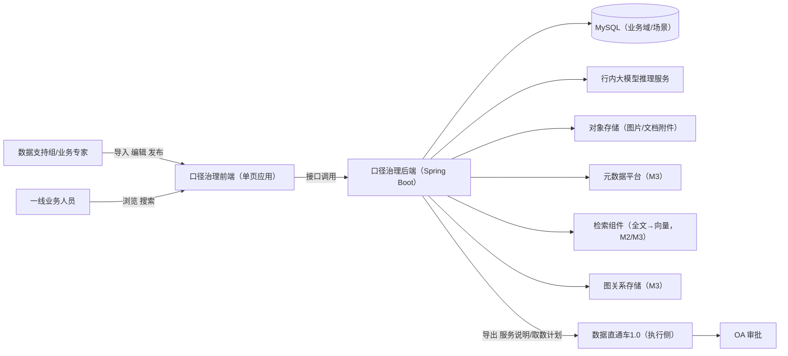
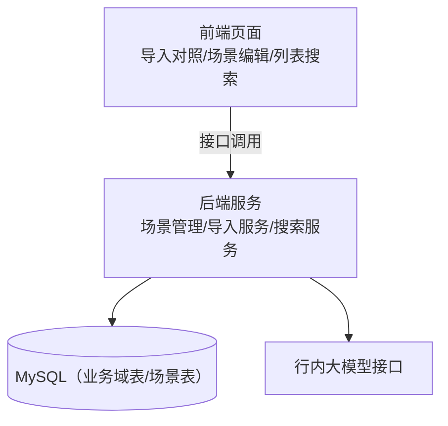
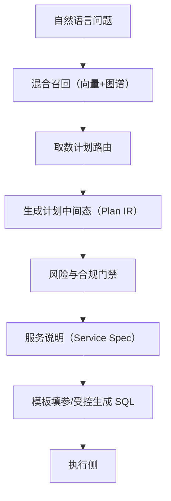
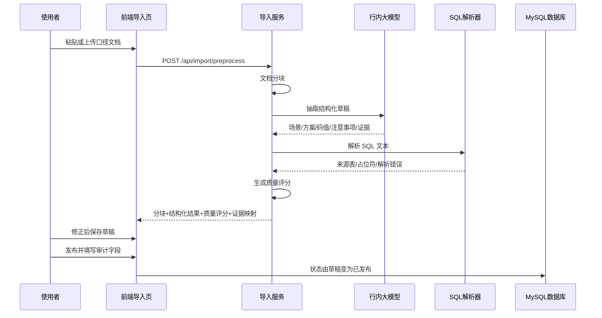
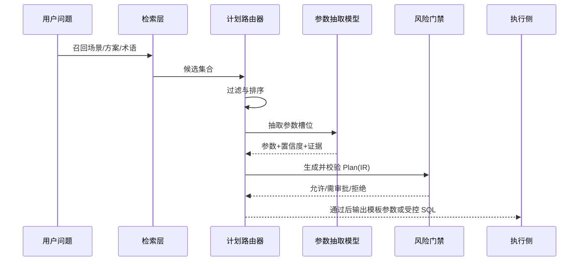
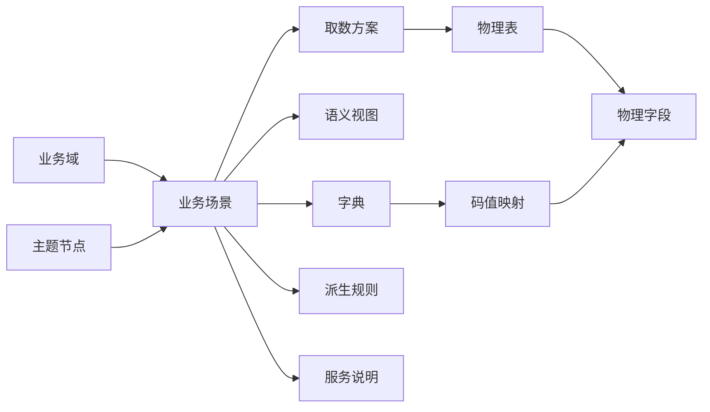
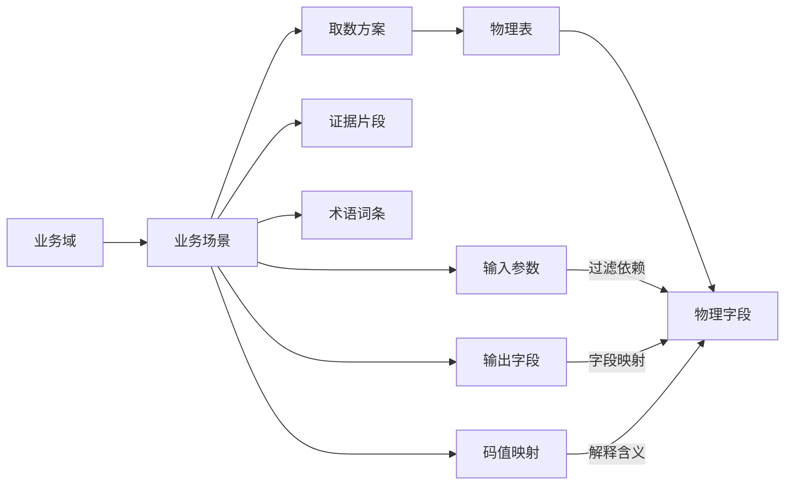
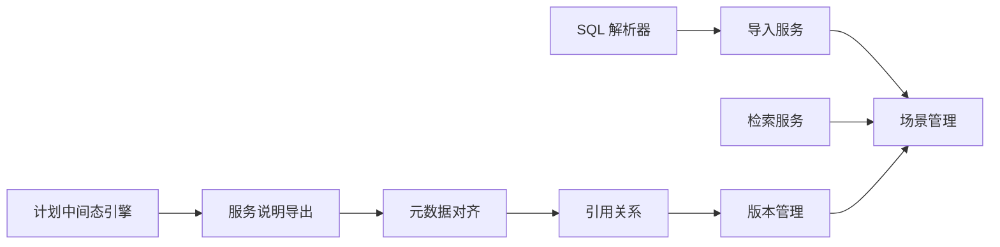
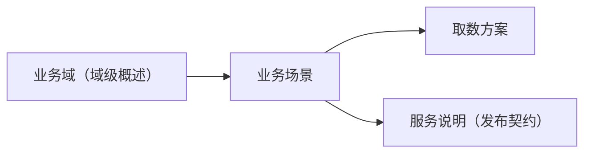

# 数据直通车·口径治理系统（CALIBER）系统总体设计方案（HLD）

> **目标**：形成覆盖 M1（口径治理 MVP）到 M3（对齐与导出 + 可控取数）的系统总体设计基线，统一“文档结构化→知识图谱→自然语言取数计划（Plan IR）”的架构口径。  
>
> **范围**：覆盖背景、边界、总体架构、端到端数据流、六资产模型、输入规范、质量门禁、非功能需求、集成契约、阶段路线；不包含执行侧 SQL 实际运行细节与审批流程实现。  
>
> **读者**：业务负责人、数据支持组、产品经理、架构师、开发测试团队、项目评审人员。  
>
> **当前阶段定位**：总体设计评审版，指导 M1 当期建设并约束 M2/M3 演进。  
>
> **术语说明**：术语口径以《[08-数据直通车-统一术语表](08-数据直通车-统一术语表.md)》为唯一标准。

- 文档版本：v1.0（总体设计评审版）
- 覆盖阶段：M1（口径治理 MVP）→ M2（引用与版本）→ M3（对齐与导出 + 可控取数）
- 系统代号：CALIBER（数据地图技术代号）

---

## 1. 背景与问题陈述

### 1.1 业务背景：数据直通车 1.0 的经验与瓶颈

数据直通车 1.0 通过“模板取数”吸收了大量高频需求，但核心瓶颈在供给侧：

1. 模板依赖少数人员持续维护。
2. 场景无法穷尽，复杂需求仍需人工编写 SQL（结构化查询语言）。
3. 模板表达僵硬，历史表分裂、跨系统映射等复杂语义难以稳定承载。

### 1.2 根问题：重点不是“怎么执行”，而是“知识怎么沉淀”

当前主要挑战是口径文档与经验知识不可治理：

- 找不到：资料分散，检索路径不稳定。
- 不可信：缺验证时间、变更摘要、权威来源。
- 不可复用：输入输出边界不清晰。
- 不可治理：缺少结构化关系、版本、引用策略。
- 不可追溯：无法定位结构化字段对应原文证据。
- 无法自动化：难以形成可被检索和服务化消费的稳定资产。

### 1.3 北极星目标

- 第一阶段（口径治理）：散落文档结构化为可编辑、可校验、可发布、可追溯资产。
- 第二阶段（数据地图）：资产可浏览、可搜索、可导航，形成图谱化知识底座。
- 目标态（可控自然语言取数）：自然语言输入后产出可审计的 Plan(IR)（中间态计划），再由执行侧完成受控 SQL 生成与执行。

> 核心原则：目标是“可控取数计划（白盒）”，不是“黑盒直接生成 SQL”。

---

## 2. 总体方案概述

### 2.1 核心设计思想：NL → Plan(IR) → SQL

在银行复杂环境下，端到端 NL2SQL（自然语言转 SQL）难以同时满足准确性、审计性、合规性。总体采用白盒链路：

```text
自然语言 → 检索与路由 → Plan(IR) → 模板填参/受控生成 → SQL → 执行侧
```

其中 Plan(IR) 是运行时核心资产：可解释、可审核、可留证、可回放。

### 2.2 数据语义图谱 + Graph-RAG（图谱增强检索生成）

系统采用“向量 + 图关系”双空间：

- 向量空间：负责语义近邻召回与模糊匹配。
- 符号图空间：负责关系约束、路径解释、规则校验。

### 2.3 知识图谱四要素在本项目的落位

1. 表示空间：Domain/Scene/Plan/Table/Column/Dictionary/Rule/Topic/ServiceSpec 节点与关系。
2. 评分函数：语义相似 + 结构覆盖 + 可信度 + 适配度 - 风险成本。
3. 编码模型：文本向量编码为主，图编码/KGE（知识图谱嵌入）为后续增强。
4. 辅助信息：术语同义词、码值、派生链、审计记录、敏感等级、执行反馈。

### 2.4 非功能性需求（质量属性）

#### 2.4.1 性能

- M1 导入预处理 `POST /api/import/preprocess`：P95 ≤ 30s。
- M1 场景列表/详情/全文搜索：P95 ≤ 2s（场景数 ≤ 1000）。
- M3 `POST /api/nl/query` 产出 Plan(IR)：P95 ≤ 5s（不含执行侧）。
- 基线假设：单次导入建议不超过 50 页等价文本或 60k 字符，超阈值建议分批导入。

#### 2.4.2 可用性

- M1 核心能力月可用性 ≥ 99.9%。
- 计划内维护每周 ≤ 1 次，单次 ≤ 30 分钟。

#### 2.4.3 一致性

- 发布（DRAFT→PUBLISHED）采用事务内强一致。
- M2 引用关系更新事务内原子。
- 检索索引与图关系更新允许最终一致，目标延迟 ≤ 5 分钟。

#### 2.4.4 安全与审计

- API 统一鉴权入口（按阶段启用细粒度控制）。
- 传输使用 HTTPS/TLS。
- 导入/保存/发布全链路操作审计。

#### 2.4.5 可观测性

- 记录 LLM（大语言模型）调用耗时、失败原因、prompt 版本。
- 记录质量评分分布、硬缺失项、解析失败率、发布回滚率。
- 建立 Prompt Registry（提示词注册表）与 Golden Set（黄金样本集）回归机制，支持提示词版本回滚。

---

## 3. 系统范围与边界

### 3.1 做什么 / 不做什么

| ✅ 做 | ❌ 不做 |
| --- | --- |
| 口径文档结构化导入、场景治理（CRUD/发布/审计） | SQL 执行（由执行侧承担） |
| 资产浏览与搜索（全文→语义→图谱） | 审批流程实现（由 OA 承担） |
| 版本与引用关系治理（M2） | 权限裁决系统本体 |
| 对齐与导出 Service Spec、Plan(IR)（M3） | 黑盒端到端 SQL 自动执行 |

### 3.2 关键设计决策（ADR 摘要）

- ADR-001：采用 NL→Plan(IR)→SQL，拒绝端到端黑盒。
- ADR-002：M1 以 JSON 列承载 Plan，M2 再拆表增强治理。
- ADR-003：`applicable_period/source_tables` 为发布硬门禁字段。
- ADR-004：`verified_at/change_summary` 为发布必填审计字段。

---

## 4. 总体架构设计

### 4.1 系统上下文图



### 4.2 M1 实现态架构



### 4.3 M3 目标态架构（Graph-RAG + Plan(IR)）



### 4.4 外部系统集成契约

#### 4.4.1 与执行侧集成

- M1：不集成。
- M3：导出 `Service Spec JSON` 与 `Plan(IR) JSON` 供执行侧消费。

建议统一错误码：

- `CAL-SS-404`：Service Spec 不存在或版本不匹配。
- `CAL-IR-422`：Plan(IR) 参数校验失败。
- `CAL-GUARD-403`：风险门禁不通过。
- `CAL-EXEC-5XX`：执行侧内部错误。

#### 4.4.2 与 OA 集成

- M1：不集成。
- M3：Plan(IR) 预留 `need_approval/approval_reason/approval_level` 字段。
- `approval_level` 建议枚举（待 OA/合规确认）：
1. `NONE`：无需审批。
2. `L1_TEAM_LEAD`：团队负责人审批。
3. `L2_DATA_GOV`：数据治理/数据安全审批。
4. `L3_COMPLIANCE`：合规/内控审批。
- 审批级别判定建议信号（M3）：
1. 敏感等级触发：`S2` 至少 `L2`，`S3` 至少 `L3`。
2. 脱敏状态触发：高敏字段 `masking=NONE` 时强制 `L3` 或 `deny`。
3. 范围与成本触发：超 `row_limit` 或高成本查询至少 `L1/L2`。
4. 身份派生链触发：涉及多跳 Derivation Rule 至少 `L2`。

#### 4.4.3 与元数据平台集成

- 对齐对象：表、字段、敏感等级、脱敏策略（按阶段开放）。
- 对齐频率：发布前按需 + 每日增量任务（M3）。
- 冲突处理：输出 `alignment_report`，不做自动覆盖。
- 最小接口集（待平台确认）：
1. `POST /meta/v1/tables:resolve`：批量解析 `source_tables` 到标准表实体。
2. `GET /meta/v1/tables/{table_id}/columns`：获取字段、类型、敏感等级、脱敏策略。
3. `GET /meta/v1/policies/sensitivity`：获取敏感等级字典。
4. `GET /meta/v1/policies/masking`：获取脱敏策略字典。
5. `GET /meta/v1/changes?since=...`（可选）：支撑影响分析。
- 鉴权与审计请求头建议：
1. `Authorization: Bearer <token>`。
2. `X-Request-Id: <uuid>`。
3. `X-App-Id: caliber`。
4. `X-User-Id: <operator>`（可选）。
- 错误码与 CALIBER 行为映射建议：
1. `401/403`：鉴权失败，直接阻断发布/对齐。
2. `404`：表不存在，若涉及 `source_tables` 则强阻断。
3. `409`：同名歧义，返回候选表并转人工确认。
4. `429`：触发频控，指数退避重试。
5. `5xx`：平台异常，退避重试并落失败任务。
- 频控/缓存默认建议（待确认）：
1. 平台频控：`QPS=10/client`，burst=20。
2. 元数据缓存 TTL：24h（或按 ETag/Last-Modified）。
3. 重试策略：`1m/2m/4m/8m`，最多 5 次。
- 门禁矩阵（M3）：
1. `source_tables` 未对齐：强阻断发布。
2. 敏感等级或脱敏缺失：强阻断发布。
3. 普通字段释义差异：允许发布但必须记录 `alignment_report_id`。

#### 4.4.4 与 LLM 服务集成

- 导入超时建议 20s，在线查询建议 10s。
- 仅网络异常/超时做 1 次重试。
- 连续失败触发熔断并降级到规则抽取/手动模式。
- 默认限流建议：单实例并发 `K=3`、QPS=1（可配置）。
- SLA 建议基线（待平台确认）：
1. 月可用性 ≥ 99.9%。
2. 导入抽取 P95 ≤ 20s。
3. 在线 NL 查询 P95 ≤ 10s。
4. 服务端 5xx 错误率 ≤ 1%。
- 可观测字段最小集：
1. `request_id`、`model_id/model_version`。
2. `prompt_hash/prompt_version`（CALIBER 透传）。
3. `token_in/token_out`、`latency_ms`、`error_code`。

### 4.5 接口版本化与冲突语义

1. 当前 M1/M2 存量实现路径为 `/api/...`（无版本前缀），用于兼容现有前后端联调。  
2. 新增或重构接口建议从 `/api/v1/...` 起步；破坏性变更使用 `/api/v2/...`，并提供至少一个版本兼容窗口。  
3. 接口文档需同时标注“当前实现路径”和“目标版本化路径”，避免治理口径与实现口径冲突。  
4. 新增冲突错误码：
- `CAL-SC-409`：Scene 并发更新冲突（乐观锁版本不匹配）。
- `CAL-SS-409`：Service Spec 版本冲突（`spec_version` 不匹配）。

---

## 5. 业务架构与能力地图

```mermaid
flowchart TB
  ROOT[数据地图/口径治理能力]

  ROOT --> P1[知识生产]
  P1 --> P11[手动录入]
  P1 --> P12[大模型辅助导入]
  P1 --> P13[SQL 解析增强]
  P1 --> P14[多模态预处理]

  ROOT --> P2[治理与发布]
  P2 --> P21[场景增删改查]
  P2 --> P22[取数方案管理]
  P2 --> P23[质量评分卡]
  P2 --> P24[发布门禁]
  P2 --> P25[审计日志]

  ROOT --> P3[检索与浏览]
  P3 --> P31[按域浏览]
  P3 --> P32[全文搜索（M1）]
  P3 --> P33[语义检索（M2）]
  P3 --> P34[图谱检索（M3）]
  P3 --> P35[证据链展示]

  ROOT --> P4[资产演进]
  P4 --> P41[字典（M2）]
  P4 --> P42[语义视图（M2）]
  P4 --> P43[引用与版本（M2）]
  P4 --> P44[主题节点（M3）]
  P4 --> P45[派生规则（M3）]
  P4 --> P46[服务说明（M3）]

  ROOT --> P5[服务化输出]
  P5 --> P51[导出服务说明]
  P5 --> P52[输出计划中间态]
```



---

## 6. 核心数据流设计（端到端）

### 6.1 构建时：文档 → 资产



### 6.2 运行时：自然语言 → Plan(IR)



### 6.3 异常处理与降级

#### 6.3.1 LLM 失败

- 降级 1：仅返回 `blocks/raw_input`，允许手动录入。
- 降级 2：规则抽取 SQL 块与表名，未识别内容写入 `unmapped_text`。

#### 6.3.2 SQL 解析失败

- 允许保存草稿。
- 写入 `quality_json.parse_errors[]`。
- 若 `source_tables` 缺失，则发布硬门禁阻断。
- `parse_errors[]` 建议结构：`{sql_block_id, reason_code, hint}`，便于前端精确定位。

#### 6.3.3 元数据平台不可用（M3）

- 允许草稿与浏览。
- 禁止发布 Service Spec 与执行输出。
- 重试策略建议：1m/2m/4m/8m 指数退避，最多 5 次后转人工处理。

---

## 7. 信息架构与数据模型

### 7.1 概念模型：Domain → Scene → Plan（M1）

- Domain：组织容器，承载域级概述与常见表。
- Scene：最小治理与发布单元。
- Plan：同一场景下按时间/条件分段的取数方案。

### 7.2 六资产模型（M2/M3）

- Scene（业务场景）
- Semantic View（语义视图）
- Dictionary（字典）
- Derivation Rule（派生规则）
- Topic Node（主题节点）
- Service Spec（服务说明）

### 7.3 六资产目标 E-R 图



### 7.4 基于三份样例口径的最小图谱 E-R 图



### 7.5 M1 逻辑数据模型

- `caliber_domain`：`domain_overview/common_tables/contacts`
- `caliber_scene`：`inputs_json/outputs_json/sql_variants_json/code_mappings_json/caveats_json/quality_json/raw_input`

关键策略：

1. 以 `sql_variants` 承载历史表分裂。
2. 长文本分表，附件走对象存储引用。
3. 发布审计字段作为强约束。

### 7.6 数据生命周期管理

- Scene 版本：默认永久保留（M2）。
- Dict/Semantic View 版本：保留最近 N 个，超出归档。
- Service Spec 版本：永久保留（M3）。
- 软删除立即生效，物理清理默认 30 天后执行；已发布版本仅归档不物理删除。
- `raw_input` 默认保留 180 天后归档，附件只存引用与元数据。
- `raw_input` 归档前执行脱敏检查；无法自动判定时按保守脱敏策略处理。
- 对象存储默认冷热分层：90 天内热存储，之后转低频/归档层（按基础设施策略配置）。

---

## 8. 模块设计与依赖约束

### 8.1 模块职责

| 模块 | 主要职责 | 阶段 |
| --- | --- | --- |
| Scene Management | Domain/Scene CRUD、发布与审计 | M1 |
| Import Service | 文档分块、LLM 抽取、证据链、质量评分 | M1 |
| SQL Parser | 表/字段/占位符解析增强 | M1（建议） |
| Search Service | 全文检索→语义检索→图谱检索 | M1→M3 |
| Asset Versioning | 版本快照、引用策略 | M2 |
| Alignment | 元数据对齐与报告 | M3 |
| Service Spec Export | 导出执行契约 | M3 |
| Plan(IR) Engine | 检索、路由、抽参、门禁 | M3 |

### 8.2 模块依赖图



### 8.3 并行开发 Checkpoint

1. Checkpoint-1：Scene CRUD + 发布门禁稳定（供导入草稿流转依赖）。  
2. Checkpoint-2：`preprocess` 返回 `blocks/evidence_map/quality_json` 且前端对照高亮可联调。  
3. Checkpoint-3：M2 引用与版本链可用后，才能进入 M3 契约导出与 Plan(IR)。

### 8.4 工程风险与缓解策略

1. 并发覆盖（Lost Update）：Scene 更新采用乐观锁（`row_version`/ETag）。
2. SQL 方言差异：Regex 保底 + AST 尽力解析，失败不阻断草稿。
3. Graph-RAG 死胡同：采用 multi-way recall（多路召回）+ seeded graph expansion（种子图扩展）。
4. Prompt 漂移：Prompt Registry + Golden Set 回归 + 快速回滚。

---

## 9. 输入规范、质量门禁与证据链

### 9.1 输入文档规范（Loose/Strict 双轨）

- Loose Mode：兼容现状文档，优先“抽得出多少就保留多少”。
- Strict Mode：面向新增资产，要求标准模板要素齐全。

### 9.2 Strict 模板最小要素

文档级：

- `domain_code/domain_name`
- `owner/contributors`
- `verified_at/change_summary`
- `domain_overview/common_tables`

场景级：

- `scene_code/scene_title`
- `caliber_definition/applicability/boundaries`
- `inputs/outputs/caveats`
- `retrieval_plans`
- `evidence`

方案级（Plan）：

- `variant_name`
- `applicable_period`
- `sql_text`（保真，不改写）
- `source_tables`
- `notes`

新增建议字段：

- `id_mapping_notes`（为 M3 派生规则预留线索）。

### 9.3 质量评分卡与发布门禁

- 输出到 `quality_json`。
- 硬门禁：`applicable_period/source_tables` 缺失不可发布。
- 软建议：`caveats/id_mapping_notes` 缺失给出告警。

### 9.4 证据链（Evidence Map）

导入返回：

- `blocks[]`：原文分块（段落/标题/SQL/图片描述）。
- `evidence_map`：字段路径到 `block_id` 列表映射。

### 9.5 前端对后端契约要求

- 对照视图依赖 `blocks + evidence_map`。
- 质量卡依赖 `quality_json`（score/hard_missing/soft_missing/warnings）。
- Plan 编辑器必须支持多 Plan 增删改排序，且 SQL 原文保真。

---

## 10. 总体接口设计（演进视图）

> 说明：以下为能力演进分组，当前实现多为 `/api/...`；后续新接口按版本化规则迁移到 `/api/v1/...`。

### 10.1 M1

- `POST /api/import/preprocess`
- `POST/GET/PUT/DELETE /api/scenes`
- `POST /api/scenes/{id}/publish`
- `GET/POST/PUT /api/domains`

### 10.2 M2

- `POST /api/scenes/{id}/versions`
- `POST /api/assets/references`
- `GET /api/dicts`
- `GET /api/views`

### 10.3 M3

- `GET /api/service-specs/{specCode}`
- `POST /api/nl/query`
- `POST /api/alignment/check`

### 10.4 Service Spec 编码与版本策略（M3）

- `spec_code` 命名建议：`<domain_code>.<scene_code>`（稳定且全局唯一）。
- `spec_version` 建议采用递增主版本（可用整数 `1/2/3`，或语义化 `1.0.0/2.0.0`；需与执行侧统一一种）。
- 推荐同时维护：
1. `schema_version`：输入输出结构的破坏性变更版本。
2. `content_version`：路由、说明、Plan 配置等兼容性变更版本。
- 升级规则建议：
1. 破坏性变更（输入 schema、输出语义、脱敏或风险策略变化）：
`schema_version+1` 且 `spec_version+1`。
2. 兼容性变更（新增 Plan、修正时段、补 caveats）：
`content_version+1` 且 `spec_version+1`。
3. 文案/注释变更：建议 `spec_version+1` 以保证审计可追溯。

---

## 11. 安全、合规与审计

### 11.1 M1 发布审计最小集

- `verified_at`（必填）
- `change_summary`（必填）
- `contributors`（建议必填）

### 11.2 M3 合规元数据

- `output_schema.sensitivity`（敏感等级）
- `masking`（脱敏策略）
- `risk_policy`（范围、审批、行数与成本约束）
- 敏感等级建议枚举（需与元数据平台字典对齐）：
1. `S0_PUBLIC`
2. `S1_INTERNAL`
3. `S2_SENSITIVE`
4. `S3_RESTRICTED`
- 脱敏策略建议枚举：
1. `NONE`
2. `PARTIAL`
3. `STAR`
4. `HASH`
5. `TOKENIZE`
- 默认策略建议（待安全团队确认）：
1. `S0/S1 -> NONE`
2. `S2 -> PARTIAL` 或 `HASH`
3. `S3 -> HASH` 或 `TOKENIZE`（默认不允许 `NONE`）
- 风险阈值建议默认（待业务/执行侧确认）：
1. `row_limit_default = 1000`
2. `row_limit_with_approval = 10000`
3. `cost_tier = LOW/MEDIUM/HIGH`，`HIGH` 至少触发 `L1` 审批
- 建议 `deny` 条件最小集合：
1. `S3` 字段且 `masking=NONE` 且未审批。
2. `source_tables` 未对齐或表不可见。
3. Plan(IR) 参数缺失或校验失败。
4. 命中合规黑名单字段（可配置）。

### 11.3 Plan(IR) 审计要求

Plan(IR) 至少输出：

- 命中 Scene/Plan。
- 参数与证据来源。
- 风险门禁判定与原因。
- 可回放标识（请求 ID、版本号、时间戳）。

---

## 12. 部署与运维

### 12.1 M1 部署

- 单体部署：Nginx + 前端静态资源 + Spring Boot + MySQL。
- LLM 通过内网 HTTP 调用。

### 12.2 M2/M3 演进

- 检索升级：ES（Elasticsearch，搜索引擎）/向量索引。
- 对齐升级：元数据平台接口与报告落库。
- 运维升级：围绕导入质量、对齐成功率、Plan 命中率构建监控面板。

---

## 13. 阶段路线与交付物

### 13.1 M1（口径治理 MVP）

- Domain/Scene/Plan 数据模型与页面。
- CALIBER_IMPORT_V2 导入与对照视图。
- 质量评分卡 + 发布门禁。
- 全文搜索。

### 13.2 M2（引用与版本）

- Dictionary/Semantic View 独立实体化。
- 引用关系与版本链。
- 主题节点导航（树形优先）。

### 13.3 M3（对齐与导出 + 可控取数）

- 元数据对齐与影响分析。
- Service Spec 导出。
- Derivation Rule 治理。
- Graph-RAG 检索与 Plan(IR) 输出（先不自动执行）。

---

## 14. 从三份样例口径构建图谱的方法

1. 文件级抽取为 Domain（域级概述、常见表、联系人）。
2. 场景级拆分为 Scene（标题、口径定义、输入输出、注意事项）。
3. 每段 SQL 归并为 Retrieval Plan（含时段与来源表）。
4. SQL 解析为 Physical Table/Column，补齐 `reads/filters_on/maps_to` 关系。
5. 注释码值抽取为 Code Mapping（M1 嵌入，M2 升级 Dictionary）。
6. 术语与同义词入图为 Term，提升召回可解释性。
7. 为 Scene/Plan/Term/Column 建立向量索引，支撑 M2 语义检索与 M3 Graph-RAG。

---

## 15. 可复用落地清单（规范 + 组件 + 资产 + 运行时）

### 15.1 规范（输入标准）

- `Caliber Doc Spec v1`（Strict 模板 + 必填规则）。
- `CALIBER_IMPORT_V2 JSON Schema`。
- 发布门禁规则表（硬门禁/软建议）。

### 15.2 组件（可复用流水线）

- 文档标准化与证据定位。
- 场景拆分器。
- Plan 识别器。
- SQL 解析器。
- 码值抽取器。
- 质量评估器。
- 人审对照视图。

### 15.3 资产（可治理六资产）

- M1：Domain + Scene（含 Plan/code_mappings）。
- M2：Semantic View + Dictionary + Version + Reference。
- M3：Derivation Rule + Topic Node + Service Spec + Alignment。

### 15.4 运行时（可审计 Plan IR）

- Service Spec 检索排序。
- Plan(IR) 生成。
- 参数抽取与派生执行。
- 模板优先、受控生成兜底。
- 执行反馈回流与再训练样本沉淀。

---

## 16. 图谱四要素工程化细化

### 16.1 表示空间（Representation Space）

- 符号图：`Domain/Scene/Plan/Table/Column/Dictionary/DerivationRule/TopicNode/ServiceSpec` 节点 + 关系边。
- 向量空间：`Scene/Plan/Term/Column` 生成向量用于语义召回。
- 三类子图协同：
1. 口径资产图（Domain-Scene-Plan-Evidence）。
2. 物理 Schema 图（Table-Column-JoinPath）。
3. 术语概念图（Term-Alias-Asset）。

### 16.2 评分函数（Scoring Function）

推荐采用可解释多目标排序，示意如下：

```text
score(plan) =
0.45 * semantic_similarity +
0.25 * graph_coverage +
0.15 * trust_score +
0.10 * applicability_fit -
0.05 * risk_cost
```

- `semantic_similarity`：问题与 Scene/Plan/Term 语义相似度。
- `graph_coverage`：问题实体对候选子图的覆盖程度。
- `trust_score`：发布态、验证时间、贡献者完整度。
- `applicability_fit`：时段/渠道/系统适配程度。
- `risk_cost`：敏感等级、跨库成本、历史不连续风险惩罚项。

### 16.3 编码模型（Encoding Model）

- M1-M2：文本编码优先（双塔召回 + 重排）。
- M3：引入图编码（如多关系图编码）增强结构语义。
- 可选 KGE（知识图谱嵌入）仅用于补链与排序增强，不作为主链路依赖。

### 16.4 辅助信息（Auxiliary Information）

- 术语同义词与历史别名。
- 码值映射与解释来源。
- ID（标识）派生链线索（`id_mapping_notes`）。
- 适用范围、边界与注意事项。
- 审计信息（验证人、验证时间、变更摘要）。
- 元数据治理信息（敏感等级、脱敏、血缘、Owner）。

---

## 17. M1 关键执行清单（防止 M3 返工）

### 17.1 结构化硬校验（发布门禁）

发布前必须满足：

1. `sql_variants[].applicable_period` 非空。
2. `sql_variants[].source_tables` 非空。
3. `verified_at`、`change_summary` 非空。

### 17.2 结构化软校验（质量建议）

建议补齐：

1. `caveats_json` 至少 1 条风险提示。
2. `id_mapping_notes` 有可追溯来源描述。
3. `code_mappings_json` 对关键码值给出解释。

### 17.3 Service Spec 合规前置（为 M3 埋点）

在 M1 结构中预留字段口径，M3 必须落地：

- `output_schema.sensitivity`
- `output_schema.masking`
- `risk_policy`（`need_approval/row_limit/cost_policy`）

---

## 18. 端到端论证总结（从文档到取数）

1. 文档结构化不是终点，目的是形成可路由、可审计的 Plan(IR)。
2. 仅做文本结构化会在 M3 失效，必须在 M1 同步采集时段路由、来源表、风险提示、证据链。
3. 运行时主链路应为 Text-to-Plan（自然语言到计划），Text-to-SQL（自然语言到 SQL）仅作为受控兜底。
4. 执行侧结果需要回流本系统，形成“召回-路由-参数-门禁-执行反馈”的持续优化闭环。

---

## 附录 A：简化概念图（业务评审）



## 附录 B：参考与一致性来源

- 《[01-数据直通车-项目背景与定位](01-数据直通车-项目背景与定位.md)》
- 《[03-数据直通车-MVP定义与交付计划](03-数据直通车-MVP定义与交付计划.md)》
- 《[04-数据直通车-当前阶段架构设计](04-数据直通车-当前阶段架构设计.md)》
- 《[05-数据直通车-知识梳理服务方案](05-数据直通车-知识梳理服务方案.md)》
- 《[08-数据直通车-统一术语表](08-数据直通车-统一术语表.md)》

## 附录 C：外部行业观察使用说明

本文档中的行业实践与案例类观点仅作为方案论证输入，不作为合规结论。涉及监管条款、同业指标、外部机构实践时，需在立项或上线评审中由合规与战略团队进行专项核验。

## 附录 D：外部依赖终版确认包（Draft → Final）

### D.1 适用范围与前提

- 适用阶段：M3（对齐与导出 + 可控取数）为主，M1/M2 仅需预埋可配置与降级框架。
- 口径前提：
1. M1 不做执行、不做审批实现、不做黑盒 NL2SQL。
2. LLM 不可用时必须降级到手动录入主路径。
3. M3 发布态必须满足“表可见可对齐 + 敏感字段有分级与脱敏策略”。

### D.2 Draft → Final 定稿门槛（Go/No-Go）

Final 前必须确认（Hard）：
1. 元数据平台：路径、字段、鉴权、错误码、频控与关键返回字段。
2. 数据安全：敏感分级体系与 masking 映射表（含默认策略与例外）。
3. 执行侧：`row_limit/cost_policy/deny` 阈值及责任边界。
4. LLM 平台：SLA、429/限流、必须回传字段。

Final 后可补充（Soft）：
1. OA 节点 ID 的最终映射细节（`approval_level -> flow_node_id`）。
2. 元数据增量变更接口（`changes`）的联调与上线。

### D.3 元数据平台确认模板（对接一页纸）

一次性确认项（12 项）：
1. Base URL 与 API 版本路径。
2. 环境隔离方式（PROD/UAT/DEV）。
3. 鉴权方案（JWT/mTLS/appKey）。
4. 必选请求头（`Authorization/X-Request-Id/X-App-Id`）。
5. `X-User-Id` 是否必须与审计要求。
6. 401/403 的错误码与返回体差异。
7. `tables:resolve` 契约（批量、歧义返回格式）。
8. `columns` 契约（含敏感等级与默认脱敏）。
9. `policies` 契约（敏感等级字典、脱敏字典）。
10. 429 频控阈值与返回字段（如 `retry_after`）。
11. SLA（P95/可用性）承诺值。
12. 缓存协商（ETag/Last-Modified/TTL）。

字段最小集（缺一不可）：
1. table：`table_id/catalog/schema/name/comment/owner/updated_at/sensitivity`。
2. column：`name/data_type/comment/sensitivity/masking_policy`（可扩展 `is_deprecated`）。

联调验收用例（建议）：
1. 全限定名 resolve 必须 FOUND。
2. 非限定名歧义必须返回候选表集合（AMB）。
3. columns 必须返回 `sensitivity/masking_policy`。
4. 429 返回体必须可驱动退避（`retry_after` 或等价字段）。
5. 若支持 ETag，则重复请求应有 304 或等价命中机制。

### D.4 OA/合规确认模板（approval_level）

枚举基线：
1. `NONE`
2. `L1_TEAM_LEAD`
3. `L2_DATA_GOV`
4. `L3_COMPLIANCE`

需确认事项（8 项）：
1. 各级别映射的流程节点 ID/模板 ID。
2. 审批角色组织映射（负责人/治理/合规）。
3. 超时与自动驳回策略。
4. 审批 SLA。
5. 回调机制（轮询/回调）。
6. 是否输出审批凭证（`approval_id/token`）。
7. 审计留存字段与保留期限。
8. 失败/撤回/过期错误码语义。

规则责任建议：
1. CALIBER 计算 `need_approval/approval_level` 并写入 Plan(IR)。
2. OA 执行流程与回执，不重复计算业务规则。

### D.5 数据安全确认模板（敏感分级与脱敏）

需确认事项（10 项）：
1. 分级体系（S0-S3 或行内等价）与定义。
2. 常见字段到分级映射（证件号/手机号/卡号/姓名/地址/交易明细）。
3. masking 枚举白名单。
4. 各分级默认 masking。
5. `masking=NONE` 的审批例外路径。
6. 黑白名单字段策略。
7. 脱敏实现层责任边界（建议执行侧落地，CALIBER 携带策略）。
8. `policy_version` 是否强制记录（建议强制）。
9. raw_input 归档脱敏策略是否复用主策略。
10. 审计硬要求：输出字段必须同时具备 sensitivity + masking。

发布硬门禁（可执行规则）：
1. 高敏字段 sensitivity 已判定但 masking 缺失：禁止发布。
2. 高敏字段 `masking=NONE` 且无审批授权：`deny`。

### D.6 执行侧风控确认模板（阈值与责任边界）

需确认事项（9 项）：
1. 默认 `row_limit` 与审批后上限。
2. 全局硬上限（任何场景不可突破）。
3. `cost_policy` 计算主体与方法。
4. `cost_tier` 阈值与动作（审批/离线/拒绝）。
5. `deny` 条件终版清单。
6. CALIBER 与执行侧门禁职责边界。
7. 执行审计回写字段（`query_id/spec_version/plan_id/approval_id`）。
8. 失败返回码与可解释 `reason` 结构。
9. 运行时限流/熔断错误码策略。

推荐责任边界：
1. CALIBER：结构化门禁（对齐、参数完整、敏感/脱敏完整）。
2. 执行侧：运行时门禁（审批凭证、权限、成本、资源限流）。

### D.7 Service Spec 编码与版本策略确认模板

编码规则：
1. `spec_code = <domain_code>.<scene_code>`，全局唯一且稳定。

版本规则：
1. `spec_version` 采用递增主版本（与执行侧统一整数或语义化）。
2. `schema_version` 表示结构破坏性变更。
3. `content_version` 表示内容兼容性变更。

需执行侧确认：
1. 缓存粒度（按 `spec_code` 或 `spec_code+spec_version`）。
2. 冲突处理：`CAL-SS-409` 返回 `latest/current`。
3. 兼容窗口与多版本并行策略。
4. 废弃字段（`deprecate_at/sunset_at`）是否必需。

### D.8 LLM 平台确认模板（SLA/限流/回传字段）

需确认事项（10 项）：
1. 可用性 SLA。
2. 导入与在线查询的 P95 时延。
3. 429 阈值与 `retry_after` 语义。
4. 5xx 分类（资源不足/模型不可用/网关异常）。
5. 最大 token 输入输出限制。
6. 请求与响应日志合规保留策略。
7. 必回传字段（`request_id/model_id/latency/token/error_code`）。
8. 可用区与灾备能力。
9. 配额与计费口径。
10. 调用方建议限流值（平台侧与应用侧协同）。

系统侧固定要求（不依赖平台差异）：
1. LLM 不可用必须无损降级。
2. 记录 `prompt_version/prompt_hash`。
3. 对 429/超时/5xx 启用熔断与降级，不做无限堆积。

### D.9 收口动作与状态表

建议按四场对齐会收口：
1. 元数据平台对齐会（接口契约 + 验收用例）。
2. 数据安全对齐会（分级标准 + masking 默认策略 + 硬门禁）。
3. 执行侧风控对齐会（阈值 + 责任边界）。
4. LLM 平台对齐会（SLA + 限流 + 回传字段）。

建议每场会后产出 1 页确认纪要，至少写死：路径、字段、错误码、QPS、回调方式。

状态跟踪模板：

| 依赖项 | 负责人 | 当前状态 | 需要确认 | 风险等级 | 定稿产出 |
| --- | --- | --- | --- | --- | --- |
| 元数据平台 | META | Draft | 路径/字段/鉴权/错误码/QPS | 高 | 接口契约 + 验收用例 |
| 数据安全 | SEC | Draft | 分级体系与 masking 映射 | 高 | 分级标准 + 默认策略 |
| 执行侧风控 | EXEC | Draft | row_limit/cost_policy/deny 边界 | 高 | 风控规则表 |
| LLM 平台 | LLM | Draft | SLA/429/回传字段 | 中 | SLA 文档 + 错误码 |
| OA/合规 | OA | Draft | approval_level 节点映射 | 中 | 节点映射表 |

### D.10 定值收口表（Fill-in Sheet，可直接会签）

#### D.10.1 元数据平台最终契约（D1）

**D1.1 基本信息**

- Base URL（PROD）：`______________`
- Base URL（UAT）：`______________`
- API 版本前缀：`______________`
- 环境区分方式（Host/Path/Header）：`______________`

**D1.2 鉴权方式**

- 鉴权类型：`JWT / mTLS / appKey-appSecret / 其它`
- 必须请求头：
1. `Authorization`：`必需/可选/不支持`
2. `X-Request-Id`：`必需/可选/不支持`
3. `X-App-Id`：`必需/可选/不支持`
4. `X-User-Id`：`必需/可选/不支持`
- Token 获取方式：`______________`
- 是否存在按表/字段授权：`有（说明）/无`

**D1.3 真实接口路径**

- `tables:resolve`：`______________`
- `columns`：`______________`
- `policies/sensitivity`：`______________`
- `policies/masking`：`______________`
- `changes`（可选）：`______________`

**D1.4 错误码语义**

- 401：`______________`
- 403：`______________`
- 404：`______________`
- 409：`______________`
- 429：`______________`
- 5xx：`______________`
- 429 是否带 `Retry-After/retry_after`：`是（字段名）/否`

**D1.5 频控与缓存**

- QPS：`____`
- burst：`____`
- ETag 支持：`是/否`
- Last-Modified 支持：`是/否`
- 推荐缓存 TTL：`____h`（或 `按 ETag 协商`）

#### D.10.2 数据安全与脱敏最终口径（D2）

**D2.1 敏感等级定义**

- 枚举体系：`______________`
- S0 定义：`______________`
- S1 定义：`______________`
- S2 定义：`______________`
- S3 定义：`______________`

**D2.2 masking 枚举与默认策略**

- 允许枚举：`NONE/PARTIAL/STAR/HASH/TOKENIZE/其它`
- S0 默认：`______`
- S1 默认：`______`
- S2 默认：`______`
- S3 默认：`______`

**D2.3 `masking=NONE` 例外**

- S3 是否允许 `NONE`：`永不允许/允许（条件）`
- S2 是否允许 `NONE`：`不允许/允许（条件）`
- 例外字段白名单机制：`支持（来源）/不支持`

**D2.4 发布硬门禁确认**

1. sensitivity 缺失：`禁止发布`
2. masking 缺失：`禁止发布`
3. `S3 + masking=NONE + 无审批凭证`：`deny`
4. 额外硬门禁：`______________`

#### D.10.3 执行侧风控阈值与责任边界（D3）

**D3.1 row_limit**

- 默认 row_limit（交互式）：`____`
- 审批后上限：`____`
- 硬上限：`____`

**D3.2 cost_policy**

- cost 计算主体：`执行侧/CALIBER/共同`
- cost_tier 枚举：`LOW/MED/HIGH`（或最终枚举）
- `HIGH` 处理动作：`审批/离线/deny/其它`

**D3.3 deny 条件（勾选）**

- 表不可见或未对齐
- 参数缺失或校验失败
- `S3` 明文且无审批
- 黑名单字段命中
- `cost_tier=HIGH` 且未审批
- 其它：`______________`

**D3.4 责任边界**

- CALIBER 负责：`对齐检查/敏感与脱敏完整性/Plan 参数完整性`
- 执行侧负责：`审批凭证校验/成本与限流/最终 allow-deny 裁决与回写`

#### D.10.4 LLM 平台最终 SLA 与回传字段（D4）

**D4.1 SLA**

- 月可用性：`____%`
- 导入抽取 P95：`____s`
- 在线 NL P95：`____s`
- 5xx 错误率：`____%`

**D4.2 429 语义**

- 触发方式：`QPS/并发/token/综合`
- 是否返回 Retry-After：`是（单位）/否`
- 429 `error_code`：`______________`

**D4.3 必回传字段**

1. `request_id`
2. `model_id/model_version`
3. `latency_ms`
4. `token_in/token_out`
5. `error_code`
6. 其它：`______________`

#### D.10.5 OA/合规审批节点映射（D5）

| approval_level | 流程模板/节点ID | 审批角色 | SLA | 回调方式 |
| --- | --- | --- | --- | --- |
| NONE | N/A | N/A | N/A | N/A |
| L1_TEAM_LEAD | `________` | `________` | `____` | `webhook/poll` |
| L2_DATA_GOV | `________` | `________` | `____` | `webhook/poll` |
| L3_COMPLIANCE | `________` | `________` | `____` | `webhook/poll` |
