# SuperSonic 开源项目技术分享

> 日期：2025年10月13日

---

## 一、项目背景与定位

### 1.1 项目简介

**SuperSonic** 是一个融合 Chat BI（powered by LLM）和 Headless BI（powered by 语义层）的新一代 BI 平台。

- **开发团队**：腾讯音乐（Tencent Music）开源
- **核心定位**：通过自然语言查询数据，无需修改或复制数据
- **技术路线**：Chat BI + Headless BI 融合

### 1.2 解决的核心问题

#### 传统 Text2SQL 的痛点

1. **幻觉问题**：LLM 对数据语义理解不足，容易产生错误SQL
2. **复杂度问题**：复杂SQL（JOIN、公式等）难以生成

#### SuperSonic 的解决方案

1. 将数据语义纳入提示词，减少幻觉
2. 将高级SQL生成卸载到语义层，降低复杂度

### 1.3 应用场景

- 业务用户通过自然语言查询数据
- 数据分析师构建和管理语义模型
- 企业级 BI 数据问答系统

---

## 二、技术栈分析

### 2.1 核心技术栈

#### 后端技术

- **框架**：Spring Boot 3.3.9
- **Java 版本**：Java 21
- **构建工具**：Maven（多模块项目）
- **LLM 集成**：Langchain4j 0.36.2
- **SQL 解析**：JSqlParser 4.9、Apache Calcite 1.38.0
- **自然语言处理**：HanLP (portable-1.8.4)
- **数据库**：MyBatis Plus 3.5.10、支持多种数据源

#### 数据库支持

- MySQL、ClickHouse、Presto、Trino、Kyuubi
- PostgreSQL、DuckDB
- 支持 JDBC 标准数据源

#### 向量数据库集成（知识库）

- Milvus
- Chroma
- OpenSearch
- PgVector

#### 前端技术

- React + TypeScript
- Monorepo 结构（packages: supersonic-fe, chat-sdk）

### 2.2 技术特点

- **多模型支持**：OpenAI、本地 AI、Ollama
- **向量嵌入**：BGE-small-zh、all-MiniLM-L6-v2
- **可插拔架构**：Java SPI 扩展机制

---

## 三、系统架构设计

### 3.1 整体架构

SuperSonic 采用模块化分层架构：

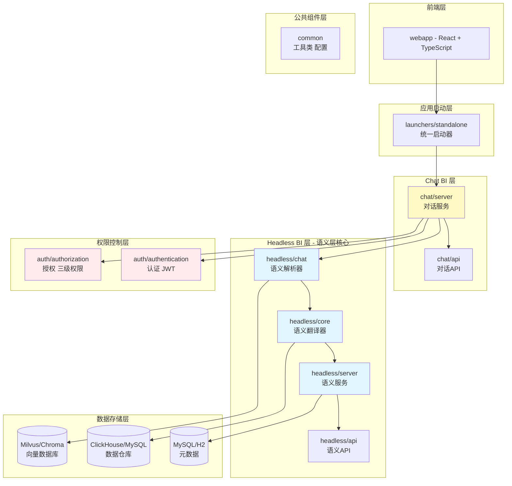

**模块目录结构（基于 `pom.xml:12-18`）：**

```sql
supersonic/
├── auth/              # 认证授权模块
│   ├── api/          # 权限API定义
│   ├── authentication/ # 认证实现 (JWT)
│   └── authorization/  # 授权实现（数据集级、列级、行级）
├── common/            # 公共组件
├── headless/          # Headless BI核心（语义层）
│   ├── api/          # API定义
│   ├── core/         # 核心业务逻辑（语义翻译器）
│   ├── chat/         # 语义解析（Schema Mapper, Parser）
│   └── server/       # 服务层（元数据管理）
├── chat/              # Chat BI核心（对话引擎）
│   ├── api/          # API定义
│   └── server/       # 服务实现（Plugin, Memory）
├── launchers/         # 启动器（standalone、headless、chat）
└── webapp/            # 前端应用（React + TypeScript）
```

### 3.2 核心处理流程

**用户查询处理链路：**

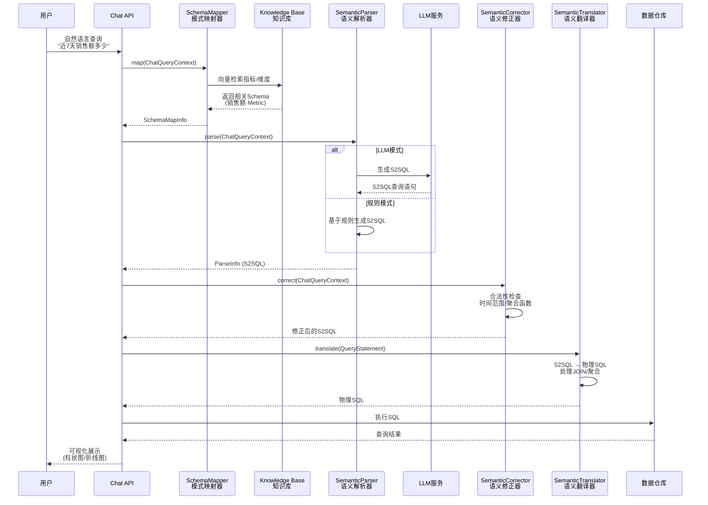

**关键接口定义：**

1. **SchemaMapper** - `headless/chat/src/main/java/com/tencent/supersonic/headless/chat/mapper/SchemaMapper.java:9-12`

   ```java
   public interface SchemaMapper {
       void map(ChatQueryContext chatQueryContext);
   }
   ```

2. **SemanticParser** - `headless/chat/src/main/java/com/tencent/supersonic/headless/chat/parser/SemanticParser.java:10-13`

   ```java
   public interface SemanticParser {
       void parse(ChatQueryContext chatQueryContext);
   }
   ```

3. **SemanticTranslator** - `headless/core/src/main/java/com/tencent/supersonic/headless/core/translator/SemanticTranslator.java:9-12`

   ```java
   public interface SemanticTranslator {
       void translate(QueryStatement queryStatement) throws Exception;
   }
   ```

4. **ChatQueryContext** - `headless/chat/src/main/java/com/tencent/supersonic/headless/chat/ChatQueryContext.java:24-33`

   ```java
   @Data
   public class ChatQueryContext implements Serializable {
       private QueryNLReq request;              // 用户请求
       private ParseResp parseResp;             // 解析响应
       private List<SemanticQuery> candidateQueries; // 候选查询
       private SchemaMapInfo mapInfo;           // Schema映射信息
       private SemanticSchema semanticSchema;   // 语义模型
   }
   ```

### 3.3 核心组件解析

#### 1. Knowledge Base（模型知识库）

- 定期从语义模型提取 schema 信息
- 构建词典和索引
- 支持向量检索

#### 2. Schema Mapper（模式映射器）

- 在知识库中匹配自然语言
- 识别指标、维度、实体
- 为语义解析提供上下文

#### 3. Semantic Parser（语义解析器）

- 基于规则的解析器（内置）
- 基于 LLM 的解析器
- 生成 S2SQL（语义SQL）

#### 4. Semantic Corrector（语义修正器）

- 检查语义查询合法性
- 修正不合法信息
- 优化查询性能

#### 5. Semantic Translator（语义翻译器）

- S2SQL 翻译成物理 SQL
- 处理 JOIN、聚合等复杂逻辑
- 适配不同数据库方言

#### 6. Chat Plugin（问答插件）

- 通过第三方工具扩展功能
- LLM 选择最合适插件

#### 7. Chat Memory（问答记忆）

- 封装历史查询轨迹
- Few-shot 样例嵌入提示词
- 支持多轮对话

### 3.4 语义模型设计

**核心概念：**
- **Metric（指标）**：可度量的业务指标（如销售额、UV）
- **Dimension（维度）**：查询的分析维度（如时间、地区）
- **Entity（实体）**：业务实体（如用户、商品）
- **Tag（标签）**：实体的属性标签

**语义模型层次关系：**

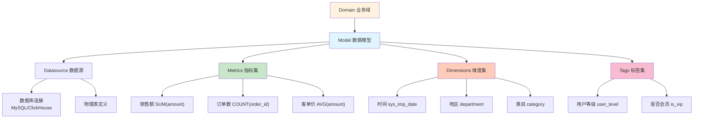

**语义翻译示例：**

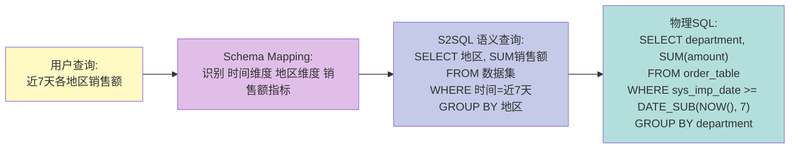

---

## 四、核心功能解析

### 4.1 自然语言查询（Chat BI）

#### 关键特性

1. **输入联想**：智能提示可查询的指标和维度
2. **多轮对话**：支持上下文理解和追问
3. **问题推荐**：查询后推荐相关问题
4. **可视化自动选择**：根据数据特征选择图表类型

#### 核心处理流程代码实现

**1. Schema Mapper（模式映射）**
- **接口定义**：`headless.chat.mapper.SchemaMapper`
- **核心实现类**：
  - `KeywordMapper`：基于关键词匹配
  - `EmbeddingMapper`：基于向量相似度匹配
  - `AllFieldMapper`：全字段匹配
- **工作原理**：

  ```sql
  用户输入 → HanLP 分词 → 向量检索/关键词匹配
  → 识别指标/维度/实体 → 构建 SchemaElementMatch
  ```

**2. Semantic Parser（语义解析）**
- **接口定义**：`headless/chat/src/main/java/com/tencent/supersonic/headless/chat/parser/SemanticParser.java`
- **核心实现类**：
  - `LLMSqlParser`：使用 LLM 生成 S2SQL
  - `RuleSqlParser`：基于规则生成 S2SQL
  - `AggregateTypeParser`：聚合类型解析
  - `TimeRangeParser`：时间范围解析
- **LLM 解析流程**（`headless/chat/src/main/java/com/tencent/supersonic/headless/chat/parser/llm/LLMSqlParser.java:26-91`）：

  ```mermaid
  flowchart TD
      A[开始解析] --> B{是否启用LLM模式?}
      B -->|否| Z[跳过LLM解析]
      B -->|是| C[获取DataSetId]
      C --> D[构建LLMReq<br/>包含schema信息+示例]
      D --> E[重试循环 maxRetries次]
      E --> F[调用LLM服务<br/>runText2SQL]
      F --> G{LLM返回成功?}
      G -->|否| H{还有重试次数?}
      H -->|是| I[增加temperature<br/>提高随机性]
      I --> E
      H -->|否| Z
      G -->|是| J[去重S2SQL结果]
      J --> K[按权重排序]
      K --> L[构建ParseInfo]
      L --> M[添加到候选查询列表]
      M --> N[结束]
      Z --> N

      style B fill:#fff9c4
      style F fill:#e1bee7
      style J fill:#c5cae9
  ```

  **关键代码**：

  ```java
  // 判断是否启用LLM (LLMSqlParser.java:29)
  if (!queryCtx.getRequest().getText2SQLType().enableLLM()) {
      return;
  }

  // 重试机制 (LLMSqlParser.java:58-82)
  int currentRetry = 1;
  while (currentRetry <= maxRetries) {
      LLMResp llmResp = requestService.runText2SQL(llmReq);
      if (Objects.nonNull(llmResp)) {
          sqlRespMap = responseService.getDeduplicationSqlResp(currentRetry, llmResp);
          if (MapUtils.isNotEmpty(sqlRespMap)) {
              break;  // 成功生成SQL,退出重试
          }
      }
      // 失败时增加温度参数，提高随机性
      if (temperature == 0) {
          chatModelConfig.setTemperature(0.5);
      }
      currentRetry++;
  }
  ```

**3. Semantic Translator（语义翻译）**
- **接口定义**：`headless/core/src/main/java/com/tencent/supersonic/headless/core/translator/SemanticTranslator.java`
- **核心实现**：`headless/core/src/main/java/com/tencent/supersonic/headless/core/translator/DefaultSemanticTranslator.java`
- **关键能力**：
  - 使用 Apache Calcite 做 SQL 优化
  - 支持多种数据库方言适配（`headless/core/src/main/java/com/tencent/supersonic/headless/core/adaptor/db/`包）
  - JOIN 关系自动生成
  - 指标表达式展开

**语义翻译流程图：**

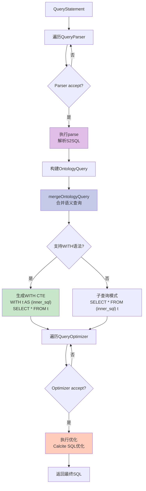

**核心代码** (`DefaultSemanticTranslator.java:27-56`)：

```java
public void translate(QueryStatement queryStatement) throws Exception {
    // 1. 遍历所有QueryParser进行解析
    for (QueryParser parser : ComponentFactory.getQueryParsers()) {
        if (parser.accept(queryStatement)) {
            parser.parse(queryStatement);  // 解析语义查询
            if (!queryStatement.getStatus().equals(QueryState.SUCCESS)) {
                break;
            }
        }
    }

    // 2. 合并语义查询到物理SQL
    mergeOntologyQuery(queryStatement);

    // 3. 遍历所有QueryOptimizer进行优化
    for (QueryOptimizer optimizer : ComponentFactory.getQueryOptimizers()) {
        if (optimizer.accept(queryStatement)) {
            optimizer.rewrite(queryStatement);  // Calcite SQL优化
        }
    }
}
```

**4. Knowledge Base（知识库）**
- **服务类**：`headless/chat/src/main/java/com/tencent/supersonic/headless/chat/knowledge/KnowledgeBaseService.java`
- **向量存储**：支持 Milvus、Chroma、OpenSearch、PgVector
- **构建流程**：

  ```mermaid
  flowchart LR
      A[语义模型变更] --> B[提取元数据<br/>Metric/Dimension]
      B --> C[生成Embedding<br/>BGE-small-zh]
      C --> D[存入向量数据库<br/>Milvus/Chroma]
      D --> E[定期更新索引]
      E --> F[提供检索服务]

      style B fill:#e1bee7
      style C fill:#c5cae9
      style D fill:#c8e6c9
  ```

**EmbeddingMapper 实现** (`headless/chat/src/main/java/com/tencent/supersonic/headless/chat/mapper/EmbeddingMapper.java:35-76`)：

```java
public void doMap(ChatQueryContext chatQueryContext) {
    // 1. 用户查询向量化后检索 Top-K 相似元素
    EmbeddingMatchStrategy matchStrategy = ContextUtils.getBean(EmbeddingMatchStrategy.class);
    List<EmbeddingResult> matchResults = getMatches(chatQueryContext, matchStrategy);

    // 2. 构建 SchemaElementMatch
    for (EmbeddingResult matchResult : matchResults) {
        Long elementId = Retrieval.getLongId(matchResult.getId());
        Long dataSetId = Retrieval.getLongId(matchResult.getMetadata().get("dataSetId"));
        SchemaElementType elementType = SchemaElementType.valueOf(
            matchResult.getMetadata().get("type")
        );

        SchemaElement schemaElement = getSchemaElement(
            dataSetId, elementType, elementId, chatQueryContext.getSemanticSchema()
        );

        // 构建匹配对象,包含相似度分数
        SchemaElementMatch schemaElementMatch = SchemaElementMatch.builder()
            .element(schemaElement)
            .word(matchResult.getName())
            .similarity(matchResult.getSimilarity())  // 向量相似度
            .detectWord(matchResult.getDetectWord())
            .build();

        // 3. 添加到 ChatQueryContext 的 mapInfo
        addToSchemaMap(chatQueryContext.getMapInfo(), dataSetId, schemaElementMatch);
    }
}
```

### 4.2 语义模型构建（Headless BI）

#### 核心数据结构

**Dimension（维度）** - `headless/api/pojo/Dimension.java:14`

```java
class Dimension {
    String name;           // 维度名称
    DimensionType type;    // 类型：CATEGORICAL/TIME
    String expr;           // SQL 表达式
    String bizName;        // 业务名称
    String description;    // 业务描述
}
```

**Metric（指标）** - 类似结构，包含聚合函数定义

**语义模型管理**：
- **服务接口**：`headless.server.facade.service.SemanticLayerService`
- **存储**：使用 MyBatis Plus 持久化到关系数据库
- **缓存**：Caffeine 本地缓存加速访问

### 4.3 权限控制

#### 实现路径

**认证模块**（`auth/authentication`）：
- **拦截器**：`DefaultAuthenticationInterceptor`
- **JWT Token**：使用 JJWT 0.12.6

**授权模块**（`auth/authorization`）：
- **数据集级**：通过 `AuthService` 检查用户组权限
- **列级**：过滤用户无权限的 Metric 和 Dimension
- **行级**：通过 `DimensionFilter` 自动在 SQL 中添加 WHERE 条件

**权限规则**（`auth/api/pojo/AuthRule.java`）：

```java
class AuthRule {
    Long groupId;                    // 用户组ID
    List<Long> metrics;              // 可见指标列表
    List<Long> dimensions;           // 可见维度列表
    List<DimensionFilter> filters;   // 行级过滤条件
}
```

### 4.4 Chat Plugin（问答插件）

#### 核心实现

**插件基类**：`chat.server.plugin.ChatPlugin`
- **插件类型**：WEB_PAGE、WEB_SERVICE
- **解析模式**：ParseMode（LLM 选择或规则匹配）
- **配置化**：支持动态配置插件参数和示例问题

**插件执行流程**：

```sql
用户查询 → NL2PluginParser 识别插件场景
→ LLM 选择最合适的插件 → PluginExecutor 执行
→ 返回结果并渲染
```

### 4.5 Chat Memory（对话记忆）

#### 实现要点

**存储**：`chat.server.persistence.ChatMemoryDO`
- 持久化历史查询和结果
- 记录用户反馈（正例/负例）

**应用场景**：
1. **上下文理解**：多轮对话时提供历史上下文
2. **Few-shot 学习**：将优质查询作为示例嵌入提示词
3. **用户偏好**：学习用户的查询习惯

**服务接口**：`chat.server.service.MemoryService`

### 4.6 可扩展架构

#### 数据库适配器扩展

**工厂模式**：`headless.core.adaptor.db.DbAdaptorFactory`
- **基类**：`BaseDbAdaptor`
- **内置实现**：MySQL、ClickHouse、Presto、Trino、PostgreSQL、DuckDB、Oracle、StarRocks等
- **扩展方式**：继承 `BaseDbAdaptor` 并实现特定方言的 SQL 生成逻辑

#### LLM 提供商扩展

**使用 Langchain4j 抽象**：
- 支持 OpenAI、本地模型、Ollama
- 统一的 `ChatLanguageModel` 接口
- 通过配置切换不同提供商

---

## 五、优秀设计实践

### 5.1 架构设计亮点

#### 1. 语义层抽象（Semantic Layer）★★★

**设计思想**：
- 在物理数据模型和业务查询之间引入语义层
- 将复杂的 SQL 生成逻辑从 LLM 卸载到语义层
- 统一管理业务指标和维度定义

**技术实现架构：**

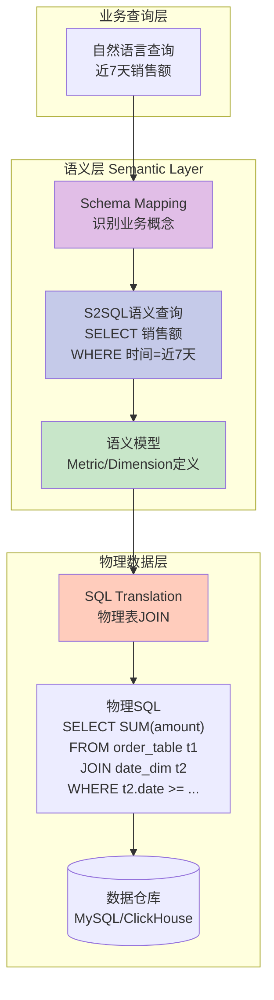

**核心价值**：
- **减少幻觉**：LLM 只需理解业务概念，不需要理解复杂的表结构和 JOIN 关系
- **降低复杂度**：多表 JOIN、复杂聚合由语义层自动处理
- **保证一致性**：所有查询访问统一的语义定义，确保数据口径一致

#### 2. 检索增强生成（RAG）★★★

**实现方式：**
- **向量化存储**：将 Metric、Dimension 的名称、别名、描述向量化
- **相似度检索**：用户查询文本向量化后，从知识库检索相关 schema
- **上下文注入**：将检索结果作为上下文注入 LLM 提示词

**RAG 工作流程：**

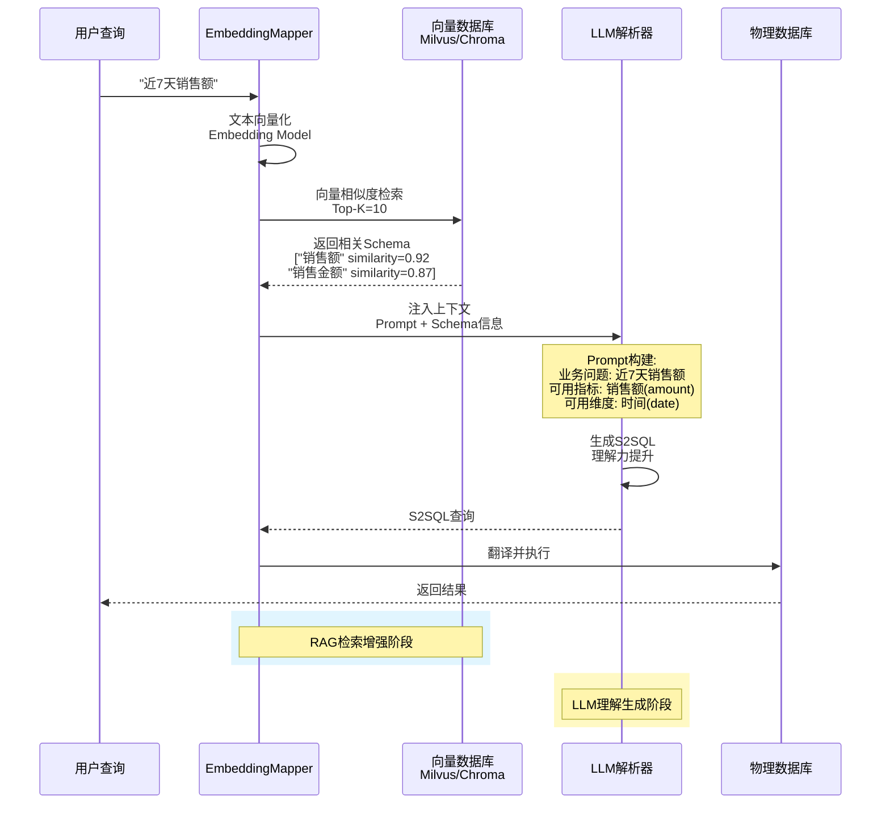

**EmbeddingMapper 实现**（`headless/chat/src/main/java/com/tencent/supersonic/headless/chat/mapper/EmbeddingMapper.java:35-76`）：

```java
public void doMap(ChatQueryContext chatQueryContext) {
    // 1. 用户查询向量化后检索 Top-K 相似元素
    EmbeddingMatchStrategy matchStrategy = ContextUtils.getBean(EmbeddingMatchStrategy.class);
    List<EmbeddingResult> matchResults = getMatches(chatQueryContext, matchStrategy);

    // 2. 构建 SchemaElementMatch 包含相似度分数
    for (EmbeddingResult matchResult : matchResults) {
        SchemaElementMatch schemaElementMatch = SchemaElementMatch.builder()
            .element(schemaElement)
            .similarity(matchResult.getSimilarity())  // 相似度: 0.92
            .build();

        addToSchemaMap(chatQueryContext.getMapInfo(), dataSetId, schemaElementMatch);
    }
}
```

**技术栈**：
- **Embedding 模型**：BGE-small-zh（中文, `pom.xml:147-149`）、all-MiniLM-L6-v2（英文）
- **向量数据库**：Milvus (`pom.xml:157-159`)、Chroma (`pom.xml:137-139`)、PgVector、OpenSearch
- **Langchain4j 集成**：统一的向量检索接口 (`pom.xml:117-119`)

#### 3. 可插拔组件架构（Pluggable）★★

**设计模式：**
- **接口抽象**：所有核心组件定义接口（SchemaMapper、SemanticParser、SemanticTranslator 等）
- **工厂模式**：通过工厂类创建具体实现（DbAdaptorFactory）
- **策略模式**：运行时根据配置选择不同策略（LLM vs Rule Parser）

**数据库适配器架构：**

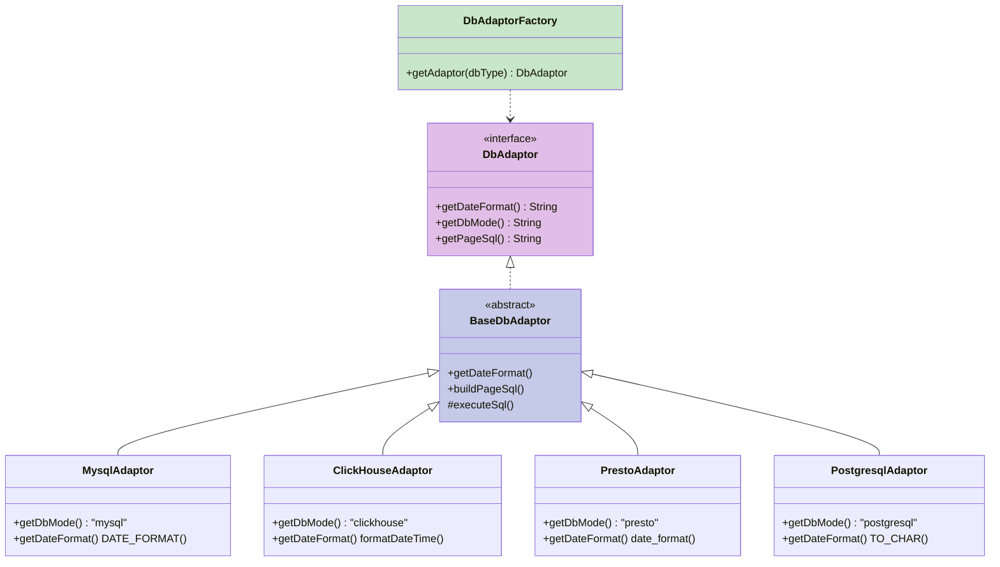

**实现路径：**
- **接口定义**：`headless/core/src/main/java/com/tencent/supersonic/headless/core/adaptor/db/DbAdaptor.java`
- **基类实现**：`headless/core/src/main/java/com/tencent/supersonic/headless/core/adaptor/db/BaseDbAdaptor.java`
- **MySQL实现**：`headless/core/src/main/java/com/tencent/supersonic/headless/core/adaptor/db/MysqlAdaptor.java`
- **ClickHouse实现**：`headless/core/src/main/java/com/tencent/supersonic/headless/core/adaptor/db/ClickHouseAdaptor.java`
- **工厂类**：`headless/core/src/main/java/com/tencent/supersonic/headless/core/adaptor/db/DbAdaptorFactory.java`

**扩展点示例**：

```java
// 1. 数据库适配器扩展
class MyCustomDbAdaptor extends BaseDbAdaptor {
    @Override
    public String getDateFormat() {
        return "CUSTOM_DATE_FORMAT(%s, '%Y-%m-%d')";
    }

    @Override
    public String getDbMode() {
        return "mycustom";
    }
}

// 2. 语义解析器扩展
class MyCustomParser implements SemanticParser {
    @Override
    public void parse(ChatQueryContext ctx) {
        // 自定义解析逻辑
    }
}
```

**应用场景**：
- 支持新的数据库类型（如 Doris、StarRocks 等）
- 集成自研的 NLP 模型
- 替换向量数据库实现

#### 4. 多策略解析（Hybrid Parsing）★★

**策略组合：**

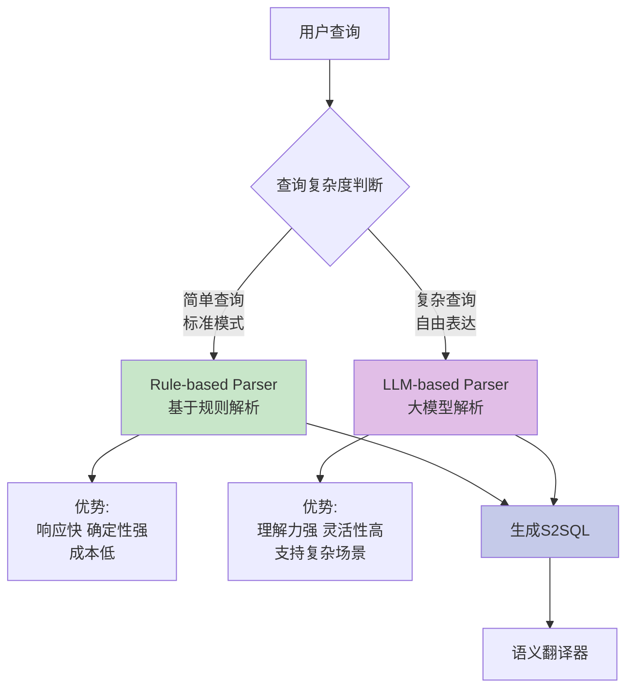

**1. Rule-based Parser**：基于规则的快速解析
   - 适用于标准化查询（如"近7天销售额"）
   - 响应快、成本低、确定性强
   - 实现路径：`headless/chat/src/main/java/com/tencent/supersonic/headless/chat/parser/rule/RuleSqlParser.java`

**2. LLM-based Parser**：基于大模型的智能解析
   - 适用于复杂查询（如"比上个月增长最快的商品类别"）
   - 理解能力强、灵活性高
   - 实现路径：`headless/chat/src/main/java/com/tencent/supersonic/headless/chat/parser/llm/LLMSqlParser.java`

**选择逻辑** (`LLMSqlParser.java:29`):

```java
// 判断是否启用LLM
if (!queryCtx.getRequest().getText2SQLType().enableLLM()) {
    return; // 跳过LLM，使用规则解析
}
```

**重试机制**（`LLMSqlParser.java:58-82`）：
- 最多重试 maxRetries 次
- 失败时动态调整 temperature（增加随机性）
- 多个候选 SQL 去重并按权重排序

### 5.2 代码实践亮点

#### 1. 清晰的模块分层 ★★★

**依赖关系：**

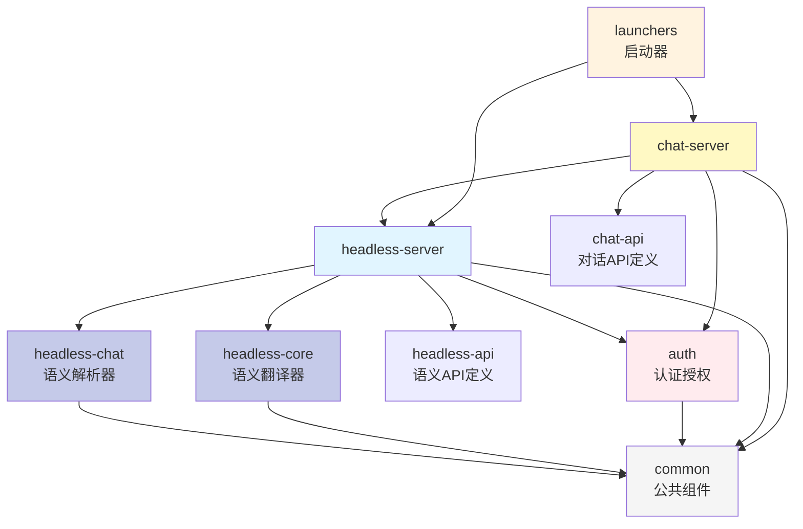

**分层职责（基于 `pom.xml:12-18`）**：
- **api 层**：定义数据结构（POJO）、接口契约、枚举类型
- **core 层**：核心业务逻辑、算法实现
- **server 层**：服务实现、REST 接口、持久化
- **launcher 层**：应用启动、配置组装

**优势**：
- 接口和实现分离，易于测试
- 模块职责清晰，便于团队协作
- 支持按模块独立部署（Headless BI / Chat BI 可分开部署）

#### 2. 统一的 Context 传递 ★★

**ChatQueryContext 设计** (`headless/chat/src/main/java/com/tencent/supersonic/headless/chat/ChatQueryContext.java:24-33`)：

```java
@Data
public class ChatQueryContext implements Serializable {
    private QueryNLReq request;              // 用户请求
    private ParseResp parseResp;             // 解析响应
    private List<SemanticQuery> candidateQueries; // 候选查询
    private SchemaMapInfo mapInfo;           // 映射结果
    private SemanticSchema semanticSchema;   // 语义模型
    // ... 完整的上下文信息
}
```

**贯穿整个流程：**

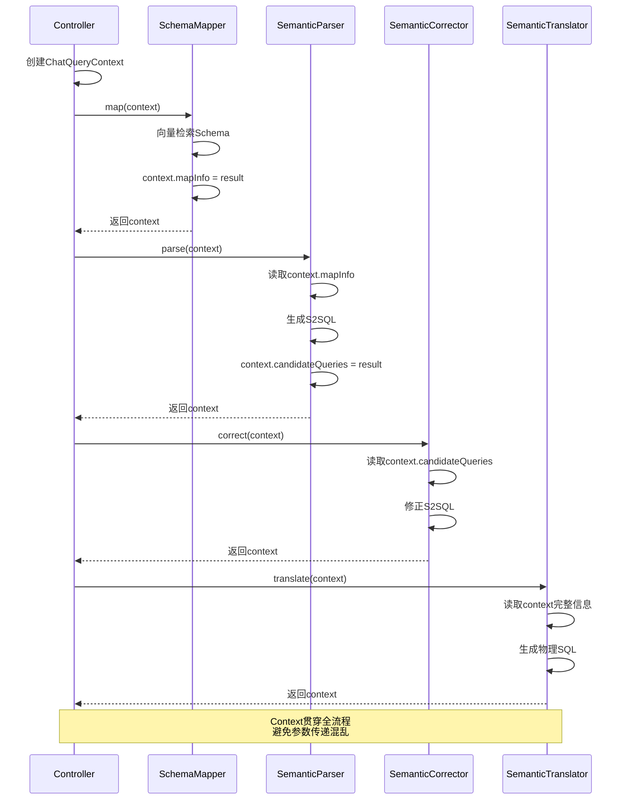

**优势**：
- 避免参数爆炸
- 便于传递中间结果
- 易于扩展新的上下文信息

#### 3. 数据库方言适配 ★★

**Adaptor 模式**（`headless/core/adaptor/db/`）：
- **BaseDbAdaptor**：定义通用行为
- **各数据库实现类**：覆写特定方法

**典型场景**：

```java
// 日期格式差异
MySQL:      DATE_FORMAT(time, '%Y-%m-%d')
ClickHouse: formatDateTime(time, '%Y-%m-%d')
Presto:     date_format(time, '%Y-%m-%d')

// 分页语法差异
MySQL:      LIMIT 100
Oracle:     ROWNUM <= 100
```

**DbAdaptorFactory 自动选择**：

```java
DbAdaptor adaptor = DbAdaptorFactory.getAdaptor(dbType);
String sql = adaptor.buildPageSql(originalSql, pageSize);
```

#### 4. 缓存策略 ★

**多级缓存**：
1. **查询结果缓存**（`headless/core/cache/QueryCache`）
   - 使用 Caffeine 本地缓存
   - 相同查询直接返回结果

2. **语义模型缓存**
   - 减少数据库访问
   - 定期刷新保证一致性

3. **向量检索缓存**
   - 相同查询文本的向量检索结果缓存

#### 5. 代码质量保障 ★

**自动化工具**：
- **Spotless**：自动代码格式化（Eclipse formatter）
- **Lombok**：减少 getter/setter 样板代码
- **MyBatis Plus**：简化 DAO 层代码

**配置示例**（`pom.xml:281-307`）：

```xml
<plugin>
    <artifactId>spotless-maven-plugin</artifactId>
    <execution>
        <phase>validate</phase>
        <goals><goal>apply</goal></goals>
    </execution>
</plugin>
```

#### 6. 前后端分离 ★

**技术选型**：
- **后端**：Spring Boot REST API
- **前端**：React + TypeScript（Monorepo 结构）
- **通信**：RESTful JSON

**前端模块**（`webapp/packages/`）：
- `supersonic-fe`：主应用（Chat BI + Headless BI 界面）
- `chat-sdk`：对话组件 SDK（可独立集成）

**优势**：
- 前后端独立开发和部署
- Chat SDK 可嵌入其他应用

---

## 六、可借鉴的价值点（对数据直通车项目）

### 6.1 架构层面

#### 1. 引入语义层设计 ★★★

**SuperSonic 方案**：
- 构建统一的语义模型（Metric/Dimension/Entity）
- 业务语义与物理模型解耦
- 指标定义可复用、可治理

**数据直通车当前状态**：
- 可能直接基于物理表进行查询
- 指标定义散落在各处，难以统一管理
- 口径不一致问题

**借鉴建议**：
1. **构建指标中台**：
   - 定义统一的指标字典（名称、口径、计算逻辑）
   - 维度字典（业务含义、取值范围）
   - 实体关系图（表之间的 JOIN 关系）

2. **语义查询引擎**：
   - 用户查询基于业务语义（如"销售额"），而非物理字段（如 `SUM(order_amount)`）
   - 自动处理多表 JOIN 和聚合逻辑
   - 保证数据口径一致性

3. **落地路径**：
   - **短期**（1-2个月）：梳理核心指标，建立指标元数据库
   - **中期**（3-6个月）：开发语义翻译引擎，将业务查询转化为 SQL
   - **长期**（6-12个月）：完整的语义层平台，支持自助式数据分析

#### 2. RAG 知识库增强 ★★★

**SuperSonic 方案**：
- 将指标/维度向量化存储
- 用户查询时检索相关 schema
- 注入 LLM 上下文，提高准确性

**数据直通车痛点**：
- LLM 直接生成 SQL，容易产生幻觉
- 指标名称理解不准确
- 表名、字段名识别错误

**借鉴建议**：
1. **建设向量知识库**：
   - **数据源**：指标名称、别名、业务描述、示例值
   - **向量模型**：BGE-small-zh（适合中文业务术语）
   - **存储方案**：Milvus 或 PgVector（结合现有 PostgreSQL）

2. **检索策略**：
   - 用户查询 → 向量化 → Top-K 检索（K=10）
   - 混合检索：向量相似度 + 关键词匹配
   - 结果注入 LLM 提示词

3. **实施优先级**：
   - **第一批**：核心业务指标向量化（100-200 个核心指标）
   - **第二批**：常用维度和实体向量化
   - **第三批**：历史优质查询作为 Few-shot 样例

#### 3. LLM 集成规范化 ★★

**SuperSonic 方案**：
- 使用 Langchain4j 统一 LLM 调用
- 支持多种模型无缝切换
- 提示词工程模板化

**数据直通车现状**：
- 可能直接调用 OpenAI/Claude API
- 提示词硬编码在代码中
- 模型切换困难

**借鉴建议**：
1. **引入 Langchain4j**：
   - 统一的 ChatLanguageModel 接口
   - 支持 OpenAI、Anthropic、本地模型、Ollama
   - 方便的提示词模板管理

2. **提示词工程**：
   - 模板化提示词（分场景：简单查询、复杂查询、多表 JOIN）
   - Few-shot 样例管理
   - 动态注入 schema 上下文

3. **成本优化**：
   - 规则解析器处理简单查询（省成本）
   - LLM 处理复杂查询（保体验）
   - 缓存相似查询结果

### 6.2 功能层面

#### 1. 多轮对话能力 ★★

**SuperSonic 方案**：
- Chat Memory 记录上下文
- 支持追问和指代消解
- Few-shot 样例优化

**价值**：
- 用户体验提升：

  ```sql
  用户："最近7天的销售额是多少？"
  系统：XX万元
  用户："按地区分组呢？"（理解上下文，自动带上时间范围）
  ```

**借鉴建议**：
1. **上下文管理**：
   - 保存最近 N 轮对话（N=3-5）
   - 识别指代词（"它"、"这个"、"上个月"）
   - 继承上一轮的过滤条件

2. **实现方式**：
   - 使用 Redis 存储会话上下文
   - 提示词中包含历史对话
   - LLM 解析当前查询时参考历史

#### 2. 权限控制体系 ★★

**SuperSonic 方案**：
- 数据集级：控制可见数据域
- 列级：控制可见指标/维度
- 行级：自动添加数据过滤条件

**数据直通车需求**：
- 不同部门看不同数据
- 敏感指标权限控制
- 数据脱敏

**借鉴建议**：
1. **权限模型**：

   ```java
   UserGroup → DataSet → [Metrics, Dimensions, RowFilters]

   示例：
   "华东销售组" 用户只能看：
   - 指标：销售额、订单数（不能看成本）
   - 维度：时间、地区、商品（不能看客户明细）
   - 行过滤：region IN ('上海', '江苏', '浙江')
   ```

2. **实现位置**：
   - 在 SQL 生成阶段自动注入过滤条件
   - 前端隐藏无权限的指标选项
   - API 层权限校验

#### 3. 查询推荐与引导 ★

**SuperSonic 方案**：
- 输入联想（Autocomplete）
- 查询后推荐相关问题
- 示例问题引导

**价值**：
- 降低学习成本
- 提高查询成功率
- 发现更多分析角度

**借鉴建议**：
1. **输入联想**：
   - 基于已有指标/维度的前缀匹配
   - 高频查询模式推荐

2. **智能推荐**：
   - 当前查询 + 常见下钻维度
   - 同类指标对比（如"销售额" → "同比销售额"）

### 6.3 工程实践层面

#### 1. 模块化架构 ★★

**借鉴点**：
- **api 层独立**：定义清晰的数据契约
- **核心逻辑复用**：headless 模块可被多个上层应用使用
- **独立部署**：Chat BI 和 Headless BI 可分开部署

**应用到数据直通车**：

```sql
data-direct-car/
├── api/              # 数据契约（给前端和其他系统调用）
├── core/             # 核心引擎（语义解析、SQL生成）
├── knowledge/        # 知识库管理
├── query-executor/   # 查询执行引擎
├── web-server/       # Web服务
└── sdk/              # Java/Python SDK
```

#### 2. 可观测性 ★

**SuperSonic 实践**：
- Slf4j 统一日志
- 关键节点打点（SchemaMapper、Parser、Translator）
- 查询耗时统计

**建议增强**：
1. **链路追踪**：
   - 用户查询 ID 贯穿全流程
   - 记录每个环节耗时（Schema映射、LLM调用、SQL执行）

2. **质量监控**：
   - LLM 生成 SQL 的准确率
   - 用户反馈（点赞/点踩）统计
   - 失败查询收集和分析

3. **成本监控**：
   - LLM token 消耗统计
   - 查询缓存命中率
   - 数据库查询开销

#### 3. 数据库适配能力 ★

**价值**：
- 支持多种数据源（MySQL、ClickHouse、StarRocks、Doris等）
- 统一查询接口

**Adaptor 模式应用**：

```java
interface DataSourceAdaptor {
    String translateSql(SemanticQuery query);
    ResultSet execute(String sql);
    String getDateFormat();
}

// 各数据源实现
class ClickHouseAdaptor implements DataSourceAdaptor { ... }
class DorisAdaptor implements DataSourceAdaptor { ... }
```

### 6.4 技术选型建议

#### 立即可用

1. **Langchain4j**：LLM 统一接口层
2. **Apache Calcite**：SQL 解析和优化
3. **HanLP**：中文分词和 NLP
4. **Caffeine**：本地缓存
5. **MyBatis Plus**：持久化层

#### 需评估

1. **向量数据库**：
   - **轻量级**：PgVector（结合现有 PostgreSQL）
   - **高性能**：Milvus（独立部署，适合大规模）

2. **Embedding 模型**：
   - **开源**：BGE-small-zh（2亿参数，本地部署）
   - **云服务**：OpenAI Embedding API

### 6.5 实施路线图

#### 阶段一：基础能力（1-3个月）

**目标**：建立基本的语义查询能力

**任务**：
1. 梳理核心指标和维度（50-100个）
2. 构建指标元数据库（MySQL/PostgreSQL）
3. 集成 Langchain4j，规范 LLM 调用
4. 实现基础的 Text2SQL（直接调用 LLM）
5. 添加查询缓存和结果缓存

**验收标准**：
- 简单查询准确率 > 85%
- 平均响应时间 < 3秒

#### 阶段二：语义层构建（3-6个月）

**目标**：建立完整的语义层架构

**任务**：
1. 设计语义模型结构（Metric、Dimension、Entity）
2. 开发语义翻译引擎（S2SQL → SQL）
3. 自动处理多表 JOIN 逻辑
4. 集成 Apache Calcite 优化 SQL
5. 开发语义模型管理界面

**验收标准**：
- 支持 80% 的常见查询通过语义层
- 复杂查询（多表JOIN）准确率 > 70%
- 数据口径一致性 100%

#### 阶段三：智能增强（6-12个月）

**目标**：RAG 知识库和智能优化

**任务**：
1. 构建向量知识库（指标/维度向量化）
2. 实现 RAG 检索增强生成
3. 多轮对话能力（Chat Memory）
4. 智能推荐和引导
5. 权限体系完善（行级权限）

**验收标准**：
- 查询准确率 > 90%
- 支持多轮对话
- 查询推荐点击率 > 20%
- LLM 成本降低 30%（通过缓存和规则优化）

---

## 七、总结与展望

### 7.1 SuperSonic 核心价值总结

SuperSonic 通过 **Chat BI + Headless BI 融合** 的创新架构，提供了一套完整的智能数据问答解决方案：

#### 三大核心能力

1. **语义层统一治理**
   - 业务语义与物理模型解耦
   - 保证数据口径一致性
   - 支持指标复用和统一管理

2. **LLM + RAG 增强**
   - 检索增强生成减少幻觉
   - 向量知识库提升理解准确性
   - 混合解析策略平衡成本和效果

3. **可插拔扩展架构**
   - 支持多种数据库、LLM、向量库
   - 接口清晰，易于扩展
   - 降低技术栈锁定风险

#### 技术亮点

- ★★★ **语义层抽象**：降低 LLM 复杂度，保证数据一致性
- ★★★ **RAG 知识库**：提升准确率，减少幻觉
- ★★ **混合解析**：规则 + LLM，平衡成本和体验
- ★★ **权限体系**：三级权限（数据集/列/行）
- ★★ **模块化设计**：清晰分层，支持独立部署

### 7.2 对数据直通车的启示

#### 立即可行（1-3个月）

1. **规范 LLM 集成**
   - 引入 Langchain4j 统一抽象
   - 模板化提示词管理
   - 添加缓存和重试机制

2. **建立指标字典**
   - 梳理核心业务指标（50-100个）
   - 定义统一的业务术语和口径
   - 建立元数据管理数据库

3. **增强可观测性**
   - 全链路追踪（查询ID贯穿）
   - LLM 成本监控
   - 查询准确率统计

#### 中期规划（3-6个月）

1. **构建语义层**
   - 设计 Metric/Dimension/Entity 模型
   - 开发语义翻译引擎（业务查询 → SQL）
   - 自动处理多表 JOIN

2. **RAG 知识库**
   - 指标向量化（BGE-small-zh）
   - 向量数据库选型（PgVector/Milvus）
   - 检索增强生成

3. **多轮对话**
   - Chat Memory 管理上下文
   - 支持追问和指代消解

#### 长期愿景（6-12个月）

1. **智能分析平台**
   - 自助式数据分析
   - 智能推荐和引导
   - 自然语言报表生成

2. **数据治理中台**
   - 统一的数据语义层
   - 指标血缘追溯
   - 数据质量监控

3. **生态扩展**
   - SDK 支持（Java/Python）
   - 第三方应用集成
   - API 开放平台

### 7.3 关键成功因素

#### 1. 业务理解优先

- **指标定义准确**：业务专家参与指标梳理
- **场景聚焦**：先解决高频场景（80/20原则）
- **持续迭代**：根据用户反馈不断优化

#### 2. 技术架构合理

- **分层解耦**：语义层、查询引擎、展示层独立
- **可扩展性**：预留扩展点，支持未来演进
- **性能优化**：缓存、异步、批量处理

#### 3. 数据质量保障

- **准确率监控**：建立评估体系（准确率、召回率）
- **badcase 管理**：失败查询分析和修正
- **持续训练**：优质查询积累为 Few-shot 样例

### 7.4 风险与挑战

#### 技术风险

1. **LLM 幻觉**：通过 RAG、Few-shot、语义层多重保障
2. **成本控制**：混合策略（规则+LLM）、缓存、本地模型
3. **性能瓶颈**：向量检索优化、SQL 优化、并发控制

#### 业务风险

1. **用户习惯**：提供示例引导、输入联想降低门槛
2. **准确率预期**：明确告知用户准确率，支持人工修正
3. **数据安全**：权限控制、脱敏、审计日志

### 7.5 建议后续行动

#### 短期（本月）

1. **技术调研**：
   - Langchain4j 集成可行性
   - 向量数据库选型（PgVector vs Milvus）
   - Apache Calcite 学习和评估

2. **业务梳理**：
   - 与业务方共同梳理核心指标（Top 50）
   - 整理高频查询模式
   - 确定优先支持的数据源

#### 中期（下月）

1. **原型验证**：
   - 开发 MVP（最小可行产品）
   - 小范围灰度测试（10-20 用户）
   - 收集反馈和准确率数据

2. **架构设计**：
   - 详细的技术方案设计
   - 模块划分和接口定义
   - 性能和容量规划

#### 长期（下季度）

1. **全面推广**：
   - 扩大用户范围
   - 持续优化准确率
   - 建立运营体系（用户培训、FAQ）

2. **生态建设**：
   - 开放 API 和 SDK
   - 与其他数据产品集成
   - 建立开发者社区

---

## 附录

### A. 参考资源

- **项目地址**：https://github.com/tencentmusic/supersonic
- **文档中心**：https://supersonicbi.github.io/
- **在线演示**：http://117.72.46.148:9080（注册体验）
- **中文 README**：项目根目录 README_CN.md

### B. 技术术语表

| 术语                 | 英文                               | 解释                          |
| ------------------ | -------------------------------- | --------------------------- |
| Chat BI            | Chat-based Business Intelligence | 基于对话的商业智能，通过自然语言交互进行数据查询    |
| Headless BI        | Headless Business Intelligence   | 无头商业智能，通过 API 提供统一的数据语义层    |
| Text2SQL           | Text to SQL                      | 自然语言转 SQL 技术                |
| S2SQL              | Semantic SQL                     | 语义 SQL，SuperSonic 定义的中间查询语言 |
| RAG                | Retrieval Augmented Generation   | 检索增强生成，通过检索相关知识增强 LLM 生成质量  |
| Embedding          | Vector Embedding                 | 向量嵌入，将文本转换为高维向量表示           |
| Schema             | Database Schema                  | 数据库模式，包括表结构、字段定义等           |
| Metric             | Business Metric                  | 业务指标，如销售额、用户数等可度量的业务数据      |
| Dimension          | Analysis Dimension               | 分析维度，如时间、地区、商品类别等           |
| Entity             | Business Entity                  | 业务实体，如用户、商品、订单等业务对象         |
| Few-shot Learning  | Few-shot Learning                | 少样本学习，通过少量示例让 LLM 学习任务      |
| Prompt Engineering | Prompt Engineering               | 提示词工程，设计合适的提示词引导 LLM 生成     |

### C. SuperSonic 技术栈速查

```sql
【后端框架】
- Spring Boot 3.3.9 (Java 21)
- MyBatis Plus 3.5.10
- Langchain4j 0.36.2

【SQL 处理】
- JSqlParser 4.9
- Apache Calcite 1.38.0

【NLP 处理】
- HanLP portable-1.8.4（中文分词）
- BGE-small-zh（中文 Embedding）

【数据库支持】
- MySQL、ClickHouse、Presto、Trino
- PostgreSQL、DuckDB、Oracle、StarRocks

【向量数据库】
- Milvus、Chroma、OpenSearch、PgVector

【LLM 支持】
- OpenAI、本地模型、Ollama

【前端技术】
- React + TypeScript
- Monorepo (supersonic-fe + chat-sdk)

【缓存】
- Caffeine（本地缓存）

【构建工具】
- Maven（多模块）
- Spotless（代码格式化）
```

### D. 核心代码路径速查

```sql
【语义层核心】
headless/core/src/main/java/com/tencent/supersonic/headless/core/
├── translator/        # 语义翻译器（S2SQL → SQL）
├── adaptor/db/       # 数据库适配器
├── executor/         # 查询执行器
└── cache/            # 查询缓存

【Chat 核心】
headless/chat/src/main/java/com/tencent/supersonic/headless/chat/
├── mapper/           # Schema 映射器（向量检索、关键词匹配）
├── parser/           # 语义解析器（LLM、规则）
└── knowledge/        # 知识库服务

【Chat 服务】
chat/server/src/main/java/com/tencent/supersonic/chat/server/
├── plugin/           # 插件系统
├── memory/           # 对话记忆
├── agent/            # Agent 管理
└── service/          # 业务服务

【权限控制】
auth/
├── authentication/   # 认证（JWT）
└── authorization/    # 授权（三级权限）

【数据模型】
headless/api/src/main/java/com/tencent/supersonic/headless/api/pojo/
├── Dimension.java    # 维度定义
├── Measure.java      # 度量定义
└── SchemaElement.java # Schema 元素

【前端】
webapp/packages/
├── supersonic-fe/    # 主应用
└── chat-sdk/         # 对话 SDK
```

---
